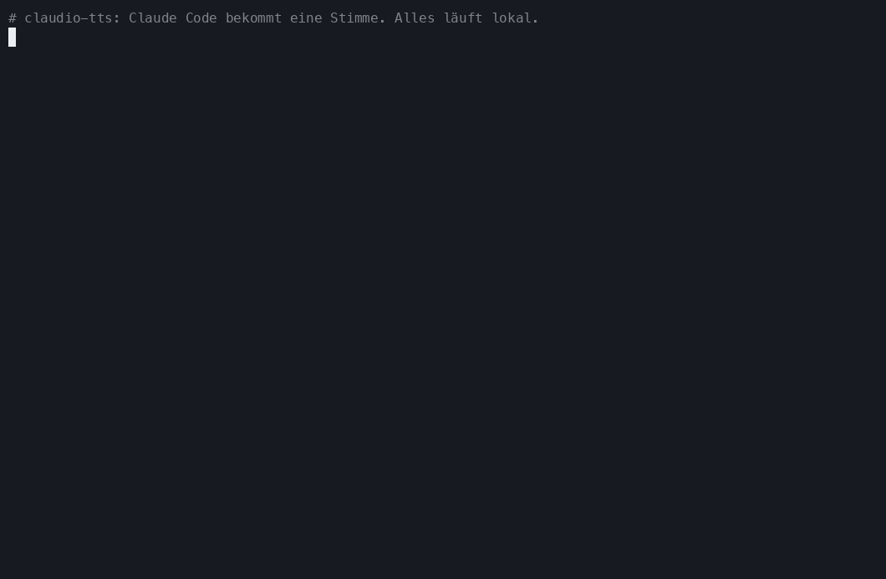
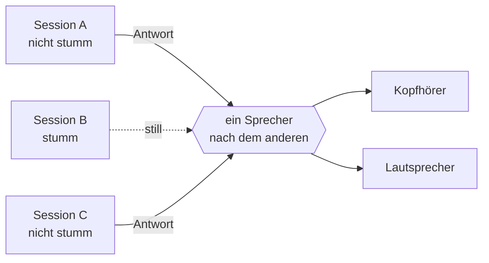
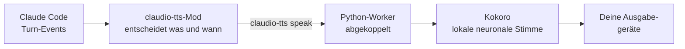

<div align="center">

<sub>🌍 [English (US)](README.md) · [Italiano](README.it.md) · [Polski](README.pl.md) · [Français](README.fr.md) · **Deutsch** · [日本語](README.ja.md) · [简体中文](README.zh-CN.md) · [हिन्दी](README.hi.md) · [Русский](README.ru.md) · [Español](README.es.md) · [Português](README.pt-BR.md)</sub>

# 🔊 claudio-tts

### Gib Claude Code eine Stimme. Lokal. Kostenlos. Ohne einen einzigen Token.

Natürlich gesprochene Antworten für [Claude Code](https://claude.com/claude-code), angetrieben vom Open-Source-Sprachmodell
**[Kokoro](https://huggingface.co/hexgrad/Kokoro-82M)** und gebaut auf dem neuen
**Mod-System** von Claude Code. Kein API-Schlüssel, kein Konto, keine Kosten pro Wort, und dein Text verlässt nie deinen Rechner.

[](https://github.com/restante/claudio-tts/actions/workflows/ci.yml)
[](https://github.com/restante/claudio-tts/releases)
[](LICENSE)


[](CONTRIBUTING.md)



<sub>Eine echte Aufnahme der echten Befehle. Ein GIF kann keinen Ton transportieren, also
<a href="#-die-stimmen-anhören">hör dir unten die Hörproben an</a>. Du kannst es jederzeit neu aufnehmen mit
<code>scripts/make-demo.sh</code>.</sub>

**[Installation](#-installation) · [Stimmen](#%EF%B8%8F-stimmen) · [Befehle](#-befehle) · [Warum Kokoro](#-warum-kokoro-keine-tokens-keine-apis-keine-rechnung) · [Mods](#-auf-claude-code-mods-aufgebaut) · [Mitmachen](#-mitmachen) · [Fehler melden](#-fehler-melden)**

</div>

---

## ✨ Highlights

- 🎧 **Hör Claude zu, während du etwas anderes machst.** Lies einen Diff, hol dir einen Kaffee, gönn deinen Augen eine Pause. Claudes Antworten
  und die Erzählung vor jedem Tool-Aufruf werden vorgelesen, sobald sie eintreffen.
- 🆓 **Für immer kostenlos, keine Tokens, keine APIs.** Die Sprache wird auf deinem eigenen Rechner erzeugt. Du musst dich
  nirgends anmelden und für nichts bezahlen.
- 🔒 **Privat und offline.** Nach dem einmaligen Download des Modells funktioniert alles ohne Internet. Dein Code und deine
  Gespräche werden nirgendwohin geschickt, um vertont zu werden.
- 🎯 **Immer die neueste Antwort.** claudio-tts hört auf die eigenen Turn-Events von Claude Code, statt die Transkriptdatei
  auszulesen. So liest es nie die Nachricht *vor* der, die du gerade bekommen hast.
- 🧑‍🤝‍🧑 **Gemacht für viele Sessions.** Stummschaltung gilt pro Session, neue Sessions starten stumm, Sessions kommen der Reihe nach dran, statt
  durcheinanderzureden, und jede stoppt immer nur *ihre eigene* Stimme.
- 🗣️ **54 Stimmen, 9 Sprachen.** Wechsle die Stimme mit einem Befehl: `/tts voice af_heart`.
- 🔈 **Deine Lautsprecher, deine Regeln.** Lautstärke, Tempo und Ausgabegerät (eins, mehrere oder alle gleichzeitig).
- 🩺 **Leicht zu unterstützen.** `claudio-tts doctor --report` schreibt einen fertigen Fehlerbericht zum Einfügen.

---

## 🧩 Auf Claude-Code-Mods aufgebaut

claudio-tts basiert auf dem neuen **Mod-System** in Claude Code und nicht auf den älteren Hooks, die bei jedem
Ereignis ein Shell-Skript ausführen. Ein Mod ist ein kleines Plugin aus typisierten Funktionen, das *innerhalb* von Claude Code läuft, in Echtzeit sieht, was das Modell
gerade tut, Befehle und Statuszeilen-Einträge hinzufügen kann und sich während der Arbeit automatisch neu lädt. Genau das braucht
eine gute Stimme:

| Mod-Funktion | Was claudio-tts damit macht |
| --- | --- |
| **Turn-Events** (`turn.complete`, `turn.step`, `turn.start`, `session.end`) | Erhält den Endtext des Modells und die Erzählung vor Tool-Aufrufen *direkt im Event*, ist also nie eine Antwort im Rückstand und muss nie eine Transkriptdatei neu einlesen |
| **Zustand pro Session** | Jede Session merkt sich ihren eigenen Stummschalter, damit aus zehn offenen Sessions nicht zehn Stimmen werden |
| **Persistenter Mod-Speicher** | Lautstärke, Tempo, Stimme und Ausgabegerät überleben Neustarts |
| **Registrierung von Slash-Befehlen** | Fügt `/tts` mit allem Folgenden direkt in Claude Code hinzu |
| **Statuszeile** | Zeigt `TTS on` oder `TTS muted` für die Session, die du gerade ansiehst |
| **Process-API** | Übergibt den Text an die lokale Sprach-Engine, ohne Claude je zu blockieren |
| **Typisierter Vertrag und Tooling** | Liefert einen Typ-Vertrag mit und wird mit `claude plugin validate` und `claude plugin test` geprüft |
| **Hot Reload** | Ändere den Mod, und er lädt sich neu, ganz ohne Neustart während der Entwicklung |

Der Mod selbst ist eine dünne TypeScript-Schicht ([`src/claudio_tts/mod`](src/claudio_tts/mod)). Die Audioarbeit steckt in
einem kleinen Python-Paket, sodass macOS und Windows denselben Codepfad nutzen.

---

## 🚀 Installation

Du brauchst [Claude Code](https://claude.com/claude-code). Der Installer erledigt alles andere, einschließlich Python,
der Abhängigkeiten und des Sprachmodells.

**macOS**

```bash
curl -fsSL https://raw.githubusercontent.com/restante/claudio-tts/main/install.sh | bash
```

**Windows** (PowerShell, Beta)

```powershell
irm https://raw.githubusercontent.com/restante/claudio-tts/main/install.ps1 | iex
```

Dann **starte Claude Code neu** und gib in einer Session ein:

```text
/tts unmute
```

Das war's. Schick eine Nachricht und hör zu. 🎉 (Neue Sessions starten absichtlich stumm, siehe
[viele Sessions](#-viele-sessions-ein-paar-ohren).)

<details>
<summary><b>Was macht der Installer eigentlich?</b></summary>

1. Installiert [`uv`](https://docs.astral.sh/uv/), falls du es noch nicht hast. `uv` lädt außerdem ein privates Python 3.12 herunter,
   du brauchst also kein eigenes Python.
2. Legt eine isolierte Umgebung an (macOS: `~/Library/Application Support/claudio-tts`,
   Windows: `%LOCALAPPDATA%\claudio-tts`) und installiert dieses Paket samt Abhängigkeiten darin.
3. Lädt das Kokoro-Modell herunter (326 MB, oder 92 MB mit `--lite`) und **prüft seine SHA-256-Prüfsumme**.
4. Kopiert den Claude-Code-Mod nach `~/.claude/mods/claudio-tts` und registriert ihn in `~/.claude/settings.json`.
   Deine Einstellungen werden nach `settings.json.claudio-tts.bak` gesichert und zusammengeführt, nie überschrieben.
5. Führt `doctor` aus, um Modell, Audiogeräte und Claude Code zu prüfen.

Du kannst den Installer jederzeit gefahrlos erneut ausführen: Er aktualisiert nur, und nichts wird doppelt angelegt.
</details>

<details>
<summary><b>Installer-Optionen</b></summary>

| macOS / Linux (`bash -s -- …`) | Windows (`-…`) | Wirkung |
| --- | --- | --- |
| `--lite` | `-Lite` | Kleineres 92-MB-Modell (etwas weniger natürlich, dafür schneller geladen und ausgeführt) |
| `--no-model` | `-NoModel` | Den Modell-Download überspringen |
| `--ref <ref>` | `-Ref <ref>` | Einen Branch, Tag oder Commit installieren |
| `--uninstall` | `-Uninstall` | Alles entfernen (mit `--keep-models` / `-KeepModels` behältst du die Stimmdateien) |
| `--local` | `-Local` | Aus dem Checkout installieren, in dem du gerade stehst |

Mit PowerShells `irm | iex` kannst du keine Schalter übergeben. Setze vorher `CLAUDIO_TTS_LITE=1`, `CLAUDIO_TTS_NO_MODEL=1`,
`CLAUDIO_TTS_REF=<ref>` oder `CLAUDIO_TTS_UNINSTALL=1`, oder nutze
`& ([scriptblock]::Create((irm <url>))) -Lite`.
</details>

---

## 🎮 Befehle

Alles ist ein einziger Slash-Befehl innerhalb von Claude Code:

| Befehl | Was er macht |
| --- | --- |
| `/tts` | Sprachausgabe **für diese Session** umschalten |
| `/tts mute` · `/tts unmute` | Nur für diese Session aus- / einschalten |
| `/tts status` | Stummschaltung, Lautstärke, Tempo, Stimme und Ausgabe anzeigen |
| `/tts default on` · `/tts default off` | Ob **neue** Sessions sprechen (`off` = stumm starten, der Standard) |
| `/tts voice` | Alle Stimmen auflisten und die aktuelle anzeigen |
| `/tts voice af_heart` | Die Stimme wechseln (sie sagt in der neuen Stimme hallo). `/tts voice default` setzt sie zurück |
| `/tts lang de` · `/tts lang auto` | Die Stimme eine andere Sprache vorlesen lassen (eine von 140) oder zurück zu ihrer eigenen |
| `/tts volume 1-10` | Lautstärke, gilt für alle Sessions. `/tts volume` zeigt sie an |
| `/tts speed 0.5-1.5` | Sprechtempo (1 ist normal). `/tts pace` ist ein Alias |
| `/tts device` | Ausgabegeräte auflisten und die aktuelle Wahl anzeigen |
| `/tts device airpods` | Auf einem Gerät sprechen (Teilnamen funktionieren) |
| `/tts device airpods,macbook` | …auf mehreren Geräten **gleichzeitig** |
| `/tts device all` | …auf jedem echten Ausgang (virtuelle Geräte wie Zoom und Teams werden übersprungen) |
| `/tts device default` | Zurück zum Systemstandard |
| `/tts mic` | Mikrofone auflisten; `/tts mic <name>` speichert eine Vorliebe |

So sieht das in einer Session aus:

```text
> /tts unmute
claudio-tts: TTS on (this session), volume 10/10, speed 1, voice default, output default

> /tts voice bf_emma
claudio-tts: Voice: bf_emma

> /tts speed 0.9
claudio-tts: TTS speed 0.9
```

Lautstärke, Tempo, Stimme und Gerät beschreiben *dein Setup*, deshalb gelten sie für alle. Stummschaltung beschreibt *ein Gespräch*, deshalb
gilt sie pro Session.

---

## 🗣️ Stimmen

Kokoro liefert **54 Stimmen in 9 Sprachen**. Wähle eine mit `/tts voice <name>` oder liste alle mit `/tts voice` auf
(oder mit `claudio-tts voices` im Terminal). Der erste Buchstabe eines Stimmnamens steht für die Sprache, der zweite für das
Geschlecht, und **claudio-tts wählt anhand des Namens automatisch die richtige Sprache**.

> **Das sind Beispiele, keine Grenzen.** Du kannst jede Stimme nutzen, die Kokoro unterstützt, eigene Stimmdateien hinzufügen,
> und eine Stimme kann Text in 140 Sprachen vorlesen (siehe [Beliebige andere Stimmen oder Sprachen nutzen](#-beliebige-andere-stimmen-oder-sprachen-nutzen)).

| | Sprache | Weiblich | Männlich |
| --- | --- | --- | --- |
| 🇺🇸 | Amerikanisches Englisch | `af_alloy` `af_aoede` `af_bella` `af_heart` `af_jessica` `af_kore` `af_nicole` `af_nova` `af_river` `af_sarah` `af_sky` | `am_adam` `am_echo` `am_eric` `am_fenrir` `am_liam` `am_michael` `am_onyx` `am_puck` `am_santa` |
| 🇬🇧 | Britisches Englisch | `bf_alice` `bf_emma` `bf_isabella` `bf_lily` | `bm_daniel` `bm_fable` `bm_george` `bm_lewis` |
| 🇪🇸 | Spanisch | `ef_dora` | `em_alex` `em_santa` |
| 🇫🇷 | Französisch | `ff_siwis` | |
| 🇮🇳 | Hindi | `hf_alpha` `hf_beta` | `hm_omega` `hm_psi` |
| 🇮🇹 | Italienisch | `if_sara` | `im_nicola` |
| 🇯🇵 | Japanisch | `jf_alpha` `jf_gongitsune` `jf_nezumi` `jf_tebukuro` | `jm_kumo` |
| 🇧🇷 | Brasilianisches Portugiesisch | `pf_dora` | `pm_alex` `pm_santa` |
| 🇨🇳 | Mandarin-Chinesisch | `zf_xiaobei` `zf_xiaoni` `zf_xiaoxiao` `zf_xiaoyi` | `zm_yunjian` `zm_yunxi` `zm_yunxia` `zm_yunyang` |

> **Deutsch, Polnisch und Russisch:** Kokoro hat bisher keine muttersprachlichen deutschen, polnischen oder russischen Stimmen. Der Installer, die
> Befehle und diese Dokumentation gibt es in allen drei Sprachen vollständig (siehe die Links ganz oben), aber die gesprochene Stimme ist eine
> englische oder eine Stimme einer anderen Sprache, die deinen Text mit deutlich hörbarem Akzent vorliest. Für deutsche Texte klingt das also
> hörbar akzentuiert. Unser Tipp: Probier für technische Antworten auf Deutsch eine englische Stimme wie `af_heart` aus. Sie klingt am
> natürlichsten, und Fachbegriffe und Code-Wörter bleiben meist gut verständlich. Hör es dir direkt an mit
> `claudio-tts say "…" --voice af_heart --lang de` (oder `pl`, `ru`). Falls Kokoro diese Stimmen irgendwann ergänzt, übernimmt
> claudio-tts sie über denselben Befehl `/tts voice`.

### 🎧 Die Stimmen anhören

**[▶ Öffne den Stimm-Player](https://restante.github.io/claudio-tts/)**, um dir alle 54 Stimmen direkt im
Browser anzuhören, mit Play-Buttons zum Draufklicken. (GitHub kann in einer README kein Audio abspielen, deshalb
liegt der Player auf einer kleinen Webseite.) Oder klick unten auf einen Namen, um direkt zu ihm zu springen. Die Hörproben wurden von Kokoro selbst erzeugt.

| Stimme | Anhören | Stimme | Anhören |
| --- | --- | --- | --- |
| `af_heart` ⭐ | [▶ anhören](https://restante.github.io/claudio-tts/#af_heart) | `bf_emma` | [▶ anhören](https://restante.github.io/claudio-tts/#bf_emma) |
| `af_bella` ⭐ | [▶ anhören](https://restante.github.io/claudio-tts/#af_bella) | `bf_isabella` | [▶ anhören](https://restante.github.io/claudio-tts/#bf_isabella) |
| `af_nicole` | [▶ anhören](https://restante.github.io/claudio-tts/#af_nicole) | `bm_george` | [▶ anhören](https://restante.github.io/claudio-tts/#bm_george) |
| `af_sarah` | [▶ anhören](https://restante.github.io/claudio-tts/#af_sarah) | `bm_fable` | [▶ anhören](https://restante.github.io/claudio-tts/#bm_fable) |
| `af_sky` | [▶ anhören](https://restante.github.io/claudio-tts/#af_sky) | `ef_dora` 🇪🇸 | [▶ anhören](https://restante.github.io/claudio-tts/#ef_dora) |
| `am_michael` | [▶ anhören](https://restante.github.io/claudio-tts/#am_michael) | `ff_siwis` 🇫🇷 | [▶ anhören](https://restante.github.io/claudio-tts/#ff_siwis) |
| `am_fenrir` | [▶ anhören](https://restante.github.io/claudio-tts/#am_fenrir) | `if_sara` 🇮🇹 | [▶ anhören](https://restante.github.io/claudio-tts/#if_sara) |
| `am_puck` | [▶ anhören](https://restante.github.io/claudio-tts/#am_puck) | `jf_alpha` 🇯🇵 | [▶ anhören](https://restante.github.io/claudio-tts/#jf_alpha) |
| `hf_alpha` 🇮🇳 | [▶ anhören](https://restante.github.io/claudio-tts/#hf_alpha) | `zf_xiaoxiao` 🇨🇳 | [▶ anhören](https://restante.github.io/claudio-tts/#zf_xiaoxiao) |
| `pf_dora` 🇧🇷 | [▶ anhören](https://restante.github.io/claudio-tts/#pf_dora) | | |

⭐ `af_heart` und `af_bella` gelten allgemein als die natürlichsten englischen Stimmen. Fang am besten dort an.

### Tipps

- **Stimme und Text sollten zusammenpassen.** Eine spanische Stimme, die Englisch vorliest, klingt merkwürdig, denn die Stimme
  bestimmt, wie der Text ausgesprochen wird. Wenn du mit Claude auf Spanisch chattest, nimm `ef_dora` oder `em_alex`.
- **Lege einen Standard für jede Session fest**, ganz ohne Befehl: Trag `"KOKORO_VOICE": "bf_emma"` in den `env`-Block von
  `~/.claude/settings.json` ein. `/tts voice` überschreibt ihn, und `/tts voice default` kehrt zu ihm zurück.
- **Zu schnell, zu langsam?** `/tts speed 0.85` bremst, `/tts speed 1.2` beschleunigt.
- **Soll es leiser sein?** `/tts volume 4`. Die Lautstärke wird pro Hörprobe angewendet und ändert deine Systemlautstärke nicht.
- Der erste Satz einer Session kann einen Moment dauern, während das Modell lädt; die folgenden kommen schnell. Das `--lite`-Modell
  startet schneller und braucht weniger Speicher.

### 🔧 Beliebige andere Stimmen oder Sprachen nutzen

Die 54 eingebauten Stimmen und 9 Muttersprachen sind nur das, was serienmäßig dabei ist:

```text
/tts voice af_mix                # a voice you added (a .npy file in the voices folder)
/tts lang de                     # read German (or any of 140 languages) through the current voice
/tts lang auto                   # back to the voice's own language
```

```json
{ "env": { "CLAUDIO_TTS_MODEL": "/path/to/model.onnx", "CLAUDIO_TTS_VOICES": "/path/to/voices.bin" } }
```

- **Eigene Stimme hinzufügen**: Speichere einen Kokoro-Stilvektor als `voices/<name>.npy` im Installationsordner, und `<name>`
  erscheint in `/tts voice`. Du kannst sogar zwei Stimmen zu einer neuen mischen.
- **Ein anderes Kokoro-Modell oder Stimmenpaket verwenden** (ein neueres Release, ein Community-Paket): Setze die beiden oben gezeigten
  Umgebungsvariablen in `~/.claude/settings.json`.
- **Jede Sprache vorlesen**: `/tts lang <code>` lässt die aktuelle Stimme diese Sprache vorlesen (140 Codes, siehe
  `claudio-tts languages`). Sprachen ohne muttersprachliche Stimme werden mit Akzent gelesen. Für Deutsch gibt es `/tts lang de`: Die aktuelle
  Stimme liest dann deutschen Text vor, hörbar mit Akzent.

Schritt für Schritt, mit einem Misch-Skript: **[docs/voices.md](docs/voices.md)**.

---

## 🆓 Warum Kokoro? Keine Tokens, keine APIs, keine Rechnung

Die meisten „Lass es sprechen"-Lösungen schicken jede Antwort an einen Cloud-Text-to-Speech-Dienst. claudio-tts nicht. Es betreibt
**[Kokoro](https://huggingface.co/hexgrad/Kokoro-82M)**, ein kleines Sprachmodell mit offenen Gewichten, auf deiner eigenen CPU.

| | ☁️ Cloud-Text-to-Speech | 🔊 claudio-tts + Kokoro |
| --- | --- | --- |
| **API-Schlüssel / Konto** | Erforderlich | **Keins** |
| **Kosten** | Pro Zeichen oder pro Minute, für immer | **Kostenlos** |
| **Verbrauchte Claude-Tokens** | Oft zusätzliche, wenn ein Modell das Skript schreibt | **Null zusätzliche** (siehe Hinweis) |
| **Datenschutz** | Deine Antworten gehen an einen Dritten | **Nichts verlässt deinen Rechner** |
| **Offline** | Nein | **Ja** (nach dem einmaligen Download) |
| **Latenz** | Netzwerk-Roundtrip plus Warteschlange | **Fängt an zu sprechen, sobald der erste Satz fertig ist** |
| **Rate Limits / Ausfälle** | Ja | **Keine** |
| **Lizenz** | Nutzungsbedingungen | **Apache-2.0-Modell, MIT-Code** |
| **Größe** | k. A. | 326 MB (92 MB mit `--lite`) |

> **Ehrliche Hinweise.** Der einmalige Modell-Download umfasst 326 MB. Die Spracherzeugung beansprucht beim Sprechen etwas CPU. Die
> allerbesten kostenpflichtigen Cloud-Stimmen können voller klingen als Kokoro, aber Kokoro ist für ein so kleines Modell
> bemerkenswert natürlich. Und die *optionale* [gesprochene Zusammenfassung](#%EF%B8%8F-lass-es-weniger-sprechen-die-optionale-gesprochene-zusammenfassung) bittet Claude,
> pro Antwort ein bis zwei zusätzliche Sätze zu schreiben, was eine Handvoll Output-Tokens kostet, aber nur, wenn du sie einschaltest.
> Ohne sie liest claudio-tts Text vor, den Claude ohnehin geschrieben hat, und verbraucht **überhaupt keine zusätzlichen Tokens**.

---

## 🧑‍🤝‍🧑 Viele Sessions, ein Paar Ohren



- Neue Sessions **starten stumm**. Schalte nur die ein, die du gerade beobachtest (`/tts unmute`), oder nutze
  `/tts default on`, wenn lieber alle gleich sprechen sollen.
- Wenn zwei nicht stummgeschaltete Sessions gleichzeitig antworten, **wartet die zweite, bis sie dran ist**, statt die erste abzuwürgen.
- Wenn du einen Prompt abschickst oder stummschaltest, stoppt das **nur die Stimme dieser Session**.

## ✂️ Lass es *weniger* sprechen: die optionale gesprochene Zusammenfassung

Lange Antworten sind anstrengend zum Zuhören. Wenn eine Antwort einen Zusammenfassungsblock enthält, liest claudio-tts **nur diesen Block**
vor und überspringt den Rest. Füg etwas wie das hier in deine `CLAUDE.md` ein, und Claude schreibt jedes Mal einen:

```markdown
At the END of EVERY response add a short, conversational summary for text-to-speech, in this exact form.
Avoid URLs, file paths, code and variable names.

<!-- TTS_SUMMARY Zwei oder drei einfache Sätze zum Ergebnis. TTS_SUMMARY -->
```

Kein Block? Dann liest es die ganze Antwort vor, wobei Markdown, Codeblöcke, Links und Emoji bereinigt werden, damit es natürlich klingt.

---

## 🛠️ So funktioniert es



Der Mod lauscht auf den Text und die Tool-Aufrufe des Modells, verfolgt die Stummschaltung pro Session und übergibt Text an den
Befehl `claudio-tts`. Die gesamte betriebssystemspezifische Arbeit (Audio, Prozesssteuerung, Sperren, das Leiserdrehen deiner Musik beim Sprechen) steckt im
Python-Paket, sodass macOS und Windows einen gemeinsamen Codepfad nutzen. Details in [docs/how-it-works.md](docs/how-it-works.md).

## ⚙️ Konfiguration

Umgebungsvariablen (trag sie in den `env`-Block von `~/.claude/settings.json` ein):

| Variable | Standard | Bedeutung |
| --- | --- | --- |
| `KOKORO_VOICE` | `af_sky` | Standardstimme für jede Session (siehe [Stimmen](#%EF%B8%8F-stimmen)) |
| `CLAUDIO_TTS_MODEL`, `CLAUDIO_TTS_VOICES` | eingebaut | Ein anderes Kokoro-Modell / Stimmenpaket verwenden (beide erforderlich) |
| `AUDIO_DUCK_ENABLED` | `true` | Apple Music / Spotify beim Sprechen leiser stellen (nur macOS) |
| `DUCK_LEVEL` | `5` | Prozent der ursprünglichen Musiklautstärke, auf die abgesenkt wird |
| `CLAUDIO_TTS_HOME` | je nach OS | Wo die Installation liegt |

## 💻 Kommandozeile

Das Paket installiert außerdem einen Befehl `claudio-tts` (in seiner privaten Umgebung):

```text
claudio-tts say "Hello there" --voice bf_emma   speak now and wait
claudio-tts voices                              list all voices (the 54 built-in plus yours)
claudio-tts languages                           list the 140 languages a voice can read
claudio-tts devices [--inputs]                  list audio devices
claudio-tts doctor [--speak | --report]         check the install, or write a bug report
claudio-tts download-model [--lite]             fetch and verify the voice files
claudio-tts install-mod / uninstall-mod
```

## 🖥️ Plattform-Unterstützung

| | Status |
| --- | --- |
| **macOS** (Apple Silicon und Intel) | ✅ Unterstützt und getestet, einschließlich Musik-Ducking |
| **Windows 10/11** | 🧪 **Beta.** In der CI getestet; Feedback mit echtem Audio ist willkommen. Noch kein Musik-Ducking |
| **Linux** | 🤷 Nach bestem Bemühen, auf echter Hardware nicht getestet |

---

## 🐞 Fehler melden

Etwas Seltsames entdeckt? Das ist wirklich hilfreich, danke dir.

1. Führe das hier aus und kopiere die Ausgabe:

   ```bash
   claudio-tts doctor --report
   ```

   (Wenn `claudio-tts` nicht in deinem PATH liegt, nimm den vollständigen Pfad, den der Installer ausgegeben hat und der auf
   `python -m claudio_tts doctor --report` endet.) Der Bericht enthält dein Betriebssystem, Versionen und Gerätenamen, aber **niemals** etwas,
   das du hast sprechen lassen, und keine Geheimnisse.
2. [**Eröffne einen Fehlerbericht**](https://github.com/restante/claudio-tts/issues/new?template=bug_report.yml) und füg ihn
   ein. Schreib dazu, was du erwartet hast und was passiert ist.

Schnelle Lösungen findest du in [docs/troubleshooting.md](docs/troubleshooting.md) und [docs/windows.md](docs/windows.md). Der
häufigste Fall: **Stille bedeutet meistens, dass die Session noch stummgeschaltet ist**, gib also `/tts unmute` ein.

## 🤝 Mitmachen

**Mitwirkende sind herzlich willkommen.** Das hier hat als Wochenendprojekt einer einzelnen Person angefangen, und es wird besser, je mehr
Leute mitmachen: mehr getestete Stimmen, mehr abgedeckte Plattformen, mehr Ideen.

Gute Einstiegspunkte:

- 🪟 **Windows**: Probier es auf echter Hardware aus, berichte, was du hörst, oder baue Musik-Ducking (Lautstärke pro App).
- 🐧 **Linux**: Poliere und teste den Installer auf deiner Distribution.
- 🎛️ **Stimmen mischen und Vorschauen**: Mische zwei Stimmen oder hör in eine Stimme hinein, bevor du dich entscheidest.
- 📦 **Paketierung**: `pipx`, Homebrew, winget.
- 🌍 **Sprachen**: Besseres Vorlesen von Code, Zahlen und gemischtsprachigem Text.
- 📚 **Doku und Demos**: Bessere GIFs, Übersetzungen, Tutorials.

Halte Ausschau nach [`good first issue`](https://github.com/restante/claudio-tts/labels/good%20first%20issue) und
[`help wanted`](https://github.com/restante/claudio-tts/labels/help%20wanted), und lies
[CONTRIBUTING.md](CONTRIBUTING.md), um in fünf Minuten startklar zu sein.

**Möchtest du erst reden?** [Starte eine Diskussion](https://github.com/restante/claudio-tts/discussions) oder erreich mich
über mein GitHub-Profil, [@restante](https://github.com/restante). Ideen, Fragen, „Ich hab es auf X ausprobiert und…"-Geschichten
und Hilfsangebote sind alle willkommen. Und wenn claudio-tts dir den Tag verschönert hat, hilft ein ⭐ anderen, es zu finden.

## 🗺️ Roadmap

- [ ] Musik-Ducking unter Windows
- [ ] Stimmen mischen (`/tts voice af_heart+am_adam`)
- [ ] Installation per `pipx` / Homebrew / winget
- [ ] Klügeres Vorlesen von Code, Pfaden und Zahlen
- [ ] Eine Auswahl mit Stimmvorschau

## 🗑️ Deinstallation

```bash
curl -fsSL https://raw.githubusercontent.com/restante/claudio-tts/main/install.sh | bash -s -- --uninstall
```

(Windows: `$env:CLAUDIO_TTS_UNINSTALL=1; irm …/install.ps1 | iex`.) Deine `settings.json` wird so wiederhergestellt, wie sie war.

## 🧑‍💻 Entwickeln

```bash
git clone https://github.com/restante/claudio-tts && cd claudio-tts
bash install.sh --dev          # editable install, mod symlinked from src/claudio_tts/mod
.venv/bin/pytest               # or: uv venv && uv pip install -e ".[dev]" && pytest
```

Wenn Claude Code installiert ist, prüfe den Mod mit `claude plugin validate src/claudio_tts/mod` und
`claude plugin test src/claudio_tts/mod`.

## 🙏 Danksagung

- [Kokoro-82M](https://huggingface.co/hexgrad/Kokoro-82M) von hexgrad (Apache-2.0), ausgeführt über
  [kokoro-onnx](https://github.com/thewh1teagle/kokoro-onnx) von thewh1teagle (MIT).
- Die Idee, Claude Code zu vertonen, stammt von [ktaletsk/claude-code-tts](https://github.com/ktaletsk/claude-code-tts).
  claudio-tts ist eine frische Implementierung auf dem Mod-System von Claude Code und teilt keinen Code damit.
- Mein Freund [Donato Antonini](https://www.linkedin.com/in/donato-antonini-47b18a48/), für das Brainstorming und die Idee.

## 📄 Lizenz

[MIT](LICENSE) © 2026 Claudio Restante
