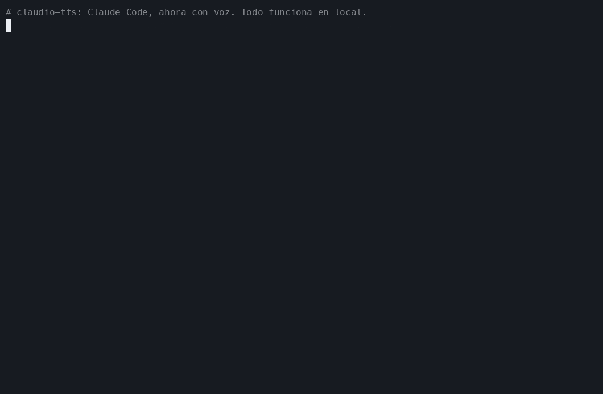
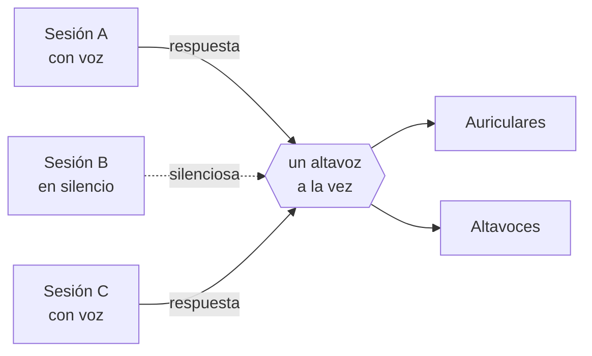
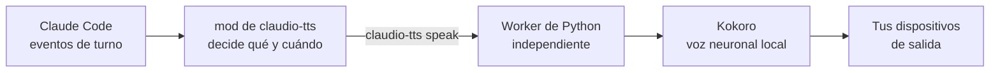

<div align="center">

<sub>🌍 [English (US)](README.md) · [Italiano](README.it.md) · [Polski](README.pl.md) · [Français](README.fr.md) · [Deutsch](README.de.md) · [日本語](README.ja.md) · [简体中文](README.zh-CN.md) · [हिन्दी](README.hi.md) · [Русский](README.ru.md) · **Español** · [Português](README.pt-BR.md)</sub>

# 🔊 claudio-tts

### Dale voz a Claude Code. En local. Gratis. Con cero tokens.

Respuestas habladas y naturales para [Claude Code](https://claude.com/claude-code), con el modelo de voz de código
abierto **[Kokoro](https://huggingface.co/hexgrad/Kokoro-82M)** y construidas sobre el nuevo
**sistema de mods** de Claude Code. Sin clave de API, sin cuenta, sin coste por palabra, y tu texto nunca sale de tu equipo.

[](https://github.com/restante/claudio-tts/actions/workflows/ci.yml)
[](https://github.com/restante/claudio-tts/releases)
[](LICENSE)


[](CONTRIBUTING.md)



<sub>Una grabación real de los comandos reales. Un GIF no puede llevar sonido, así que
<a href="#-escucha-las-voces">escucha las muestras</a> más abajo. Puedes volver a grabarla cuando quieras con
<code>scripts/make-demo.sh</code>.</sub>

**[Instala](#-instala) · [Voces](#%EF%B8%8F-voces) · [Comandos](#-comandos) · [Por qué Kokoro](#-por-qué-kokoro-sin-tokens-sin-apis-sin-factura) · [Mods](#-construido-sobre-los-mods-de-claude-code) · [Contribuye](#-contribuye) · [Informa de un bug](#-informa-de-un-bug)**

</div>

---

## ✨ Lo más destacado

- 🎧 **Escucha a Claude mientras haces otra cosa.** Lee un diff, prepárate un café, descansa la vista. Las respuestas de
  Claude, y la narración antes de cada llamada a una herramienta, se leen en voz alta según llegan.
- 🆓 **Gratis para siempre, sin tokens, sin APIs.** La voz se genera en tu propio ordenador. No hay nada a lo que
  registrarse ni nada que pagar.
- 🔒 **Privado y sin conexión.** Tras la descarga única del modelo, funciona sin internet. Tu código y tus
  conversaciones nunca se envían a ningún sitio para que los lean en voz alta.
- 🎯 **Siempre la última respuesta.** Escucha los eventos de turno de Claude Code en lugar de rebuscar en el archivo de
  la transcripción, así que nunca puede leer el mensaje *anterior* al que acabas de recibir.
- 🧑‍🤝‍🧑 **Pensado para muchas sesiones.** El silencio es por sesión, las sesiones nuevas empiezan en silencio, las
  sesiones se turnan en lugar de pisarse al hablar, y cada una solo detiene *su propia* voz.
- 🗣️ **54 voces, 9 idiomas.** Cambia de voz con un solo comando: `/tts voice af_heart`.
- 🔈 **Tus altavoces, tus reglas.** Volumen, velocidad y dispositivo de salida (uno, varios o todos a la vez).
- 🩺 **Fácil de dar soporte.** `claudio-tts doctor --report` escribe un informe de bug listo para pegar.

---

## 🧩 Construido sobre los mods de Claude Code

claudio-tts está construido sobre el nuevo **sistema de mods** de Claude Code, no sobre los antiguos hooks de "ejecuta
un script de shell en cada evento". Un mod es un pequeño plugin de funciones tipadas que se ejecuta *dentro* de Claude
Code, ve lo que hace el modelo mientras ocurre, puede añadir comandos y entradas a la línea de estado, y se recarga en
caliente mientras trabajas. Justo lo que necesita una buena voz:

| Función del mod | Qué hace claudio-tts con ella |
| --- | --- |
| **Eventos de turno** (`turn.complete`, `turn.step`, `turn.start`, `session.end`) | Recibe el texto final del modelo y la narración previa a las llamadas a herramientas *directamente en el evento*, así que nunca va una respuesta por detrás y nunca tiene que releer un archivo de transcripción |
| **Estado por sesión** | Cada sesión recuerda su propio interruptor de silencio, así que diez sesiones abiertas no se convierten en diez voces |
| **Almacén persistente del mod** | El volumen, la velocidad, la voz y el dispositivo de salida sobreviven a los reinicios |
| **Registro de comandos con barra** | Añade `/tts` con todo lo de abajo, directamente dentro de Claude Code |
| **Línea de estado** | Muestra `TTS on` o `TTS muted` para la sesión que estás mirando |
| **API de procesos** | Entrega el texto al motor de voz local sin bloquear nunca a Claude |
| **Contrato tipado y herramientas** | Incluye un contrato de tipos y se comprueba con `claude plugin validate` y `claude plugin test` |
| **Recarga en caliente** | Edita el mod y se recarga, sin reiniciar mientras desarrollas |

El mod en sí es una capa fina de TypeScript ([`src/claudio_tts/mod`](src/claudio_tts/mod)). El trabajo de audio vive
en un pequeño paquete de Python, para que macOS y Windows compartan un único camino de código.

---

## 🚀 Instala

Necesitas [Claude Code](https://claude.com/claude-code). El instalador se encarga del resto, incluidos Python,
las dependencias y el modelo de voz.

**macOS**

```bash
curl -fsSL https://raw.githubusercontent.com/restante/claudio-tts/main/install.sh | bash
```

**Windows** (PowerShell, beta)

```powershell
irm https://raw.githubusercontent.com/restante/claudio-tts/main/install.ps1 | iex
```

Después **reinicia Claude Code** y, en una sesión:

```text
/tts unmute
```

¡Y listo! Envía un mensaje y escucha. 🎉 (Las sesiones nuevas empiezan en silencio a propósito; mira
[muchas sesiones](#-muchas-sesiones-un-solo-par-de-oídos).)

<details>
<summary><b>¿Qué hace exactamente el instalador?</b></summary>

1. Instala [`uv`](https://docs.astral.sh/uv/) si no lo tienes. `uv` también descarga un Python 3.12 privado,
   así que no necesitas tener Python instalado.
2. Crea un entorno aislado (macOS: `~/Library/Application Support/claudio-tts`,
   Windows: `%LOCALAPPDATA%\claudio-tts`) e instala en él este paquete y sus dependencias.
3. Descarga el modelo Kokoro (326 MB, o 92 MB con `--lite`) y **verifica su suma de comprobación SHA-256**.
4. Copia el mod de Claude Code en `~/.claude/mods/claudio-tts` y lo registra en `~/.claude/settings.json`.
   Tu configuración se respalda en `settings.json.claudio-tts.bak` y se fusiona, nunca se sobrescribe.
5. Ejecuta `doctor` para comprobar el modelo, los dispositivos de audio y Claude Code.

Es seguro volver a ejecutarlo: al repetirlo se actualiza, y no se duplica nada.
</details>

<details>
<summary><b>Opciones del instalador</b></summary>

| macOS / Linux (`bash -s -- …`) | Windows (`-…`) | Efecto |
| --- | --- | --- |
| `--lite` | `-Lite` | Modelo más pequeño de 92 MB (un poco menos natural, más rápido de descargar y de ejecutar) |
| `--no-model` | `-NoModel` | Omite la descarga del modelo |
| `--ref <ref>` | `-Ref <ref>` | Instala una rama, una etiqueta o un commit |
| `--uninstall` | `-Uninstall` | Elimina todo (añade `--keep-models` / `-KeepModels` para conservar los archivos de voz) |
| `--local` | `-Local` | Instala desde la copia del repositorio en la que estás |

Con `irm | iex` de PowerShell no puedes pasar parámetros; define antes `CLAUDIO_TTS_LITE=1`, `CLAUDIO_TTS_NO_MODEL=1`,
`CLAUDIO_TTS_REF=<ref>` o `CLAUDIO_TTS_UNINSTALL=1`, o usa
`& ([scriptblock]::Create((irm <url>))) -Lite`.
</details>

---

## 🎮 Comandos

Todo es un único comando con barra dentro de Claude Code:

| Comando | Qué hace |
| --- | --- |
| `/tts` | Activa o desactiva la voz **para esta sesión** |
| `/tts mute` · `/tts unmute` | La silencia / la activa solo en esta sesión |
| `/tts status` | Muestra el estado de silencio, el volumen, la velocidad, la voz y la salida |
| `/tts default on` · `/tts default off` | Si las sesiones **nuevas** empiezan hablando (`off` = empiezan en silencio, el valor por defecto) |
| `/tts voice` | Lista todas las voces y muestra la actual |
| `/tts voice af_heart` | Cambia la voz (te saluda con la nueva voz). `/tts voice default` la restablece |
| `/tts volume 1-10` | Volumen, compartido por todas las sesiones. `/tts volume` lo muestra |
| `/tts speed 0.5-1.5` | Ritmo al hablar (1 es lo normal). `/tts pace` es un alias |
| `/tts device` | Lista los dispositivos de salida y muestra el elegido |
| `/tts device airpods` | Habla en un dispositivo (valen nombres parciales) |
| `/tts device airpods,macbook` | …en varios dispositivos **a la vez** |
| `/tts device all` | …en todas las salidas reales (se omiten los dispositivos virtuales como Zoom y Teams) |
| `/tts device default` | Vuelve al predeterminado del sistema |
| `/tts lang de` · `/tts lang auto` | Haz que la voz lea otro idioma (cualquiera de 140), o vuelve al suyo propio |
| `/tts mic` | Lista los micrófonos; `/tts mic <name>` guarda una preferencia |

Así se ve en una sesión:

```text
> /tts unmute
claudio-tts: TTS on (this session), volume 10/10, speed 1, voice default, output default

> /tts voice bf_emma
claudio-tts: Voice: bf_emma

> /tts speed 0.9
claudio-tts: TTS speed 0.9
```

El volumen, la velocidad, la voz y el dispositivo describen *tu configuración*, así que se comparten. El silencio
describe *una conversación*, así que es por sesión.

---

## 🗣️ Voces

Kokoro incluye **54 voces en 9 idiomas**. Elige una con `/tts voice <name>`, o lista todas con `/tts voice`
(o `claudio-tts voices` en una terminal). La primera letra del nombre de una voz es su idioma y la segunda es su
género, y **claudio-tts elige el idioma correcto automáticamente** a partir del nombre.

> **Son ejemplos, no límites.** Se puede usar cualquier voz que Kokoro admita, puedes añadir tus propios archivos de
> voz, y una voz puede leer texto en 140 idiomas (mira [Usa cualquier otra voz o idioma](#-usa-cualquier-otra-voz-o-idioma)).

| | Idioma | Femenina | Masculina |
| --- | --- | --- | --- |
| 🇺🇸 | Inglés americano | `af_alloy` `af_aoede` `af_bella` `af_heart` `af_jessica` `af_kore` `af_nicole` `af_nova` `af_river` `af_sarah` `af_sky` | `am_adam` `am_echo` `am_eric` `am_fenrir` `am_liam` `am_michael` `am_onyx` `am_puck` `am_santa` |
| 🇬🇧 | Inglés británico | `bf_alice` `bf_emma` `bf_isabella` `bf_lily` | `bm_daniel` `bm_fable` `bm_george` `bm_lewis` |
| 🇪🇸 | Español | `ef_dora` | `em_alex` `em_santa` |
| 🇫🇷 | Francés | `ff_siwis` | |
| 🇮🇳 | Hindi | `hf_alpha` `hf_beta` | `hm_omega` `hm_psi` |
| 🇮🇹 | Italiano | `if_sara` | `im_nicola` |
| 🇯🇵 | Japonés | `jf_alpha` `jf_gongitsune` `jf_nezumi` `jf_tebukuro` | `jm_kumo` |
| 🇧🇷 | Portugués de Brasil | `pf_dora` | `pm_alex` `pm_santa` |
| 🇨🇳 | Chino mandarín | `zf_xiaobei` `zf_xiaoni` `zf_xiaoxiao` `zf_xiaoyi` | `zm_yunjian` `zm_yunxi` `zm_yunxia` `zm_yunyang` |

> **¡Buenas noticias para quien habla español!** El español es uno de los idiomas **nativos** de Kokoro, con tres
> voces propias: `ef_dora`, `em_alex` y `em_santa`. Si chateas con Claude en español, elige una de ellas y
> escucharás una pronunciación natural, sin acento extranjero. Empieza por la muestra de `ef_dora` más abajo.

> **Alemán, polaco y ruso:** Kokoro todavía no tiene voces nativas de alemán, polaco ni ruso. El instalador, los
> comandos y esta documentación están totalmente disponibles en los tres (mira los enlaces de arriba), pero la voz
> hablada será una de inglés o de otro idioma leyendo tu texto con un acento notable. Prueba
> `claudio-tts say "…" --voice af_heart --lang de` (o `pl`, `ru`) para oírlo. Si Kokoro añade esas voces,
> claudio-tts las incorporará a través del mismo comando `/tts voice`.

### 🎧 Escucha las voces

**[▶ Abre el reproductor de voces](https://restante.github.io/claudio-tts/)** para escuchar las 54 voces directamente
en tu navegador, con botones de reproducción de un clic. (GitHub no puede reproducir audio dentro de un README, así que
el reproductor vive en una pequeña página web.) O haz clic en un nombre de abajo para ir directo a él. Las muestras las
genera el propio Kokoro.

| Voz | Escuchar | Voz | Escuchar |
| --- | --- | --- | --- |
| `af_heart` ⭐ | [▶ escuchar](https://restante.github.io/claudio-tts/#af_heart) | `bf_emma` | [▶ escuchar](https://restante.github.io/claudio-tts/#bf_emma) |
| `af_bella` ⭐ | [▶ escuchar](https://restante.github.io/claudio-tts/#af_bella) | `bf_isabella` | [▶ escuchar](https://restante.github.io/claudio-tts/#bf_isabella) |
| `af_nicole` | [▶ escuchar](https://restante.github.io/claudio-tts/#af_nicole) | `bm_george` | [▶ escuchar](https://restante.github.io/claudio-tts/#bm_george) |
| `af_sarah` | [▶ escuchar](https://restante.github.io/claudio-tts/#af_sarah) | `bm_fable` | [▶ escuchar](https://restante.github.io/claudio-tts/#bm_fable) |
| `af_sky` | [▶ escuchar](https://restante.github.io/claudio-tts/#af_sky) | `ef_dora` 🇪🇸 | [▶ escuchar](https://restante.github.io/claudio-tts/#ef_dora) |
| `am_michael` | [▶ escuchar](https://restante.github.io/claudio-tts/#am_michael) | `ff_siwis` 🇫🇷 | [▶ escuchar](https://restante.github.io/claudio-tts/#ff_siwis) |
| `am_fenrir` | [▶ escuchar](https://restante.github.io/claudio-tts/#am_fenrir) | `if_sara` 🇮🇹 | [▶ escuchar](https://restante.github.io/claudio-tts/#if_sara) |
| `am_puck` | [▶ escuchar](https://restante.github.io/claudio-tts/#am_puck) | `jf_alpha` 🇯🇵 | [▶ escuchar](https://restante.github.io/claudio-tts/#jf_alpha) |
| `hf_alpha` 🇮🇳 | [▶ escuchar](https://restante.github.io/claudio-tts/#hf_alpha) | `zf_xiaoxiao` 🇨🇳 | [▶ escuchar](https://restante.github.io/claudio-tts/#zf_xiaoxiao) |
| `pf_dora` 🇧🇷 | [▶ escuchar](https://restante.github.io/claudio-tts/#pf_dora) | | |

⭐ `af_heart` y `af_bella` se consideran en general las voces de inglés más naturales; empieza por ahí. Para
español, `ef_dora` 🇪🇸 es tu mejor punto de partida.

### Consejos

- **La voz y el texto deben coincidir.** Una voz en español leyendo inglés sonará rara, porque la voz decide cómo se
  pronuncia el texto. Si chateas con Claude en español, elige `ef_dora` o `em_alex`.
- **Define una voz por defecto para todas las sesiones** sin usar un comando: pon `"KOKORO_VOICE": "bf_emma"` en el
  bloque `env` de `~/.claude/settings.json`. `/tts voice` la anula, y `/tts voice default` vuelve a ella.
- **¿Demasiado rápido o demasiado lento?** `/tts speed 0.85` la ralentiza, `/tts speed 1.2` la acelera.
- **¿Quieres que suene más bajo?** `/tts volume 4`. El volumen se aplica a cada muestra, así que no toca el volumen de tu sistema.
- La primera frase de una sesión puede tardar un momento mientras se carga el modelo; las siguientes son rápidas. El
  modelo `--lite` arranca más rápido y usa menos memoria.

### 🔧 Usa cualquier otra voz o idioma

Las 54 voces incluidas y los 9 idiomas nativos son solo lo que viene de serie:

```text
/tts voice af_mix                # a voice you added (a .npy file in the voices folder)
/tts lang de                     # read German (or any of 140 languages) through the current voice
/tts lang auto                   # back to the voice's own language
```

```json
{ "env": { "CLAUDIO_TTS_MODEL": "/path/to/model.onnx", "CLAUDIO_TTS_VOICES": "/path/to/voices.bin" } }
```

- **Añade tu propia voz**: guarda un vector de estilo de Kokoro como `voices/<name>.npy` en la carpeta de instalación,
  y `<name>` aparecerá en `/tts voice`. Incluso puedes mezclar dos voces en una nueva.
- **Usa otro modelo o paquete de voces de Kokoro** (una versión más reciente, un paquete de la comunidad): define las
  dos variables de entorno de arriba en `~/.claude/settings.json`.
- **Lee cualquier idioma**: `/tts lang <code>` hace que la voz actual lea ese idioma (140 códigos, mira
  `claudio-tts languages`). Los idiomas sin voz nativa se leen con acento.

Paso a paso, con un script de mezcla: **[docs/voices.md](docs/voices.md)**.

---

## 🆓 ¿Por qué Kokoro? Sin tokens, sin APIs, sin factura

La mayoría de las soluciones para "hacerlo hablar" envían cada respuesta a un servicio de texto a voz en la nube.
claudio-tts no. Ejecuta **[Kokoro](https://huggingface.co/hexgrad/Kokoro-82M)**, un pequeño modelo de voz de pesos
abiertos, en tu propia CPU.

| | ☁️ Texto a voz en la nube | 🔊 claudio-tts + Kokoro |
| --- | --- | --- |
| **Clave de API / cuenta** | Obligatoria | **Ninguna** |
| **Coste** | Por carácter o por minuto, para siempre | **Gratis** |
| **Tokens de Claude usados** | A menudo extra, si un modelo escribe el guion | **Cero extra** (mira la nota) |
| **Privacidad** | Tus respuestas se envían a un tercero | **Nada sale de tu ordenador** |
| **Sin conexión** | No | **Sí** (tras la descarga única) |
| **Latencia** | Ida y vuelta por la red más colas de espera | **Empieza a hablar en cuanto la primera frase está lista** |
| **Límites de uso / caídas** | Sí | **Ninguno** |
| **Licencia** | Términos de servicio | **Modelo Apache-2.0, código MIT** |
| **Tamaño** | n/d | 326 MB (92 MB con `--lite`) |

> **Notas sinceras.** La descarga única del modelo pesa 326 MB. Generar voz usa algo de CPU mientras habla. Las mejores
> voces de pago en la nube pueden sonar más ricas que Kokoro, pero Kokoro es sorprendentemente natural para un modelo
> tan pequeño. Y el [resumen hablado](#%EF%B8%8F-haz-que-hable-menos-el-resumen-hablado-opcional) *opcional* le pide a
> Claude que escriba una o dos frases extra por respuesta, lo que cuesta un puñado de tokens de salida, solo si lo
> activas. Sin él, claudio-tts lee texto que Claude ya escribió y **no usa ningún token extra**.

---

## 🧑‍🤝‍🧑 Muchas sesiones, un solo par de oídos



- Las sesiones nuevas **empiezan en silencio**. Activa solo la que estás mirando (`/tts unmute`), o ejecuta
  `/tts default on` si prefieres que todas empiecen hablando.
- Si dos sesiones con voz responden a la vez, la segunda **espera su turno** en lugar de cortar a la primera.
- Enviar un prompt, o silenciar, detiene **solo la voz de esa sesión**.

## ✂️ Haz que hable *menos*: el resumen hablado opcional

Las respuestas largas cansan al escucharlas. Si una respuesta contiene un bloque de resumen, claudio-tts lee **solo ese
bloque** y se salta el resto. Añade algo como esto a tu `CLAUDE.md` y Claude escribirá uno cada vez:

```markdown
At the END of EVERY response add a short, conversational summary for text-to-speech, in this exact form.
Avoid URLs, file paths, code and variable names.

<!-- TTS_SUMMARY Two or three plain sentences about the result. TTS_SUMMARY -->
```

¿Sin bloque? Lee la respuesta entera, con el markdown, los bloques de código, los enlaces y los emojis limpiados para que suene natural.

---

## 🛠️ Cómo funciona



El mod escucha el texto del modelo y las llamadas a herramientas, controla el silencio por sesión y entrega el texto al
comando `claudio-tts`. Todo el trabajo específico del sistema operativo (audio, control de procesos, bloqueos, bajar la
música mientras habla) vive en el paquete de Python, así que macOS y Windows comparten un único camino de código.
Detalles en [docs/how-it-works.md](docs/how-it-works.md).

## ⚙️ Configuración

Variables de entorno (ponlas en el bloque `env` de `~/.claude/settings.json`):

| Variable | Por defecto | Significado |
| --- | --- | --- |
| `KOKORO_VOICE` | `af_sky` | Voz por defecto para todas las sesiones (mira [Voces](#%EF%B8%8F-voces)) |
| `AUDIO_DUCK_ENABLED` | `true` | Baja Apple Music / Spotify mientras habla (solo macOS) |
| `DUCK_LEVEL` | `5` | Porcentaje del volumen original de la música al que se baja |
| `CLAUDIO_TTS_HOME` | según el SO | Dónde vive la instalación |
| `CLAUDIO_TTS_MODEL`, `CLAUDIO_TTS_VOICES` | incluidos | Usa otro modelo / paquete de voces de Kokoro (se necesitan ambos) |

## 💻 Línea de comandos

El paquete también instala un comando `claudio-tts` (dentro de su entorno privado):

```text
claudio-tts say "Hello there" --voice bf_emma   speak now and wait
claudio-tts voices                              list all voices (the 54 built-in plus yours)
claudio-tts languages                           list the 140 languages a voice can read
claudio-tts devices [--inputs]                  list audio devices
claudio-tts doctor [--speak | --report]         check the install, or write a bug report
claudio-tts download-model [--lite]             fetch and verify the voice files
claudio-tts install-mod / uninstall-mod
```

## 🖥️ Compatibilidad de plataformas

| | Estado |
| --- | --- |
| **macOS** (Apple silicon e Intel) | ✅ Compatible y probado, incluida la bajada de volumen de la música |
| **Windows 10/11** | 🧪 **Beta.** Probado en CI; se agradece feedback con audio real. Aún sin bajada de volumen de la música |
| **Linux** | 🤷 Mejor esfuerzo, sin probar en hardware real |

---

## 🐞 Informa de un bug

¿Has encontrado algo raro? Eso es muy útil de verdad, gracias.

1. Ejecuta esto y copia la salida:

   ```bash
   claudio-tts doctor --report
   ```

   (Si `claudio-tts` no está en tu PATH, usa la ruta completa que imprimió el instalador, terminada en
   `python -m claudio_tts doctor --report`.) Contiene tu sistema operativo, versiones y nombres de dispositivos, pero
   **nunca** nada de lo que hayas dicho en voz alta ni secretos.
2. [**Abre un informe de bug**](https://github.com/restante/claudio-tts/issues/new?template=bug_report.yml) y pégalo
   ahí. Cuenta qué esperabas y qué pasó.

Las soluciones rápidas están en [docs/troubleshooting.md](docs/troubleshooting.md) y [docs/windows.md](docs/windows.md).
La más habitual: **el silencio suele significar que la sesión sigue silenciada**, así que escribe `/tts unmute`.

## 🤝 Contribuye

**Los colaboradores son muy bienvenidos.** Esto empezó como un proyecto de fin de semana de una sola persona, y mejora
con más gente: más voces probadas, más plataformas cubiertas, más ideas.

Buenos sitios por donde empezar:

- 🪟 **Windows**: pruébalo en hardware real, cuéntanos qué oyes, o crea la bajada de volumen de la música (volumen por aplicación).
- 🐧 **Linux**: pule y prueba el instalador en tu distribución.
- 🎛️ **Mezcla de voces y vistas previas**: mezcla dos voces, o escucha una voz antes de elegirla.
- 📦 **Empaquetado**: `pipx`, Homebrew, winget.
- 🌍 **Idiomas**: mejor lectura de código, números y texto en varios idiomas mezclados.
- 📚 **Documentación y demos**: mejores GIFs, traducciones, tutoriales.

Busca [`good first issue`](https://github.com/restante/claudio-tts/labels/good%20first%20issue) y
[`help wanted`](https://github.com/restante/claudio-tts/labels/help%20wanted), y lee
[CONTRIBUTING.md](CONTRIBUTING.md) para ponerte a punto en cinco minutos.

**¿Prefieres hablar primero?** [Abre una discusión](https://github.com/restante/claudio-tts/discussions) o contacta
conmigo a través de mi perfil de GitHub, [@restante](https://github.com/restante). Ideas, preguntas, historias de "lo
probé en X y…" y ofertas de ayuda son todas bienvenidas. Y si claudio-tts te alegró el día, una ⭐ ayuda a que otros lo encuentren.

## 🗺️ Hoja de ruta

- [ ] Bajada de volumen de la música en Windows
- [ ] Mezcla de voces (`/tts voice af_heart+am_adam`)
- [ ] Instalación con `pipx` / Homebrew / winget
- [ ] Lectura más inteligente de código, rutas y números
- [ ] Un selector con vista previa de voces

## 🗑️ Desinstala

```bash
curl -fsSL https://raw.githubusercontent.com/restante/claudio-tts/main/install.sh | bash -s -- --uninstall
```

(Windows: `$env:CLAUDIO_TTS_UNINSTALL=1; irm …/install.ps1 | iex`.) Tu `settings.json` se restaura tal como estaba.

## 🧑‍💻 Desarrolla

```bash
git clone https://github.com/restante/claudio-tts && cd claudio-tts
bash install.sh --dev          # editable install, mod symlinked from src/claudio_tts/mod
.venv/bin/pytest               # or: uv venv && uv pip install -e ".[dev]" && pytest
```

Con Claude Code instalado, comprueba el mod con `claude plugin validate src/claudio_tts/mod` y
`claude plugin test src/claudio_tts/mod`.

## 🙏 Créditos

- [Kokoro-82M](https://huggingface.co/hexgrad/Kokoro-82M) de hexgrad (Apache-2.0), ejecutado mediante
  [kokoro-onnx](https://github.com/thewh1teagle/kokoro-onnx) de thewh1teagle (MIT).
- La idea de darle voz a Claude Code viene de [ktaletsk/claude-code-tts](https://github.com/ktaletsk/claude-code-tts).
  claudio-tts es una implementación nueva sobre el sistema de mods de Claude Code y no comparte código con él.
- Creado con la ayuda de Claude (IA), y revisado y probado después por el responsable del proyecto.

## 📄 Licencia

[MIT](LICENSE) © 2026 Claudio Restante
