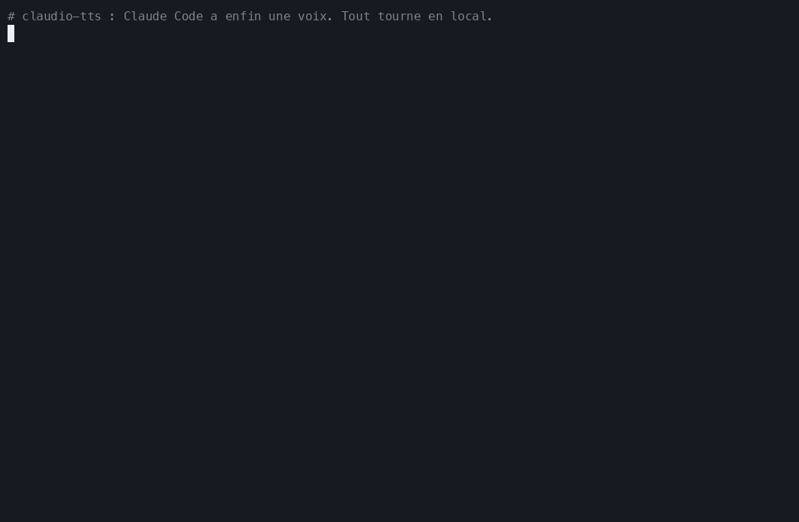
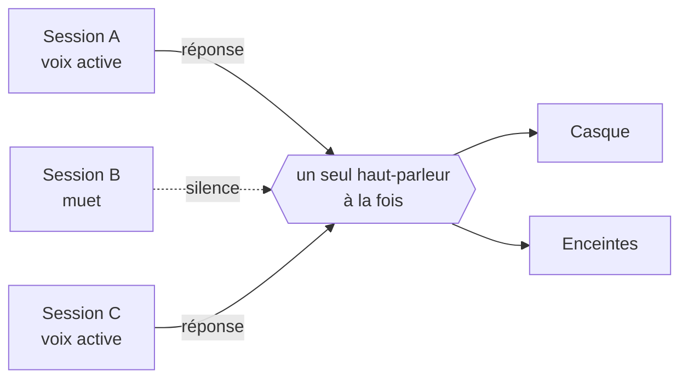
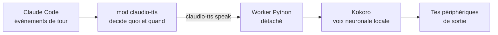

<div align="center">

<sub>🌍 [English (US)](README.md) · [Italiano](README.it.md) · [Polski](README.pl.md) · **Français** · [Deutsch](README.de.md) · [日本語](README.ja.md) · [简体中文](README.zh-CN.md) · [हिन्दी](README.hi.md) · [Русский](README.ru.md) · [Español](README.es.md) · [Português](README.pt-BR.md)</sub>

# 🔊 claudio-tts

### Donne une voix à Claude Code. En local. Gratuitement. Sans aucun token.

Des réponses parlées naturelles pour [Claude Code](https://claude.com/claude-code), propulsées par le modèle vocal
open source **[Kokoro](https://huggingface.co/hexgrad/Kokoro-82M)** et construites sur le nouveau
**système de mods** de Claude Code. Pas de clé d'API, pas de compte, pas de coût au mot, et ton texte ne quitte
jamais ta machine.

[](https://github.com/restante/claudio-tts/actions/workflows/ci.yml)
[](https://github.com/restante/claudio-tts/releases)
[](LICENSE)


[](CONTRIBUTING.md)



<sub>Un vrai enregistrement des vraies commandes. Un GIF ne peut pas transporter le son, alors
<a href="#-écoute-les-voix">écoute les échantillons</a> plus bas. Réenregistre-le quand tu veux avec
<code>scripts/make-demo.sh</code>.</sub>

**[Installation](#-installation) · [Voix](#%EF%B8%8F-voix) · [Commandes](#-commandes) · [Pourquoi Kokoro](#-pourquoi-kokoro-sans-tokens-sans-api-sans-facture) · [Mods](#-construit-sur-les-mods-de-claude-code) · [Contribuer](#-contribuer) · [Signaler un bug](#-signaler-un-bug)**

</div>

---

## ✨ Points forts

- 🎧 **Écoute Claude pendant que tu fais autre chose.** Lis un diff, fais-toi un café, repose tes yeux. Les réponses
  de Claude, et la narration avant chaque appel d'outil, sont lues à voix haute au fur et à mesure.
- 🆓 **Gratuit pour toujours, sans tokens, sans API.** La voix est générée sur ton propre ordinateur. Il n'y a rien
  à créer comme compte et rien à payer.
- 🔒 **Privé et hors ligne.** Après le téléchargement unique du modèle, ça marche sans internet. Ton code et tes
  conversations ne sont jamais envoyés nulle part pour être vocalisés.
- 🎯 **Toujours la dernière réponse.** Il écoute les événements de tour de Claude Code au lieu de fouiller le fichier
  de transcription, donc il ne peut jamais lire le message *précédant* celui que tu viens de recevoir.
- 🧑‍🤝‍🧑 **Pensé pour plusieurs sessions.** Le mode muet est propre à chaque session, les nouvelles sessions démarrent en
  muet, les sessions parlent à tour de rôle au lieu de se couper la parole, et chacune ne coupe que *sa propre* voix.
- 🗣️ **54 voix, 9 langues.** Change de voix avec une seule commande : `/tts voice af_heart`.
- 🔈 **Tes enceintes, tes règles.** Volume, vitesse et périphérique de sortie (un seul, plusieurs, ou tous à la fois).
- 🩺 **Facile à dépanner.** `claudio-tts doctor --report` écrit un rapport de bug prêt à coller.

---

## 🧩 Construit sur les mods de Claude Code

claudio-tts est construit sur le nouveau **système de mods** de Claude Code, et non sur les anciens hooks
« lancer un script shell à chaque événement ». Un mod est un petit plugin de fonctions typées qui s'exécute
*à l'intérieur* de Claude Code, voit ce que fait le modèle en temps réel, peut ajouter des commandes et des entrées
dans la barre d'état, et se recharge à chaud pendant que tu travailles. C'est exactement ce qu'il faut pour une
bonne voix :

| Fonctionnalité des mods | Ce que claudio-tts en fait |
| --- | --- |
| **Événements de tour** (`turn.complete`, `turn.step`, `turn.start`, `session.end`) | Reçoit le texte final du modèle et la narration avant les appels d'outils *directement dans l'événement*, donc il n'a jamais une réponse de retard et n'a jamais à relire un fichier de transcription |
| **État par session** | Chaque session retient son propre interrupteur muet, donc dix sessions ouvertes ne deviennent pas dix voix |
| **Stockage persistant du mod** | Le volume, la vitesse, la voix et le périphérique de sortie survivent aux redémarrages |
| **Enregistrement de commandes slash** | Ajoute `/tts` avec tout ce qui suit, directement dans Claude Code |
| **Barre d'état** | Affiche `TTS on` ou `TTS muted` pour la session que tu regardes |
| **API de processus** | Transmet le texte au moteur vocal local sans jamais bloquer Claude |
| **Contrat typé et outillage** | Fournit un contrat de types, et est vérifié avec `claude plugin validate` et `claude plugin test` |
| **Rechargement à chaud** | Modifie le mod et il se recharge, sans redémarrage pendant le développement |

Le mod lui-même est une fine couche TypeScript ([`src/claudio_tts/mod`](src/claudio_tts/mod)). Le travail audio vit
dans un petit paquet Python pour que macOS et Windows partagent un seul chemin de code.

---

## 🚀 Installation

Il te faut [Claude Code](https://claude.com/claude-code). L'installateur s'occupe de tout le reste, y compris
Python, les dépendances et le modèle vocal.

**macOS**

```bash
curl -fsSL https://raw.githubusercontent.com/restante/claudio-tts/main/install.sh | bash
```

**Windows** (PowerShell, bêta)

```powershell
irm https://raw.githubusercontent.com/restante/claudio-tts/main/install.ps1 | iex
```

Ensuite, **redémarre Claude Code** et, dans une session :

```text
/tts unmute
```

Et voilà. Envoie un message et écoute. 🎉 (Les nouvelles sessions démarrent en muet volontairement ; voir
[plusieurs sessions](#-plusieurs-sessions-une-seule-paire-doreilles).)

<details>
<summary><b>Que fait vraiment l'installateur ?</b></summary>

1. Installe [`uv`](https://docs.astral.sh/uv/) si tu ne l'as pas. `uv` télécharge aussi un Python 3.12 privé,
   donc tu n'as pas besoin d'avoir Python installé.
2. Crée un environnement isolé (macOS : `~/Library/Application Support/claudio-tts`,
   Windows : `%LOCALAPPDATA%\claudio-tts`) et y installe ce paquet et ses dépendances.
3. Télécharge le modèle Kokoro (326 Mo, ou 92 Mo avec `--lite`) et **vérifie sa somme de contrôle SHA-256**.
4. Copie le mod Claude Code dans `~/.claude/mods/claudio-tts` et l'enregistre dans `~/.claude/settings.json`.
   Tes réglages sont sauvegardés dans `settings.json.claudio-tts.bak` et fusionnés, jamais écrasés.
5. Lance `doctor` pour vérifier le modèle, les périphériques audio et Claude Code.

Tu peux le relancer sans risque : relancer met à jour, et rien n'est dupliqué.
</details>

<details>
<summary><b>Options de l'installateur</b></summary>

| macOS / Linux (`bash -s -- …`) | Windows (`-…`) | Effet |
| --- | --- | --- |
| `--lite` | `-Lite` | Modèle plus léger de 92 Mo (un peu moins naturel, plus rapide à télécharger et à exécuter) |
| `--no-model` | `-NoModel` | Ignore le téléchargement du modèle |
| `--ref <ref>` | `-Ref <ref>` | Installe une branche, un tag ou un commit |
| `--uninstall` | `-Uninstall` | Supprime tout (ajoute `--keep-models` / `-KeepModels` pour garder les fichiers de voix) |
| `--local` | `-Local` | Installe depuis le dépôt cloné dans lequel tu te trouves |

Avec `irm | iex` de PowerShell, tu ne peux pas passer d'options ; définis d'abord `CLAUDIO_TTS_LITE=1`,
`CLAUDIO_TTS_NO_MODEL=1`, `CLAUDIO_TTS_REF=<ref>` ou `CLAUDIO_TTS_UNINSTALL=1`, ou utilise
`& ([scriptblock]::Create((irm <url>))) -Lite`.
</details>

---

## 🎮 Commandes

Tout passe par une seule commande slash dans Claude Code :

| Commande | Ce qu'elle fait |
| --- | --- |
| `/tts` | Active ou coupe la voix **pour cette session** |
| `/tts mute` · `/tts unmute` | La coupe / l'active pour cette session uniquement |
| `/tts status` | Affiche l'état muet, le volume, la vitesse, la voix et la sortie |
| `/tts default on` · `/tts default off` | Indique si les **nouvelles** sessions démarrent en parlant (`off` = démarrer en muet, par défaut) |
| `/tts voice` | Liste toutes les voix et affiche la voix actuelle |
| `/tts voice af_heart` | Change la voix (elle te dit bonjour avec la nouvelle voix). `/tts voice default` la réinitialise |
| `/tts lang de` · `/tts lang auto` | Fait lire une autre langue à la voix (parmi 140), ou revient à sa propre langue |
| `/tts volume 1-10` | Le volume, partagé par toutes les sessions. `/tts volume` l'affiche |
| `/tts speed 0.5-1.5` | Le rythme de parole (1 est normal). `/tts pace` est un alias |
| `/tts device` | Liste les périphériques de sortie et affiche le choix actuel |
| `/tts device airpods` | Parle sur un seul périphérique (les noms partiels fonctionnent) |
| `/tts device airpods,macbook` | …sur plusieurs périphériques **en même temps** |
| `/tts device all` | …sur toutes les vraies sorties (les périphériques virtuels comme Zoom et Teams sont ignorés) |
| `/tts device default` | Retour au périphérique par défaut du système |
| `/tts mic` | Liste les microphones ; `/tts mic <name>` enregistre une préférence |

Voilà à quoi ça ressemble dans une session :

```text
> /tts unmute
claudio-tts: TTS on (this session), volume 10/10, speed 1, voice default, output default

> /tts voice bf_emma
claudio-tts: Voice: bf_emma

> /tts speed 0.9
claudio-tts: TTS speed 0.9
```

Le volume, la vitesse, la voix et le périphérique décrivent *ta configuration*, donc ils sont partagés. Le mode muet
décrit *une conversation*, donc il est propre à chaque session.

---

## 🗣️ Voix

Kokoro propose **54 voix dans 9 langues**. Choisis-en une avec `/tts voice <name>`, ou liste-les toutes avec
`/tts voice` (ou `claudio-tts voices` dans un terminal). La première lettre du nom d'une voix indique sa langue et
la deuxième son genre, et **claudio-tts choisit automatiquement la bonne langue** à partir du nom.

> **Ce sont des exemples, pas des limites.** Toute voix prise en charge par Kokoro peut être utilisée, tu peux
> ajouter tes propres fichiers de voix, et une voix peut lire du texte dans 140 langues (voir
> [Utiliser une autre voix ou une autre langue](#-utiliser-une-autre-voix-ou-une-autre-langue)).

| | Langue | Féminin | Masculin |
| --- | --- | --- | --- |
| 🇺🇸 | Anglais américain | `af_alloy` `af_aoede` `af_bella` `af_heart` `af_jessica` `af_kore` `af_nicole` `af_nova` `af_river` `af_sarah` `af_sky` | `am_adam` `am_echo` `am_eric` `am_fenrir` `am_liam` `am_michael` `am_onyx` `am_puck` `am_santa` |
| 🇬🇧 | Anglais britannique | `bf_alice` `bf_emma` `bf_isabella` `bf_lily` | `bm_daniel` `bm_fable` `bm_george` `bm_lewis` |
| 🇪🇸 | Espagnol | `ef_dora` | `em_alex` `em_santa` |
| 🇫🇷 | Français | `ff_siwis` | |
| 🇮🇳 | Hindi | `hf_alpha` `hf_beta` | `hm_omega` `hm_psi` |
| 🇮🇹 | Italien | `if_sara` | `im_nicola` |
| 🇯🇵 | Japonais | `jf_alpha` `jf_gongitsune` `jf_nezumi` `jf_tebukuro` | `jm_kumo` |
| 🇧🇷 | Portugais brésilien | `pf_dora` | `pm_alex` `pm_santa` |
| 🇨🇳 | Chinois mandarin | `zf_xiaobei` `zf_xiaoni` `zf_xiaoxiao` `zf_xiaoyi` | `zm_yunjian` `zm_yunxi` `zm_yunxia` `zm_yunyang` |

> **Allemand, polonais et russe :** Kokoro n'a pas encore de voix natives allemandes, polonaises ni russes.
> L'installateur, les commandes et cette documentation sont entièrement disponibles dans ces trois langues (voir
> les liens en haut de page), mais la voix parlée sera une voix anglaise ou d'une autre langue qui lit ton texte
> avec un accent prononcé. Essaie `claudio-tts say "…" --voice af_heart --lang de` (ou `pl`, `ru`) pour
> l'entendre. Si Kokoro ajoute ces voix, claudio-tts les prendra en charge via la même commande `/tts voice`.

### 🎧 Écoute les voix

**[▶ Ouvre le lecteur de voix](https://restante.github.io/claudio-tts/)** pour écouter les 54 voix directement dans
ton navigateur, avec des boutons de lecture en un clic. (GitHub ne peut pas lire d'audio dans un README, donc le
lecteur vit sur une petite page web.) Ou clique sur un nom ci-dessous pour y aller directement. Les échantillons sont
générés par Kokoro lui-même.

| Voix | Écouter | Voix | Écouter |
| --- | --- | --- | --- |
| `af_heart` ⭐ | [▶ écouter](https://restante.github.io/claudio-tts/#af_heart) | `bf_emma` | [▶ écouter](https://restante.github.io/claudio-tts/#bf_emma) |
| `af_bella` ⭐ | [▶ écouter](https://restante.github.io/claudio-tts/#af_bella) | `bf_isabella` | [▶ écouter](https://restante.github.io/claudio-tts/#bf_isabella) |
| `af_nicole` | [▶ écouter](https://restante.github.io/claudio-tts/#af_nicole) | `bm_george` | [▶ écouter](https://restante.github.io/claudio-tts/#bm_george) |
| `af_sarah` | [▶ écouter](https://restante.github.io/claudio-tts/#af_sarah) | `bm_fable` | [▶ écouter](https://restante.github.io/claudio-tts/#bm_fable) |
| `af_sky` | [▶ écouter](https://restante.github.io/claudio-tts/#af_sky) | `ef_dora` 🇪🇸 | [▶ écouter](https://restante.github.io/claudio-tts/#ef_dora) |
| `am_michael` | [▶ écouter](https://restante.github.io/claudio-tts/#am_michael) | `ff_siwis` 🇫🇷 | [▶ écouter](https://restante.github.io/claudio-tts/#ff_siwis) |
| `am_fenrir` | [▶ écouter](https://restante.github.io/claudio-tts/#am_fenrir) | `if_sara` 🇮🇹 | [▶ écouter](https://restante.github.io/claudio-tts/#if_sara) |
| `am_puck` | [▶ écouter](https://restante.github.io/claudio-tts/#am_puck) | `jf_alpha` 🇯🇵 | [▶ écouter](https://restante.github.io/claudio-tts/#jf_alpha) |
| `hf_alpha` 🇮🇳 | [▶ écouter](https://restante.github.io/claudio-tts/#hf_alpha) | `zf_xiaoxiao` 🇨🇳 | [▶ écouter](https://restante.github.io/claudio-tts/#zf_xiaoxiao) |
| `pf_dora` 🇧🇷 | [▶ écouter](https://restante.github.io/claudio-tts/#pf_dora) | | |

⭐ `af_heart` et `af_bella` sont généralement considérées comme les voix anglaises les plus naturelles ; commence
par celles-ci.

### Astuces

- **La voix et le texte doivent correspondre.** Une voix espagnole qui lit de l'anglais sonnera bizarrement, car la
  voix décide de la façon dont le texte est prononcé. Si tu discutes avec Claude en espagnol, choisis `ef_dora` ou
  `em_alex`.
- **Définis une voix par défaut pour toutes les sessions** sans commande : mets `"KOKORO_VOICE": "bf_emma"` dans le
  bloc `env` de `~/.claude/settings.json`. `/tts voice` la remplace, et `/tts voice default` y revient.
- **Trop rapide, trop lent ?** `/tts speed 0.85` ralentit, `/tts speed 1.2` accélère.
- **Tu veux plus doux ?** `/tts volume 4`. Le volume est appliqué à chaque échantillon, donc il ne touche pas au
  volume de ton système.
- La première phrase d'une session peut prendre un instant le temps que le modèle se charge ; les suivantes sont
  rapides. Le modèle `--lite` démarre plus vite et consomme moins de mémoire.

### 🔧 Utiliser une autre voix ou une autre langue

Les 54 voix intégrées et les 9 langues natives ne sont que ce qui est fourni de base :

```text
/tts voice af_mix                # a voice you added (a .npy file in the voices folder)
/tts lang de                     # read German (or any of 140 languages) through the current voice
/tts lang auto                   # back to the voice's own language
```

```json
{ "env": { "CLAUDIO_TTS_MODEL": "/path/to/model.onnx", "CLAUDIO_TTS_VOICES": "/path/to/voices.bin" } }
```

- **Ajoute ta propre voix** : enregistre un vecteur de style Kokoro sous `voices/<name>.npy` dans le dossier
  d'installation, et `<name>` apparaît dans `/tts voice`. Tu peux même mélanger deux voix pour en créer une nouvelle.
- **Utilise un autre modèle Kokoro ou un autre pack de voix** (une version plus récente, un pack communautaire) :
  définis les deux variables d'environnement ci-dessus dans `~/.claude/settings.json`.
- **Lis n'importe quelle langue** : `/tts lang <code>` fait lire cette langue par la voix actuelle (140 codes, voir
  `claudio-tts languages`). Les langues sans voix native sont lues avec un accent.

Pas à pas, avec un script de mélange : **[docs/voices.md](docs/voices.md)**.

---

## 🆓 Pourquoi Kokoro, sans tokens, sans API, sans facture

La plupart des solutions pour « faire parler » envoient chaque réponse à un service vocal dans le cloud.
claudio-tts, non. Il fait tourner **[Kokoro](https://huggingface.co/hexgrad/Kokoro-82M)**, un petit modèle vocal
à poids ouverts, sur ton propre processeur.

| | ☁️ Synthèse vocale dans le cloud | 🔊 claudio-tts + Kokoro |
| --- | --- | --- |
| **Clé d'API / compte** | Obligatoire | **Aucun** |
| **Coût** | Au caractère ou à la minute, pour toujours | **Gratuit** |
| **Tokens Claude utilisés** | Souvent en plus, si un modèle écrit le script | **Zéro en plus** (voir la note) |
| **Confidentialité** | Tes réponses sont envoyées à un tiers | **Rien ne quitte ton ordinateur** |
| **Hors ligne** | Non | **Oui** (après le téléchargement unique) |
| **Latence** | Aller-retour réseau plus file d'attente | **Commence à parler dès que la première phrase est prête** |
| **Limites de débit / pannes** | Oui | **Aucune** |
| **Licence** | Conditions d'utilisation | **Modèle Apache-2.0, code MIT** |
| **Taille** | n/a | 326 Mo (92 Mo en `--lite`) |

> **En toute honnêteté.** Le téléchargement unique du modèle fait 326 Mo. Générer la voix consomme un peu de
> processeur pendant qu'il parle. Les toutes meilleures voix cloud payantes peuvent sonner plus riches que Kokoro, mais
> Kokoro est remarquablement naturel pour un modèle aussi petit. Et le
> [résumé vocal](#%EF%B8%8F-parle-moins-avec-le-résumé-vocal-optionnel) *optionnel* demande à Claude d'écrire une ou
> deux phrases de plus par réponse, ce qui coûte une poignée de tokens de sortie, uniquement si tu l'actives. Sans
> lui, claudio-tts lit un texte que Claude a déjà écrit et n'utilise **aucun token supplémentaire**.

---

## 🧑‍🤝‍🧑 Plusieurs sessions, une seule paire d'oreilles



- Les nouvelles sessions **démarrent en muet**. Active la voix uniquement pour celle que tu regardes
  (`/tts unmute`), ou lance `/tts default on` si tu préfères qu'elles parlent toutes dès le départ.
- Si deux sessions actives répondent en même temps, la seconde **attend son tour** au lieu de couper la première.
- Envoyer un prompt, ou passer en muet, ne coupe que **la voix de cette session**.

## ✂️ Parle *moins* avec le résumé vocal optionnel

Les longues réponses sont fatigantes à écouter. Si une réponse contient un bloc de résumé, claudio-tts lit
**uniquement ce bloc** et ignore le reste. Ajoute quelque chose comme ceci à ton `CLAUDE.md` et Claude en écrira un
à chaque fois :

```markdown
At the END of EVERY response add a short, conversational summary for text-to-speech, in this exact form.
Avoid URLs, file paths, code and variable names.

<!-- TTS_SUMMARY Deux ou trois phrases simples sur le résultat. TTS_SUMMARY -->
```

Pas de bloc ? Il lit toute la réponse, après avoir nettoyé le markdown, les blocs de code, les liens et les emojis
pour que ça sonne naturel.

---

## 🛠️ Comment ça marche



Le mod écoute le texte du modèle et les appels d'outils, suit le mode muet de chaque session, et transmet le texte à
la commande `claudio-tts`. Tout le travail propre à chaque système (audio, contrôle des processus, verrouillage,
baisse de ta musique pendant qu'il parle) vit dans le paquet Python, donc macOS et Windows partagent un seul chemin
de code. Détails dans [docs/how-it-works.md](docs/how-it-works.md).

## ⚙️ Configuration

Variables d'environnement (à mettre dans le bloc `env` de `~/.claude/settings.json`) :

| Variable | Par défaut | Signification |
| --- | --- | --- |
| `KOKORO_VOICE` | `af_sky` | Voix par défaut pour chaque session (voir [Voix](#%EF%B8%8F-voix)) |
| `CLAUDIO_TTS_MODEL`, `CLAUDIO_TTS_VOICES` | intégrés | Utilise un autre modèle Kokoro / pack de voix (les deux sont requis) |
| `AUDIO_DUCK_ENABLED` | `true` | Baisse Apple Music / Spotify pendant la parole (macOS uniquement) |
| `DUCK_LEVEL` | `5` | Pourcentage du volume d'origine de la musique auquel la baisser |
| `CLAUDIO_TTS_HOME` | selon l'OS | Où se trouve l'installation |

## 💻 Ligne de commande

Le paquet installe aussi une commande `claudio-tts` (dans son environnement privé) :

```text
claudio-tts say "Hello there" --voice bf_emma   speak now and wait
claudio-tts voices                              list all voices (the 54 built-in plus yours)
claudio-tts languages                           list the 140 languages a voice can read
claudio-tts devices [--inputs]                  list audio devices
claudio-tts doctor [--speak | --report]         check the install, or write a bug report
claudio-tts download-model [--lite]             fetch and verify the voice files
claudio-tts install-mod / uninstall-mod
```

## 🖥️ Plateformes prises en charge

| | Statut |
| --- | --- |
| **macOS** (Apple silicon et Intel) | ✅ Pris en charge et testé, baisse de la musique incluse |
| **Windows 10/11** | 🧪 **Bêta.** Testé en CI ; les retours avec du vrai audio sont les bienvenus. Pas encore de baisse de la musique |
| **Linux** | 🤷 Au mieux, non testé sur du vrai matériel |

---

## 🐞 Signaler un bug

Tu as trouvé un comportement étrange ? C'est vraiment utile, merci.

1. Lance ceci et copie la sortie :

   ```bash
   claudio-tts doctor --report
   ```

   (Si `claudio-tts` n'est pas dans ton PATH, utilise le chemin complet affiché par l'installateur, terminé par
   `python -m claudio_tts doctor --report`.) Il contient ton OS, les versions et les noms de tes périphériques, mais
   **jamais** rien de ce que tu as fait dire à la voix ni aucun secret.
2. [**Ouvre un rapport de bug**](https://github.com/restante/claudio-tts/issues/new?template=bug_report.yml) et colle-le
   dedans. Dis ce que tu attendais et ce qui s'est passé.

Les solutions rapides se trouvent dans [docs/troubleshooting.md](docs/troubleshooting.md) et
[docs/windows.md](docs/windows.md). La plus courante : **le silence signifie généralement que la session est encore
en muet**, donc tape `/tts unmute`.

## 🤝 Contribuer

**Les contributeurs sont les bienvenus.** Tout a commencé comme un projet de week-end en solo, et il s'améliore avec
plus de monde : plus de voix testées, plus de plateformes couvertes, plus d'idées.

Quelques bons endroits pour te lancer :

- 🪟 **Windows** : essaie-le sur du vrai matériel, dis-nous ce que tu entends, ou développe la baisse de la musique (volume par application).
- 🐧 **Linux** : peaufine et teste l'installateur sur ta distribution.
- 🎛️ **Mélange de voix et aperçus** : mélange deux voix, ou écoute une voix avant de la choisir.
- 📦 **Packaging** : `pipx`, Homebrew, winget.
- 🌍 **Langues** : une meilleure lecture du code, des nombres et des textes multilingues.
- 📚 **Docs et démos** : de meilleurs GIFs, des traductions, des tutoriels.

Cherche [`good first issue`](https://github.com/restante/claudio-tts/labels/good%20first%20issue) et
[`help wanted`](https://github.com/restante/claudio-tts/labels/help%20wanted), et lis
[CONTRIBUTING.md](CONTRIBUTING.md) pour être opérationnel en cinq minutes.

**Envie d'en parler d'abord ?** [Lance une discussion](https://github.com/restante/claudio-tts/discussions) ou
contacte-moi via mon profil GitHub, [@restante](https://github.com/restante). Les idées, les questions, les
histoires du genre « je l'ai essayé sur X et… » et les propositions d'aide sont toutes les bienvenues. Et si
claudio-tts t'a égayé la journée, une ⭐ aide les autres à le découvrir.

## 🗺️ Feuille de route

- [ ] Baisse de la musique sur Windows
- [ ] Mélange de voix (`/tts voice af_heart+am_adam`)
- [ ] Installations via `pipx` / Homebrew / winget
- [ ] Lecture plus intelligente du code, des chemins et des nombres
- [ ] Un sélecteur d'aperçu des voix

## 🗑️ Désinstallation

```bash
curl -fsSL https://raw.githubusercontent.com/restante/claudio-tts/main/install.sh | bash -s -- --uninstall
```

(Windows : `$env:CLAUDIO_TTS_UNINSTALL=1; irm …/install.ps1 | iex`.) Ton `settings.json` est restauré tel qu'il était.

## 🧑‍💻 Développer

```bash
git clone https://github.com/restante/claudio-tts && cd claudio-tts
bash install.sh --dev          # editable install, mod symlinked from src/claudio_tts/mod
.venv/bin/pytest               # or: uv venv && uv pip install -e ".[dev]" && pytest
```

Avec Claude Code installé, vérifie le mod avec `claude plugin validate src/claudio_tts/mod` et
`claude plugin test src/claudio_tts/mod`.

## 🙏 Remerciements

- [Kokoro-82M](https://huggingface.co/hexgrad/Kokoro-82M) par hexgrad (Apache-2.0), exécuté via
  [kokoro-onnx](https://github.com/thewh1teagle/kokoro-onnx) par thewh1teagle (MIT).
- L'idée de donner une voix à Claude Code vient de [ktaletsk/claude-code-tts](https://github.com/ktaletsk/claude-code-tts).
  claudio-tts est une implémentation neuve sur le système de mods de Claude Code et ne partage aucun code avec lui.
- Mon ami [Donato Antonini](https://www.linkedin.com/in/donato-antonini-47b18a48/), pour le brainstorming et l'idée.

## 📄 Licence

[MIT](LICENSE) © 2026 Claudio Restante
