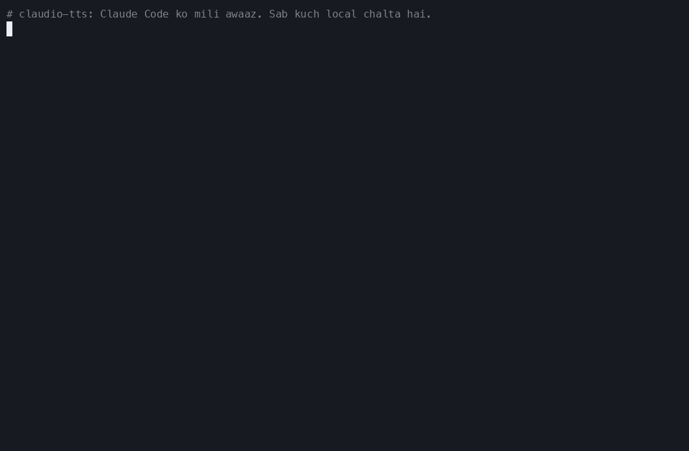
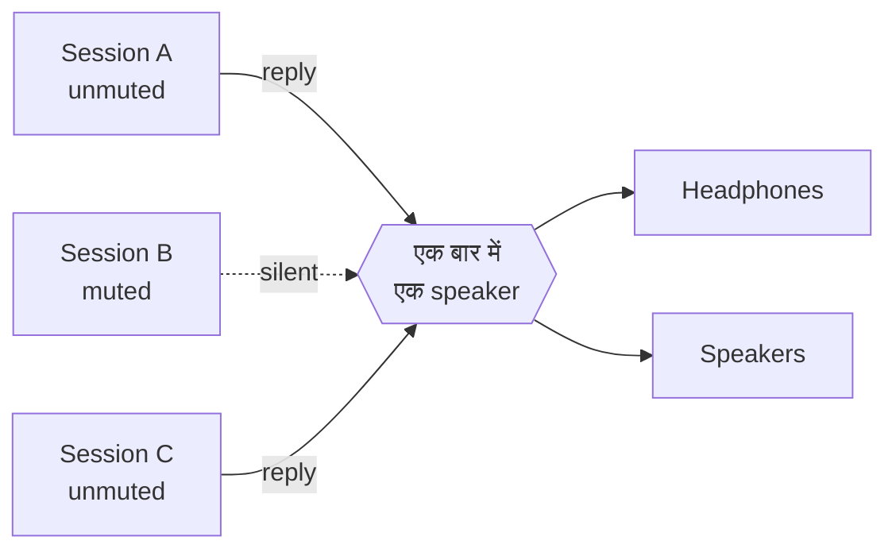
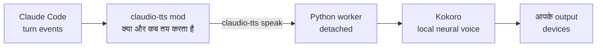

<div align="center">

<sub>🌍 [English (US)](README.md) · [Italiano](README.it.md) · [Polski](README.pl.md) · [Français](README.fr.md) · [Deutsch](README.de.md) · [日本語](README.ja.md) · [简体中文](README.zh-CN.md) · **हिन्दी** · [Русский](README.ru.md) · [Español](README.es.md) · [Português](README.pt-BR.md)</sub>

# 🔊 claudio-tts

### Claude Code को दीजिए एक आवाज़। लोकल। बिल्कुल मुफ़्त। ज़ीरो token के साथ।

[Claude Code](https://claude.com/claude-code) के लिए natural बोले गए जवाब, जो open-source voice model
**[Kokoro](https://huggingface.co/hexgrad/Kokoro-82M)** से चलते हैं और Claude Code के नए
**mod system** पर बने हैं। कोई API key नहीं, कोई account नहीं, प्रति शब्द कोई खर्च नहीं, और आपका text कभी आपकी मशीन से बाहर नहीं जाता।

[](https://github.com/restante/claudio-tts/actions/workflows/ci.yml)
[](https://github.com/restante/claudio-tts/releases)
[](LICENSE)


[](CONTRIBUTING.md)



<sub>असली कमांड की असली रिकॉर्डिंग। GIF में आवाज़ नहीं आ सकती, इसलिए नीचे
<a href="#-आवाज़ें-सुनें">सैंपल सुनिए</a>। आप इसे कभी भी दोबारा रिकॉर्ड कर सकते हैं:
<code>scripts/make-demo.sh</code>।</sub>

**[इंस्टॉल करें](#-इंस्टॉल-करें) · [आवाज़ें](#%EF%B8%8F-आवाज़ें) · [कमांड](#-कमांड) · [Kokoro ही क्यों](#-kokoro-ही-क्यों-कोई-token-नहीं-कोई-api-नहीं-कोई-बिल-नहीं) · [Mods](#-claude-code-mods-पर-बना) · [योगदान करें](#-योगदान-करें) · [बग रिपोर्ट करें](#-बग-रिपोर्ट-करें)**

</div>

---

## ✨ मुख्य बातें

- 🎧 **कुछ और करते हुए Claude को सुनिए।** कोई diff पढ़िए, चाय बना लीजिए, आँखों को आराम दीजिए। Claude के जवाब, और
  हर tool call से पहले की narration, आते ही बोलकर सुना दिए जाते हैं।
- 🆓 **हमेशा के लिए मुफ़्त, कोई token नहीं, कोई API नहीं।** आवाज़ आपके अपने कंप्यूटर पर बनती है। न कहीं sign up करना है
  और न कुछ भुगतान।
- 🔒 **Private और offline।** model का एक बार download होने के बाद यह बिना internet के चलता है। आपका code और आपकी
  बातचीत आवाज़ बनाने के लिए कहीं नहीं भेजी जाती।
- 🎯 **हमेशा ताज़ा जवाब।** यह transcript फ़ाइल खँगालने के बजाय Claude Code के अपने turn events सुनता है, इसलिए यह कभी
  उस संदेश को नहीं पढ़ सकता जो आपके ताज़ा संदेश से *पहले* का हो।
- 🧑‍🤝‍🧑 **कई sessions के लिए बना।** Mute हर session का अलग होता है, नए sessions mute से शुरू होते हैं, sessions बारी-बारी
  बोलते हैं, एक-दूसरे के ऊपर नहीं, और हर session सिर्फ़ *अपनी* ही आवाज़ रोकता है।
- 🗣️ **54 आवाज़ें, 9 भाषाएँ।** एक कमांड से आवाज़ बदलिए: `/tts voice af_heart`।
- 🔈 **आपके speakers, आपके नियम।** Volume, speed और output device (एक, कई, या सब एक साथ)।
- 🩺 **Support करना आसान।** `claudio-tts doctor --report` एक paste करने लायक तैयार bug report लिख देता है।

---

## 🧩 Claude Code mods पर बना

claudio-tts, Claude Code के नए **mod system** पर बना है, उन पुराने hooks पर नहीं जो "हर event पर एक shell script चलाओ" वाले
तरीके से काम करते थे। mod, typed functions का एक छोटा plugin है जो Claude Code के *अंदर* चलता है, model जो कर रहा है उसे
होते हुए देखता है, commands और status-line entries जोड़ सकता है, और आपके काम करते-करते hot-reload हो जाता है। एक अच्छी
आवाज़ को ठीक यही चाहिए:

| Mod feature | claudio-tts इसके साथ क्या करता है |
| --- | --- |
| **Turn events** (`turn.complete`, `turn.step`, `turn.start`, `session.end`) | model का final text और tool calls से पहले की narration सीधे event में पा लेता है, इसलिए यह कभी एक जवाब पीछे नहीं रहता और इसे transcript फ़ाइल दोबारा पढ़नी नहीं पड़ती |
| **Per-session state** | हर session अपना mute switch याद रखता है, इसलिए दस खुले sessions दस आवाज़ें नहीं बन जाते |
| **Persistent mod store** | Volume, speed, voice और output device restart के बाद भी बने रहते हैं |
| **Slash-command registration** | नीचे दी गई हर चीज़ के साथ `/tts` जोड़ता है, सीधे Claude Code के अंदर |
| **Status line** | जिस session को आप देख रहे हैं उसके लिए `TTS on` या `TTS muted` दिखाता है |
| **Process API** | text को local speech engine तक पहुँचाता है, Claude को कभी block किए बिना |
| **Typed contract और tooling** | एक type contract के साथ आता है, और `claude plugin validate` व `claude plugin test` से जाँचा जाता है |
| **Hot reload** | mod को edit कीजिए और वह reload हो जाता है, development के दौरान restart की ज़रूरत नहीं |

mod खुद एक पतली TypeScript परत है ([`src/claudio_tts/mod`](src/claudio_tts/mod))। audio का काम एक छोटे Python package में
है, ताकि macOS और Windows एक ही code path साझा करें।

---

## 🚀 इंस्टॉल करें

आपको बस [Claude Code](https://claude.com/claude-code) चाहिए। बाकी सब कुछ installer संभाल लेता है, जिसमें Python,
dependencies और voice model भी शामिल हैं।

**macOS**

```bash
curl -fsSL https://raw.githubusercontent.com/restante/claudio-tts/main/install.sh | bash
```

**Windows** (PowerShell, beta)

```powershell
irm https://raw.githubusercontent.com/restante/claudio-tts/main/install.ps1 | iex
```

फिर **Claude Code को restart कीजिए** और किसी session में यह चलाइए:

```text
/tts unmute
```

बस, इतना ही। एक संदेश भेजिए और सुनिए। 🎉 (नए sessions जान-बूझकर mute से शुरू होते हैं; देखिए
[कई sessions](#-कई-sessions-एक-जोड़ी-कान)।)

<details>
<summary><b>installer असल में क्या करता है?</b></summary>

1. अगर आपके पास [`uv`](https://docs.astral.sh/uv/) नहीं है तो उसे इंस्टॉल करता है। `uv` एक private Python 3.12 भी download
   करता है, इसलिए आपके पास Python इंस्टॉल होना ज़रूरी नहीं।
2. एक अलग (isolated) environment बनाता है (macOS: `~/Library/Application Support/claudio-tts`,
   Windows: `%LOCALAPPDATA%\claudio-tts`) और उसमें यह package व इसकी dependencies इंस्टॉल करता है।
3. Kokoro model download करता है (326 MB, या `--lite` के साथ 92 MB) और उसका **SHA-256 checksum verify करता है**।
4. Claude Code mod को `~/.claude/mods/claudio-tts` में कॉपी करता है और `~/.claude/settings.json` में register करता है।
   आपकी settings का backup `settings.json.claudio-tts.bak` में रखा जाता है और उन्हें merge किया जाता है, कभी overwrite नहीं।
5. model, audio devices और Claude Code जाँचने के लिए `doctor` चलाता है।

इसे दोबारा चलाना सुरक्षित है: दोबारा चलाने पर update होता है, और कुछ भी duplicate नहीं होता।
</details>

<details>
<summary><b>Installer के options</b></summary>

| macOS / Linux (`bash -s -- …`) | Windows (`-…`) | असर |
| --- | --- | --- |
| `--lite` | `-Lite` | छोटा 92 MB model (थोड़ा कम natural, download और चलाने में तेज़) |
| `--no-model` | `-NoModel` | model download छोड़ दीजिए |
| `--ref <ref>` | `-Ref <ref>` | कोई branch, tag या commit इंस्टॉल कीजिए |
| `--uninstall` | `-Uninstall` | सब कुछ हटा दीजिए (voice files रखने के लिए `--keep-models` / `-KeepModels` जोड़िए) |
| `--local` | `-Local` | उसी checkout से इंस्टॉल कीजिए जिसमें आप खड़े हैं |

PowerShell के `irm | iex` के साथ आप switches नहीं दे सकते; पहले `CLAUDIO_TTS_LITE=1`, `CLAUDIO_TTS_NO_MODEL=1`,
`CLAUDIO_TTS_REF=<ref>` या `CLAUDIO_TTS_UNINSTALL=1` set कीजिए, या
`& ([scriptblock]::Create((irm <url>))) -Lite` इस्तेमाल कीजिए।
</details>

---

## 🎮 कमांड

सब कुछ Claude Code के अंदर एक ही slash command है:

| कमांड | यह क्या करता है |
| --- | --- |
| `/tts` | **इस session** के लिए speech को toggle करता है |
| `/tts mute` · `/tts unmute` | सिर्फ़ इस session के लिए बंद / चालू करता है |
| `/tts status` | mute की स्थिति, volume, speed, voice और output दिखाता है |
| `/tts default on` · `/tts default off` | **नए** sessions बोलना शुरू करें या नहीं (`off` = mute से शुरू, यही default है) |
| `/tts voice` | हर आवाज़ की सूची देता है और मौजूदा आवाज़ दिखाता है |
| `/tts voice af_heart` | आवाज़ बदलता है (नई आवाज़ में hello बोलता है)। `/tts voice default` इसे reset करता है |
| `/tts volume 1-10` | आवाज़ की तेज़ी, सभी sessions में साझा। `/tts volume` इसे दिखाता है |
| `/tts speed 0.5-1.5` | बोलने की रफ़्तार (1 सामान्य है)। `/tts pace` इसका alias है |
| `/tts device` | output devices की सूची देता है और मौजूदा चुनाव दिखाता है |
| `/tts device airpods` | एक device पर बोलता है (आंशिक नाम भी चलते हैं) |
| `/tts device airpods,macbook` | …कई devices पर **एक साथ** |
| `/tts device all` | …हर असली output पर (Zoom और Teams जैसे virtual devices छोड़ दिए जाते हैं) |
| `/tts device default` | वापस system default पर |
| `/tts mic` | microphones की सूची देता है; `/tts mic <name>` एक पसंद सेव करता है |

किसी session में यह ऐसा दिखता है:

```text
> /tts unmute
claudio-tts: TTS on (this session), volume 10/10, speed 1, voice default, output default

> /tts voice bf_emma
claudio-tts: Voice: bf_emma

> /tts speed 0.9
claudio-tts: TTS speed 0.9
```

Volume, speed, voice और device *आपके setup* को बताते हैं, इसलिए वे साझा हैं। Mute *एक बातचीत* को बताता है, इसलिए वह
हर session का अलग है।

---

## 🗣️ आवाज़ें

Kokoro **9 भाषाओं में 54 आवाज़ें** के साथ आता है। `/tts voice <name>` से कोई एक चुनिए, या `/tts voice` से सब देखिए
(या terminal में `claudio-tts voices`)। आवाज़ के नाम का पहला अक्षर उसकी भाषा है और दूसरा उसका
लिंग, और **claudio-tts नाम से सही भाषा अपने आप चुन लेता है**।

| | भाषा | महिला | पुरुष |
| --- | --- | --- | --- |
| 🇺🇸 | अमेरिकी अंग्रेज़ी | `af_alloy` `af_aoede` `af_bella` `af_heart` `af_jessica` `af_kore` `af_nicole` `af_nova` `af_river` `af_sarah` `af_sky` | `am_adam` `am_echo` `am_eric` `am_fenrir` `am_liam` `am_michael` `am_onyx` `am_puck` `am_santa` |
| 🇬🇧 | ब्रिटिश अंग्रेज़ी | `bf_alice` `bf_emma` `bf_isabella` `bf_lily` | `bm_daniel` `bm_fable` `bm_george` `bm_lewis` |
| 🇪🇸 | स्पेनिश | `ef_dora` | `em_alex` `em_santa` |
| 🇫🇷 | फ़्रेंच | `ff_siwis` | |
| 🇮🇳 | हिन्दी | `hf_alpha` `hf_beta` | `hm_omega` `hm_psi` |
| 🇮🇹 | इतालवी | `if_sara` | `im_nicola` |
| 🇯🇵 | जापानी | `jf_alpha` `jf_gongitsune` `jf_nezumi` `jf_tebukuro` | `jm_kumo` |
| 🇧🇷 | ब्राज़ीलियन पुर्तगाली | `pf_dora` | `pm_alex` `pm_santa` |
| 🇨🇳 | मंदारिन चीनी | `zf_xiaobei` `zf_xiaoni` `zf_xiaoxiao` `zf_xiaoyi` | `zm_yunjian` `zm_yunxi` `zm_yunxia` `zm_yunyang` |

> **हिन्दी के पाठकों के लिए खुशखबरी:** हिन्दी Kokoro की **native भाषाओं** में से एक है! आपके पास चार असली हिन्दी आवाज़ें हैं,
> `hf_alpha` और `hf_beta` (महिला), `hm_omega` और `hm_psi` (पुरुष), जो आपके हिन्दी text को सही उच्चारण और लहजे में पढ़ती हैं,
> किसी विदेशी accent के बिना। शुरुआत के लिए `hf_alpha` का [सैंपल सुनिए](docs/samples/hf_alpha.mp3), फिर
> `/tts voice hf_alpha` चलाइए।

> **जर्मन, पोलिश और रूसी:** Kokoro में अभी जर्मन, पोलिश या रूसी की कोई native आवाज़ नहीं है। installer, commands और यह
> documentation तीनों भाषाओं में पूरी तरह उपलब्ध हैं (ऊपर दिए links देखिए), लेकिन बोली जाने वाली आवाज़ अंग्रेज़ी या किसी और
> भाषा की होगी जो आपका text साफ़ सुनाई देने वाले accent के साथ पढ़ेगी। इसे सुनने के लिए
> `claudio-tts say "…" --voice af_heart --lang de` (या `pl`, `ru`) आज़माइए। अगर Kokoro ये आवाज़ें जोड़ता है,
> तो claudio-tts उन्हें उसी `/tts voice` कमांड से उठा लेगा।

### 🎧 आवाज़ें सुनें

किसी नाम पर क्लिक करके छोटा सैंपल चलाइए (GitHub एक player खोलता है)। सैंपल खुद Kokoro ने बनाए हैं।

| आवाज़ | सुनें | आवाज़ | सुनें |
| --- | --- | --- | --- |
| `af_heart` ⭐ | [▶ play](docs/samples/af_heart.mp3) | `bf_emma` | [▶ play](docs/samples/bf_emma.mp3) |
| `af_bella` ⭐ | [▶ play](docs/samples/af_bella.mp3) | `bf_isabella` | [▶ play](docs/samples/bf_isabella.mp3) |
| `af_nicole` | [▶ play](docs/samples/af_nicole.mp3) | `bm_george` | [▶ play](docs/samples/bm_george.mp3) |
| `af_sarah` | [▶ play](docs/samples/af_sarah.mp3) | `bm_fable` | [▶ play](docs/samples/bm_fable.mp3) |
| `af_sky` | [▶ play](docs/samples/af_sky.mp3) | `ef_dora` 🇪🇸 | [▶ play](docs/samples/ef_dora.mp3) |
| `am_michael` | [▶ play](docs/samples/am_michael.mp3) | `ff_siwis` 🇫🇷 | [▶ play](docs/samples/ff_siwis.mp3) |
| `am_fenrir` | [▶ play](docs/samples/am_fenrir.mp3) | `if_sara` 🇮🇹 | [▶ play](docs/samples/if_sara.mp3) |
| `am_puck` | [▶ play](docs/samples/am_puck.mp3) | `jf_alpha` 🇯🇵 | [▶ play](docs/samples/jf_alpha.mp3) |
| `hf_alpha` 🇮🇳 | [▶ play](docs/samples/hf_alpha.mp3) | `zf_xiaoxiao` 🇨🇳 | [▶ play](docs/samples/zf_xiaoxiao.mp3) |
| `pf_dora` 🇧🇷 | [▶ play](docs/samples/pf_dora.mp3) | | |

⭐ `af_heart` और `af_bella` को आम तौर पर सबसे natural अंग्रेज़ी आवाज़ें माना जाता है; वहीं से शुरू कीजिए।

### सुझाव

- **आवाज़ और text की भाषा एक होनी चाहिए।** अंग्रेज़ी पढ़ती हुई स्पेनिश आवाज़ अजीब लगेगी, क्योंकि आवाज़ ही तय करती है कि
  text का उच्चारण कैसे होगा। अगर आप Claude से हिन्दी में बात करते हैं, तो `hf_alpha` या `hm_omega` चुनिए।
- **हर session के लिए default सेट कीजिए**, बिना किसी कमांड के: `~/.claude/settings.json` के `env` block में
  `"KOKORO_VOICE": "bf_emma"` डाल दीजिए। `/tts voice` इसे override करता है, और `/tts voice default` वापस इसी पर ले आता है।
- **बहुत तेज़ या बहुत धीमा?** `/tts speed 0.85` धीमा करता है, `/tts speed 1.2` तेज़।
- **आवाज़ कम चाहिए?** `/tts volume 4`। Volume हर sample पर लागू होता है, इसलिए यह आपके system volume को नहीं छूता।
- session का पहला वाक्य model load होने तक थोड़ा समय ले सकता है; बाद वाले तेज़ होते हैं। `--lite`
  model जल्दी शुरू होता है और कम memory लेता है।

---

## 🆓 Kokoro ही क्यों? कोई token नहीं, कोई API नहीं, कोई बिल नहीं

ज़्यादातर "इसे बोलना सिखाओ" वाले setups हर जवाब को किसी cloud text-to-speech service को भेजते हैं। claudio-tts ऐसा नहीं करता। यह
**[Kokoro](https://huggingface.co/hexgrad/Kokoro-82M)** चलाता है, जो एक छोटा open-weight voice model है, आपके अपने CPU पर।

| | ☁️ Cloud text-to-speech | 🔊 claudio-tts + Kokoro |
| --- | --- | --- |
| **API key / account** | ज़रूरी | **कुछ नहीं** |
| **खर्च** | हर character या हर मिनट के हिसाब से, हमेशा | **मुफ़्त** |
| **इस्तेमाल हुए Claude tokens** | अक्सर अतिरिक्त, अगर कोई model script लिखता है | **ज़ीरो अतिरिक्त** (नीचे note देखिए) |
| **Privacy** | आपके जवाब किसी तीसरे पक्ष को भेजे जाते हैं | **कुछ भी आपके कंप्यूटर से बाहर नहीं जाता** |
| **Offline** | नहीं | **हाँ** (एक बार के download के बाद) |
| **Latency** | network का आना-जाना और queue में इंतज़ार | **पहला वाक्य तैयार होते ही बोलना शुरू** |
| **Rate limits / outages** | हाँ | **कोई नहीं** |
| **Licence** | Terms of service | **Apache-2.0 model, MIT code** |
| **आकार** | लागू नहीं | 326 MB (`--lite` में 92 MB) |

> **सच्ची बातें।** model का एक बार का download 326 MB है। बोलते समय speech बनाने में कुछ CPU लगता है। सबसे बेहतरीन paid
> cloud आवाज़ें Kokoro से ज़्यादा समृद्ध लग सकती हैं, लेकिन इतने छोटे model के हिसाब से Kokoro कमाल का natural है।
> और *वैकल्पिक* [बोला गया सारांश](#%EF%B8%8F-इसे-कम-बोलने-दें-वैकल्पिक-बोला-गया-सारांश) Claude से हर जवाब में एक-दो अतिरिक्त वाक्य
> लिखवाता है, जिसमें मुट्ठी भर output tokens लगते हैं, और वह भी तभी जब आप उसे चालू करें।
> उसके बिना, claudio-tts वही text पढ़ता है जो Claude पहले ही लिख चुका है और **कोई अतिरिक्त token बिल्कुल नहीं** लगता।

---

## 🧑‍🤝‍🧑 कई sessions, एक जोड़ी कान



- नए sessions **mute से शुरू होते हैं**। सिर्फ़ उसी को unmute कीजिए जिसे आप देख रहे हैं (`/tts unmute`), या अगर आप चाहते हैं कि
  सब बोलना शुरू करें तो `/tts default on` चलाइए।
- अगर दो unmuted sessions एक साथ जवाब दें, तो दूसरा पहले को काटने के बजाय **अपनी बारी का इंतज़ार करता है**।
- prompt भेजने या mute करने से **सिर्फ़ उसी session की** आवाज़ रुकती है।

## ✂️ इसे *कम* बोलने दें: वैकल्पिक बोला गया सारांश

लंबे जवाब सुनते-सुनते थकान हो जाती है। अगर किसी जवाब में summary block हो, तो claudio-tts **सिर्फ़ वही block** पढ़ता है
और बाकी छोड़ देता है। अपनी `CLAUDE.md` में कुछ ऐसा जोड़ दीजिए और Claude हर बार एक लिख देगा:

```markdown
At the END of EVERY response add a short, conversational summary for text-to-speech, in this exact form.
Avoid URLs, file paths, code and variable names.

<!-- TTS_SUMMARY परिणाम के बारे में दो या तीन सादे वाक्य। TTS_SUMMARY -->
```

कोई block नहीं है? तब यह पूरा जवाब पढ़ता है, markdown, code blocks, links और emoji को साफ़ करके ताकि सुनने में natural लगे।

---

## 🛠️ यह कैसे काम करता है



mod, model के text और tool calls को सुनता है, हर session का mute ट्रैक करता है, और text को `claudio-tts`
कमांड को सौंप देता है। OS से जुड़ा सारा काम (audio, process control, locking, बोलते समय आपका संगीत धीमा करना) Python
package में है, इसलिए macOS और Windows एक ही code path साझा करते हैं। विवरण [docs/how-it-works.md](docs/how-it-works.md) में।

## ⚙️ Configuration

Environment variables (इन्हें `~/.claude/settings.json` के `env` block में डालिए):

| Variable | Default | मतलब |
| --- | --- | --- |
| `KOKORO_VOICE` | `af_sky` | हर session के लिए default आवाज़ (देखिए [आवाज़ें](#%EF%B8%8F-आवाज़ें)) |
| `AUDIO_DUCK_ENABLED` | `true` | बोलते समय Apple Music / Spotify की आवाज़ कम करता है (सिर्फ़ macOS) |
| `DUCK_LEVEL` | `5` | संगीत की मूल आवाज़ का कितने प्रतिशत तक कम करना है |
| `CLAUDIO_TTS_HOME` | OS के अनुसार | install कहाँ रहता है |

## 💻 Command line

यह package एक `claudio-tts` कमांड भी इंस्टॉल करता है (अपने private environment के अंदर):

```text
claudio-tts say "Hello there" --voice bf_emma   speak now and wait
claudio-tts voices                              list all 54 voices
claudio-tts devices [--inputs]                  list audio devices
claudio-tts doctor [--speak | --report]         check the install, or write a bug report
claudio-tts download-model [--lite]             fetch and verify the voice files
claudio-tts install-mod / uninstall-mod
```

## 🖥️ Platform support

| | स्थिति |
| --- | --- |
| **macOS** (Apple silicon और Intel) | ✅ Supported और tested, music ducking समेत |
| **Windows 10/11** | 🧪 **Beta।** CI में tested; असली audio पर feedback का स्वागत है। अभी music ducking नहीं |
| **Linux** | 🤷 Best effort, असली hardware पर untested |

---

## 🐞 बग रिपोर्ट करें

कुछ अजीब दिखा? यह सच में बहुत काम की बात है, शुक्रिया।

1. यह चलाइए और output कॉपी कीजिए:

   ```bash
   claudio-tts doctor --report
   ```

   (अगर `claudio-tts` आपके PATH में नहीं है, तो installer ने जो पूरा path print किया था वह इस्तेमाल कीजिए, जो
   `python -m claudio_tts doctor --report` पर खत्म होता है।) इसमें आपका OS, versions और device names होते हैं, लेकिन आपने जो
   कुछ बोला है या कोई secrets **कभी नहीं** होते।
2. [**bug report खोलिए**](https://github.com/restante/claudio-tts/issues/new?template=bug_report.yml) और उसे वहाँ paste
   कर दीजिए। बताइए कि आपने क्या उम्मीद की थी और क्या हुआ।

तुरंत हल [docs/troubleshooting.md](docs/troubleshooting.md) और [docs/windows.md](docs/windows.md) में हैं।
सबसे आम बात: **चुप्पी का मतलब अक्सर यह होता है कि session अभी भी mute है**, तो `/tts unmute` टाइप कीजिए।

## 🤝 योगदान करें

**Contributors का दिल से स्वागत है।** यह एक अकेले इंसान का weekend project था, और ज़्यादा लोगों के साथ यह और बेहतर होता है:
ज़्यादा आवाज़ों की testing, ज़्यादा platforms, ज़्यादा विचार।

कूदकर शामिल होने की बढ़िया जगहें:

- 🪟 **Windows**: असली hardware पर आज़माइए, जो सुनाई दे वह बताइए, या music ducking बनाइए (per-app volume)।
- 🐧 **Linux**: अपने distro पर installer को निखारिए और test कीजिए।
- 🎛️ **Voice blending और previews**: दो आवाज़ें मिलाइए, या चुनने से पहले कोई आवाज़ सुनकर देखिए।
- 📦 **Packaging**: `pipx`, Homebrew, winget।
- 🌍 **भाषाएँ**: code, संख्याओं और मिली-जुली भाषा के text को बेहतर पढ़ना।
- 📚 **Docs और demos**: बेहतर GIFs, अनुवाद, tutorials।

[`good first issue`](https://github.com/restante/claudio-tts/labels/good%20first%20issue) और
[`help wanted`](https://github.com/restante/claudio-tts/labels/help%20wanted) देखिए, और पाँच मिनट में setup करने के लिए
[CONTRIBUTING.md](CONTRIBUTING.md) पढ़िए।

**पहले बात करना चाहते हैं?** [Discussion शुरू कीजिए](https://github.com/restante/claudio-tts/discussions) या मेरी GitHub profile
[@restante](https://github.com/restante) के ज़रिए मुझसे संपर्क कीजिए। विचार, सवाल, "मैंने इसे X पर आज़माया और…"
वाले किस्से, और मदद की पेशकश, सब का स्वागत है। और अगर claudio-tts ने आपका दिन बना दिया, तो एक ⭐ दूसरों को इसे ढूँढने में मदद करता है।

## 🗺️ Roadmap

- [ ] Windows पर music ducking
- [ ] Voice blending (`/tts voice af_heart+am_adam`)
- [ ] `pipx` / Homebrew / winget installs
- [ ] code, paths और संख्याओं की smarter reading
- [ ] एक voice preview picker

## 🗑️ Uninstall

```bash
curl -fsSL https://raw.githubusercontent.com/restante/claudio-tts/main/install.sh | bash -s -- --uninstall
```

(Windows: `$env:CLAUDIO_TTS_UNINSTALL=1; irm …/install.ps1 | iex`।) आपकी `settings.json` वैसी ही restore हो जाती है जैसी पहले थी।

## 🧑‍💻 Develop

```bash
git clone https://github.com/restante/claudio-tts && cd claudio-tts
bash install.sh --dev          # editable install, mod symlinked from src/claudio_tts/mod
.venv/bin/pytest               # or: uv venv && uv pip install -e ".[dev]" && pytest
```

Claude Code इंस्टॉल होने पर, mod को `claude plugin validate src/claudio_tts/mod` और
`claude plugin test src/claudio_tts/mod` से जाँचिए।

## 🙏 Credits

- [Kokoro-82M](https://huggingface.co/hexgrad/Kokoro-82M), hexgrad द्वारा (Apache-2.0), जिसे
  [kokoro-onnx](https://github.com/thewh1teagle/kokoro-onnx) (thewh1teagle, MIT) के ज़रिए चलाया जाता है।
- Claude Code को आवाज़ देने का विचार [ktaletsk/claude-code-tts](https://github.com/ktaletsk/claude-code-tts) से आया है।
  claudio-tts, Claude Code के mod system पर एक बिल्कुल नया implementation है और उसके साथ कोई code साझा नहीं करता।
- Claude (AI) की मदद से बनाया गया, फिर maintainer द्वारा review और test किया गया।

## 📄 License

[MIT](LICENSE) © 2026 Claudio Restante
