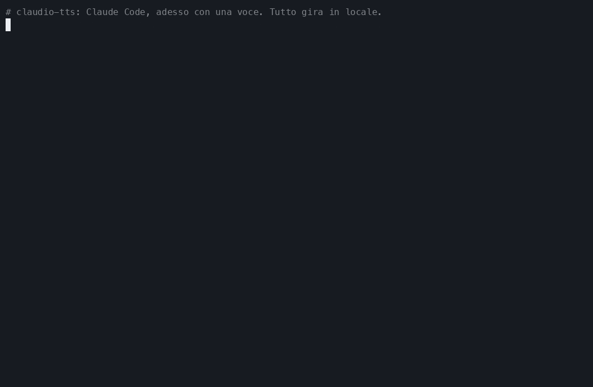
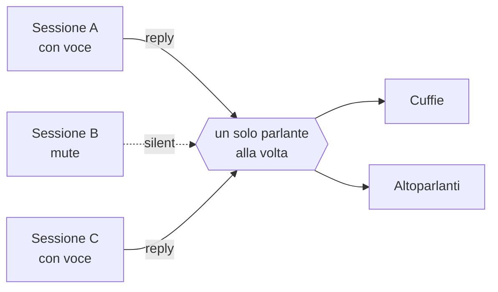
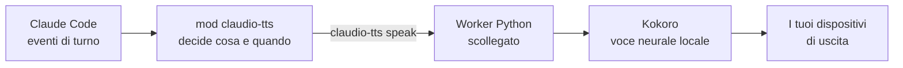

<div align="center">

<sub>🌍 [English (US)](README.md) · **Italiano** · [Polski](README.pl.md) · [Français](README.fr.md) · [Deutsch](README.de.md) · [日本語](README.ja.md) · [简体中文](README.zh-CN.md) · [हिन्दी](README.hi.md) · [Русский](README.ru.md) · [Español](README.es.md) · [Português](README.pt-BR.md)</sub>

# 🔊 claudio-tts

### Dai una voce a Claude Code. In locale. Gratis. Con zero token.

Risposte parlate naturali per [Claude Code](https://claude.com/claude-code), basate sul modello vocale open source
**[Kokoro](https://huggingface.co/hexgrad/Kokoro-82M)** e costruite sul nuovo
**sistema di mod** di Claude Code. Nessuna chiave API, nessun account, nessun costo per parola, e il tuo testo non lascia mai il tuo computer.

[](https://github.com/restante/claudio-tts/actions/workflows/ci.yml)
[](https://github.com/restante/claudio-tts/releases)
[](LICENSE)


[](CONTRIBUTING.md)



<sub>Una registrazione vera dei comandi veri. Una GIF non può portare l'audio, quindi
<a href="#-ascolta-le-voci">ascolta gli esempi</a> qui sotto. Puoi registrarla di nuovo quando vuoi con
<code>scripts/make-demo.sh</code>.</sub>

**[Installa](#-installa) · [Voci](#%EF%B8%8F-voci) · [Comandi](#-comandi) · [Perché Kokoro](#-perché-kokoro-niente-token-niente-api-niente-bolletta) · [Mod](#-costruito-sui-mod-di-claude-code) · [Contribuisci](#-contribuisci) · [Segnala un bug](#-segnala-un-bug)**

</div>

---

## ✨ In evidenza

- 🎧 **Ascolta Claude mentre fai altro.** Leggi un diff, fatti un caffè, riposa gli occhi. Le risposte di Claude, e
  la narrazione prima di ogni chiamata a uno strumento, vengono lette ad alta voce man mano che arrivano.
- 🆓 **Gratis per sempre, senza token, senza API.** La voce viene generata sul tuo computer. Non c'è niente a cui
  iscriversi e niente da pagare.
- 🔒 **Privato e offline.** Dopo il download una tantum del modello, funziona senza internet. Il tuo codice e le tue
  conversazioni non vengono mai inviati da nessuna parte per essere letti ad alta voce.
- 🎯 **Sempre l'ultima risposta.** Ascolta gli eventi di turno di Claude Code invece di rovistare nel file della
  trascrizione, quindi non può mai leggere il messaggio *precedente* a quello che hai appena ricevuto.
- 🧑‍🤝‍🧑 **Pensato per tante sessioni.** Il mute è per sessione, le nuove sessioni partono mute, le sessioni si
  alternano invece di parlarsi sopra, e ognuna ferma sempre e solo *la propria* voce.
- 🗣️ **54 voci, 9 lingue.** Cambia voce con un solo comando: `/tts voice af_heart`.
- 🔈 **I tuoi altoparlanti, le tue regole.** Volume, velocità e dispositivo di uscita (uno, più d'uno, o tutti insieme).
- 🩺 **Facile da supportare.** `claudio-tts doctor --report` scrive una segnalazione di bug pronta da incollare.

---

## 🧩 Costruito sui mod di Claude Code

claudio-tts è costruito sul nuovo **sistema di mod** di Claude Code, non sui vecchi hook "esegui uno script di shell a
ogni evento". Un mod è un piccolo plugin di funzioni tipizzate che gira *dentro* Claude Code, vede cosa fa il modello
mentre succede, può aggiungere comandi e voci nella barra di stato, e si ricarica a caldo mentre lavori. È esattamente
ciò che serve a una buona voce:

| Funzione dei mod | Cosa ne fa claudio-tts |
| --- | --- |
| **Eventi di turno** (`turn.complete`, `turn.step`, `turn.start`, `session.end`) | Riceve il testo finale del modello e la narrazione prima delle chiamate agli strumenti *direttamente nell'evento*, quindi non è mai una risposta indietro e non deve mai rileggere un file di trascrizione |
| **Stato per sessione** | Ogni sessione ricorda il proprio interruttore mute, così dieci sessioni aperte non diventano dieci voci |
| **Archivio persistente del mod** | Volume, velocità, voce e dispositivo di uscita sopravvivono ai riavvii |
| **Registrazione di slash command** | Aggiunge `/tts` con tutto quello che trovi sotto, direttamente dentro Claude Code |
| **Barra di stato** | Mostra `TTS on` oppure `TTS muted` per la sessione che stai guardando |
| **API dei processi** | Passa il testo al motore vocale locale senza mai bloccare Claude |
| **Contratto tipizzato e strumenti** | Include un contratto di tipi, e viene controllato con `claude plugin validate` e `claude plugin test` |
| **Ricarica a caldo** | Modifichi il mod e si ricarica, senza riavvio mentre sviluppi |

Il mod in sé è un sottile strato TypeScript ([`src/claudio_tts/mod`](src/claudio_tts/mod)). Il lavoro sull'audio vive in
un piccolo pacchetto Python, così macOS e Windows condividono un unico percorso di codice.

---

## 🚀 Installa

Ti serve [Claude Code](https://claude.com/claude-code). L'installer gestisce tutto il resto, compresi Python,
le dipendenze e il modello vocale.

**macOS**

```bash
curl -fsSL https://raw.githubusercontent.com/restante/claudio-tts/main/install.sh | bash
```

**Windows** (PowerShell, beta)

```powershell
irm https://raw.githubusercontent.com/restante/claudio-tts/main/install.ps1 | iex
```

Poi **riavvia Claude Code** e, in una sessione:

```text
/tts unmute
```

Tutto qui. Manda un messaggio e ascolta. 🎉 (Le nuove sessioni partono mute di proposito; vedi
[tante sessioni](#-tante-sessioni-un-solo-paio-di-orecchie).)

<details>
<summary><b>Cosa fa davvero l'installer?</b></summary>

1. Installa [`uv`](https://docs.astral.sh/uv/) se non ce l'hai. `uv` scarica anche un Python 3.12 privato,
   quindi non devi avere Python installato.
2. Crea un ambiente isolato (macOS: `~/Library/Application Support/claudio-tts`,
   Windows: `%LOCALAPPDATA%\claudio-tts`) e ci installa dentro questo pacchetto e le sue dipendenze.
3. Scarica il modello Kokoro (326 MB, oppure 92 MB con `--lite`) e **verifica il suo checksum SHA-256**.
4. Copia il mod di Claude Code in `~/.claude/mods/claudio-tts` e lo registra in `~/.claude/settings.json`.
   Le tue impostazioni vengono salvate in `settings.json.claudio-tts.bak` e unite, mai sovrascritte.
5. Esegue `doctor` per controllare il modello, i dispositivi audio e Claude Code.

Puoi rilanciarlo senza problemi: rieseguirlo aggiorna, e niente viene duplicato.
</details>

<details>
<summary><b>Opzioni dell'installer</b></summary>

| macOS / Linux (`bash -s -- …`) | Windows (`-…`) | Effetto |
| --- | --- | --- |
| `--lite` | `-Lite` | Modello più piccolo da 92 MB (un po' meno naturale, più veloce da scaricare e da eseguire) |
| `--no-model` | `-NoModel` | Salta il download del modello |
| `--ref <ref>` | `-Ref <ref>` | Installa un branch, un tag o un commit |
| `--uninstall` | `-Uninstall` | Rimuove tutto (aggiungi `--keep-models` / `-KeepModels` per tenere i file delle voci) |
| `--local` | `-Local` | Installa dal checkout in cui ti trovi |

Con `irm | iex` di PowerShell non puoi passare opzioni; imposta prima `CLAUDIO_TTS_LITE=1`, `CLAUDIO_TTS_NO_MODEL=1`,
`CLAUDIO_TTS_REF=<ref>` o `CLAUDIO_TTS_UNINSTALL=1`, oppure usa
`& ([scriptblock]::Create((irm <url>))) -Lite`.
</details>

---

## 🎮 Comandi

Tutto è un solo slash command dentro Claude Code:

| Comando | Cosa fa |
| --- | --- |
| `/tts` | Attiva/disattiva la voce **per questa sessione** |
| `/tts mute` · `/tts unmute` | La spegne / accende solo per questa sessione |
| `/tts status` | Mostra stato mute, volume, velocità, voce e uscita |
| `/tts default on` · `/tts default off` | Decide se le **nuove** sessioni partono parlando (`off` = partono mute, il valore predefinito) |
| `/tts voice` | Elenca tutte le voci e mostra quella attuale |
| `/tts voice af_heart` | Cambia la voce (ti saluta con la nuova voce). `/tts voice default` la ripristina |
| `/tts lang de` · `/tts lang auto` | Fa leggere alla voce un'altra lingua (una qualsiasi delle 140), oppure torna alla sua |
| `/tts update` | Cerca una nuova versione e la installa (nulla si installa finché non lo scrivi). `/tts update check` guarda soltanto, `/tts update off` ferma il controllo giornaliero |
| `/tts volume 1-10` | Volume, condiviso da tutte le sessioni. `/tts volume` lo mostra |
| `/tts speed 0.5-1.5` | Ritmo del parlato (1 è normale). `/tts pace` è un alias |
| `/tts device` | Elenca i dispositivi di uscita e mostra la scelta attuale |
| `/tts device airpods` | Parla su un solo dispositivo (funzionano anche i nomi parziali) |
| `/tts device airpods,macbook` | …su più dispositivi **nello stesso momento** |
| `/tts device all` | …su ogni uscita reale (i dispositivi virtuali come Zoom e Teams vengono saltati) |
| `/tts device default` | Torna al predefinito di sistema |
| `/tts mic` | Elenca i microfoni; `/tts mic <name>` salva una preferenza |

Ecco come appare in una sessione:

```text
> /tts unmute
claudio-tts: TTS on (this session), volume 10/10, speed 1, voice default, output default

> /tts voice bf_emma
claudio-tts: Voice: bf_emma

> /tts speed 0.9
claudio-tts: TTS speed 0.9
```

Volume, velocità, voce e dispositivo descrivono *la tua configurazione*, quindi sono condivisi. Il mute descrive *una
conversazione*, quindi è per sessione.

---

## 🗣️ Voci

Kokoro include **54 voci in 9 lingue**. Scegline una con `/tts voice <name>`, oppure elencale tutte con `/tts voice`
(o `claudio-tts voices` in un terminale). La prima lettera del nome di una voce indica la lingua e la seconda il
genere, e **claudio-tts sceglie automaticamente la lingua giusta** a partire dal nome.

> **Questi sono esempi, non limiti.** Puoi usare qualsiasi voce supportata da Kokoro, puoi aggiungere i tuoi file di
> voce, e una voce può leggere testi in 140 lingue (vedi [Usa qualsiasi altra voce o lingua](#-usa-qualsiasi-altra-voce-o-lingua)).

| | Lingua | Femminile | Maschile |
| --- | --- | --- | --- |
| 🇺🇸 | Inglese americano | `af_alloy` `af_aoede` `af_bella` `af_heart` `af_jessica` `af_kore` `af_nicole` `af_nova` `af_river` `af_sarah` `af_sky` | `am_adam` `am_echo` `am_eric` `am_fenrir` `am_liam` `am_michael` `am_onyx` `am_puck` `am_santa` |
| 🇬🇧 | Inglese britannico | `bf_alice` `bf_emma` `bf_isabella` `bf_lily` | `bm_daniel` `bm_fable` `bm_george` `bm_lewis` |
| 🇪🇸 | Spagnolo | `ef_dora` | `em_alex` `em_santa` |
| 🇫🇷 | Francese | `ff_siwis` | |
| 🇮🇳 | Hindi | `hf_alpha` `hf_beta` | `hm_omega` `hm_psi` |
| 🇮🇹 | Italiano | `if_sara` | `im_nicola` |
| 🇯🇵 | Giapponese | `jf_alpha` `jf_gongitsune` `jf_nezumi` `jf_tebukuro` | `jm_kumo` |
| 🇧🇷 | Portoghese brasiliano | `pf_dora` | `pm_alex` `pm_santa` |
| 🇨🇳 | Cinese mandarino | `zf_xiaobei` `zf_xiaoni` `zf_xiaoxiao` `zf_xiaoyi` | `zm_yunjian` `zm_yunxi` `zm_yunxia` `zm_yunyang` |

> **Tedesco, polacco e russo:** per ora Kokoro non ha voci native in tedesco, polacco o russo. L'installer, i comandi e
> questa documentazione sono completamente disponibili in tutte e tre le lingue (vedi i link in alto), ma la voce
> parlata sarà una voce inglese o di un'altra lingua che legge il tuo testo con un accento ben riconoscibile. Prova
> `claudio-tts say "…" --voice af_heart --lang de` (oppure `pl`, `ru`) per sentirlo. Se Kokoro aggiungerà queste voci,
> claudio-tts le userà tramite lo stesso comando `/tts voice`.

### 🎧 Ascolta le voci

**[▶ Apri il player delle voci](https://restante.github.io/claudio-tts/)** per ascoltare tutte le 54 voci direttamente
nel browser, con pulsanti di riproduzione a un clic. (GitHub non può riprodurre audio dentro un README, quindi il
player vive su una piccola pagina web.) Oppure clicca su un nome qui sotto per andare dritto a quella voce. Gli
esempi sono generati da Kokoro stesso.

| Voce | Ascolta | Voce | Ascolta |
| --- | --- | --- | --- |
| `af_heart` ⭐ | [▶ ascolta](https://restante.github.io/claudio-tts/#af_heart) | `bf_emma` | [▶ ascolta](https://restante.github.io/claudio-tts/#bf_emma) |
| `af_bella` ⭐ | [▶ ascolta](https://restante.github.io/claudio-tts/#af_bella) | `bf_isabella` | [▶ ascolta](https://restante.github.io/claudio-tts/#bf_isabella) |
| `af_nicole` | [▶ ascolta](https://restante.github.io/claudio-tts/#af_nicole) | `bm_george` | [▶ ascolta](https://restante.github.io/claudio-tts/#bm_george) |
| `af_sarah` | [▶ ascolta](https://restante.github.io/claudio-tts/#af_sarah) | `bm_fable` | [▶ ascolta](https://restante.github.io/claudio-tts/#bm_fable) |
| `af_sky` | [▶ ascolta](https://restante.github.io/claudio-tts/#af_sky) | `ef_dora` 🇪🇸 | [▶ ascolta](https://restante.github.io/claudio-tts/#ef_dora) |
| `am_michael` | [▶ ascolta](https://restante.github.io/claudio-tts/#am_michael) | `ff_siwis` 🇫🇷 | [▶ ascolta](https://restante.github.io/claudio-tts/#ff_siwis) |
| `am_fenrir` | [▶ ascolta](https://restante.github.io/claudio-tts/#am_fenrir) | `if_sara` 🇮🇹 | [▶ ascolta](https://restante.github.io/claudio-tts/#if_sara) |
| `am_puck` | [▶ ascolta](https://restante.github.io/claudio-tts/#am_puck) | `jf_alpha` 🇯🇵 | [▶ ascolta](https://restante.github.io/claudio-tts/#jf_alpha) |
| `hf_alpha` 🇮🇳 | [▶ ascolta](https://restante.github.io/claudio-tts/#hf_alpha) | `zf_xiaoxiao` 🇨🇳 | [▶ ascolta](https://restante.github.io/claudio-tts/#zf_xiaoxiao) |
| `pf_dora` 🇧🇷 | [▶ ascolta](https://restante.github.io/claudio-tts/#pf_dora) | | |

⭐ `af_heart` e `af_bella` sono generalmente considerate le voci inglesi più naturali; parti da lì.

### Consigli

- **La voce e il testo devono corrispondere.** Una voce spagnola che legge inglese suonerà strana, perché è la voce
  a decidere come si pronuncia il testo. Se chatti con Claude in spagnolo, scegli `ef_dora` o `em_alex`.
- **Imposta un valore predefinito per ogni sessione** senza usare comandi: metti `"KOKORO_VOICE": "bf_emma"` nel blocco
  `env` di `~/.claude/settings.json`. `/tts voice` lo sovrascrive, e `/tts voice default` ci torna.
- **Troppo veloce, troppo lenta?** `/tts speed 0.85` la rallenta, `/tts speed 1.2` la accelera.
- **La vuoi più bassa?** `/tts volume 4`. Il volume viene applicato a ogni campione, quindi non tocca il volume di sistema.
- La prima frase di una sessione può richiedere un attimo mentre il modello si carica; le successive sono rapide. Il
  modello `--lite` parte più in fretta e usa meno memoria.

### 🔧 Usa qualsiasi altra voce o lingua

Le 54 voci integrate e le 9 lingue native sono solo ciò che trovi già nella confezione:

```text
/tts voice af_mix                # a voice you added (a .npy file in the voices folder)
/tts lang de                     # read German (or any of 140 languages) through the current voice
/tts lang auto                   # back to the voice's own language
```

```json
{ "env": { "CLAUDIO_TTS_MODEL": "/path/to/model.onnx", "CLAUDIO_TTS_VOICES": "/path/to/voices.bin" } }
```

- **Aggiungi la tua voce**: salva un vettore di stile Kokoro come `voices/<name>.npy` nella cartella di installazione, e `<name>`
  compare in `/tts voice`. Puoi anche mescolare due voci per crearne una nuova.
- **Usa un altro modello Kokoro o un altro pacchetto di voci** (una release più recente, un pacchetto della community): imposta
  le due variabili d'ambiente qui sopra in `~/.claude/settings.json`.
- **Leggi qualsiasi lingua**: `/tts lang <code>` fa leggere alla voce attuale quella lingua (140 codici, vedi
  `claudio-tts languages`). Le lingue senza una voce nativa vengono lette con un accento.

Passo dopo passo, con uno script per mescolare le voci: **[docs/voices.md](docs/voices.md)**.

---

## 🆓 Perché Kokoro? Niente token, niente API, niente bolletta

La maggior parte delle soluzioni "fallo parlare" invia ogni risposta a un servizio cloud di sintesi vocale. claudio-tts no. Esegue
**[Kokoro](https://huggingface.co/hexgrad/Kokoro-82M)**, un piccolo modello vocale open-weight, sulla tua CPU.

| | ☁️ Sintesi vocale cloud | 🔊 claudio-tts + Kokoro |
| --- | --- | --- |
| **Chiave API / account** | Necessari | **Nessuno** |
| **Costo** | Per carattere o per minuto, per sempre | **Gratis** |
| **Token di Claude usati** | Spesso extra, se un modello scrive il copione | **Zero extra** (vedi nota) |
| **Privacy** | Le tue risposte vengono inviate a una terza parte | **Niente lascia il tuo computer** |
| **Offline** | No | **Sì** (dopo il download una tantum) |
| **Latenza** | Andata e ritorno di rete più code di attesa | **Inizia a parlare appena la prima frase è pronta** |
| **Limiti di richieste / interruzioni** | Sì | **Nessuno** |
| **Licenza** | Termini di servizio | **Modello Apache-2.0, codice MIT** |
| **Dimensione** | n/d | 326 MB (92 MB con `--lite`) |

> **Note oneste.** Il download una tantum del modello è di 326 MB. Generare la voce usa un po' di CPU mentre parla. Le
> migliori voci cloud a pagamento possono suonare più ricche di Kokoro, ma Kokoro è sorprendentemente naturale per un
> modello così piccolo. E il [riassunto vocale](#%EF%B8%8F-fai-parlare-meno-il-riassunto-vocale-opzionale) *opzionale* chiede a Claude
> di scrivere una o due frasi in più per ogni risposta, il che costa una manciata di token in output, solo se lo attivi.
> Senza, claudio-tts legge il testo che Claude ha già scritto e **non usa nessun token extra**.

---

## 🧑‍🤝‍🧑 Tante sessioni, un solo paio di orecchie



- Le nuove sessioni **partono mute**. Attiva la voce solo in quella che stai guardando (`/tts unmute`), oppure esegui
  `/tts default on` se preferisci che partano tutte parlando.
- Se due sessioni con la voce attiva rispondono insieme, la seconda **aspetta il suo turno** invece di interrompere la prima.
- Inviare un prompt, o andare in mute, ferma **solo la voce di quella sessione**.

## ✂️ Fai parlare *meno*: il riassunto vocale opzionale

Le risposte lunghe stancano da ascoltare. Se una risposta contiene un blocco di riassunto, claudio-tts legge **solo quel blocco**
e salta il resto. Aggiungi qualcosa di simile al tuo `CLAUDE.md` e Claude ne scriverà uno ogni volta:

```markdown
At the END of EVERY response add a short, conversational summary for text-to-speech, in this exact form.
Avoid URLs, file paths, code and variable names.

<!-- TTS_SUMMARY Due o tre frasi semplici sul risultato. TTS_SUMMARY -->
```

Nessun blocco? Legge l'intera risposta, con markdown, blocchi di codice, link ed emoji ripuliti in modo che suoni naturale.

---

## 🛠️ Come funziona



Il mod ascolta il testo del modello e le chiamate agli strumenti, tiene traccia del mute per sessione, e passa il testo al
comando `claudio-tts`. Tutto il lavoro specifico del sistema operativo (audio, controllo dei processi, lock, abbassare la tua musica mentre parla) vive nel
pacchetto Python, così macOS e Windows condividono un unico percorso di codice. I dettagli sono in [docs/how-it-works.md](docs/how-it-works.md).

## ⚙️ Configurazione

Variabili d'ambiente (mettile nel blocco `env` di `~/.claude/settings.json`):

| Variabile | Predefinito | Significato |
| --- | --- | --- |
| `KOKORO_VOICE` | `af_sky` | Voce predefinita per ogni sessione (vedi [Voci](#%EF%B8%8F-voci)) |
| `AUDIO_DUCK_ENABLED` | `true` | Abbassa Apple Music / Spotify mentre parla (solo macOS) |
| `DUCK_LEVEL` | `5` | Percentuale del volume originale della musica a cui abbassare |
| `CLAUDIO_TTS_HOME` | dipende dall'OS | Dove si trova l'installazione |
| `CLAUDIO_TTS_MODEL`, `CLAUDIO_TTS_VOICES` | integrato | Usa un altro modello Kokoro / pacchetto di voci (servono entrambe) |

## 💻 Riga di comando

Il pacchetto installa anche un comando `claudio-tts` (dentro il suo ambiente privato):

```text
claudio-tts say "Hello there" --voice bf_emma   speak now and wait
claudio-tts voices                              list all voices (the 54 built-in plus yours)
claudio-tts languages                           list the 140 languages a voice can read
claudio-tts devices [--inputs]                  list audio devices
claudio-tts doctor [--speak | --report]         check the install, or write a bug report
claudio-tts download-model [--lite]             fetch and verify the voice files
claudio-tts install-mod / uninstall-mod
```

## 🖥️ Piattaforme supportate

| | Stato |
| --- | --- |
| **macOS** (Apple silicon e Intel) | ✅ Supportato e testato, compreso l'abbassamento della musica |
| **Windows 10/11** | 🧪 **Beta.** Testato in CI; i riscontri con audio reale sono benvenuti. Ancora niente abbassamento della musica |
| **Linux** | 🤷 Nei limiti del possibile, non testato su hardware reale |

---

## 🐞 Segnala un bug

Hai trovato qualcosa di strano? È davvero utile, grazie.

1. Esegui questo e copia l'output:

   ```bash
   claudio-tts doctor --report
   ```

   (Se `claudio-tts` non è nel tuo PATH, usa il percorso completo stampato dall'installer, che finisce con
   `python -m claudio_tts doctor --report`.) Contiene il tuo OS, le versioni e i nomi dei dispositivi, ma **mai** niente
   di ciò che è stato letto ad alta voce né alcun segreto.
2. [**Apri una segnalazione di bug**](https://github.com/restante/claudio-tts/issues/new?template=bug_report.yml) e incollala.
   Racconta cosa ti aspettavi e cosa è successo.

Le soluzioni rapide stanno in [docs/troubleshooting.md](docs/troubleshooting.md) e [docs/windows.md](docs/windows.md). Quella
più comune: **il silenzio di solito significa che la sessione è ancora in mute**, quindi scrivi `/tts unmute`.

## 🤝 Contribuisci

**I contributori sono i benvenuti, davvero.** Tutto è nato come un progetto di un weekend portato avanti da una sola persona, e migliora con più
persone: più voci provate, più piattaforme coperte, più idee.

Ottimi punti da cui iniziare:

- 🪟 **Windows**: provalo su hardware reale, racconta cosa senti, oppure costruisci l'abbassamento della musica (volume per app).
- 🐧 **Linux**: rifinisci e testa l'installer sulla tua distro.
- 🎛️ **Mix di voci e anteprime**: mescola due voci, oppure ascolta una voce prima di sceglierla.
- 📦 **Pacchettizzazione**: `pipx`, Homebrew, winget.
- 🌍 **Lingue**: lettura migliore di codice, numeri e testo in più lingue mescolate.
- 📚 **Documentazione e demo**: GIF migliori, traduzioni, tutorial.

Cerca [`good first issue`](https://github.com/restante/claudio-tts/labels/good%20first%20issue) e
[`help wanted`](https://github.com/restante/claudio-tts/labels/help%20wanted), e leggi
[CONTRIBUTING.md](CONTRIBUTING.md) per essere operativo in cinque minuti.

**Vuoi parlarne prima?** [Apri una discussione](https://github.com/restante/claudio-tts/discussions) o contattami
tramite il mio profilo GitHub, [@restante](https://github.com/restante). Idee, domande, storie del tipo "l'ho provato su X e…",
e offerte di aiuto sono tutte benvenute. E se claudio-tts ti ha migliorato la giornata, una ⭐ aiuta gli altri a trovarlo.

## 🗺️ Roadmap

- [ ] Abbassamento della musica su Windows
- [ ] Mix di voci (`/tts voice af_heart+am_adam`)
- [ ] Installazioni con `pipx` / Homebrew / winget
- [ ] Lettura più intelligente di codice, percorsi e numeri
- [ ] Un selettore con anteprima delle voci

## 🔄 Aggiornamento

claudio-tts cerca una nuova versione al massimo una volta al giorno all'avvio di una sessione e mostra `update available`. Non installa mai da solo. Scrivi `/tts update` per installarla, poi riavvia le sessioni aperte. `/tts update off` disattiva il controllo.

## 🗑️ Disinstalla

```bash
curl -fsSL https://raw.githubusercontent.com/restante/claudio-tts/main/install.sh | bash -s -- --uninstall
```

(Windows: `$env:CLAUDIO_TTS_UNINSTALL=1; irm …/install.ps1 | iex`.) Il tuo `settings.json` viene ripristinato com'era.

## 🧑‍💻 Sviluppo

```bash
git clone https://github.com/restante/claudio-tts && cd claudio-tts
bash install.sh --dev          # editable install, mod symlinked from src/claudio_tts/mod
.venv/bin/pytest               # or: uv venv && uv pip install -e ".[dev]" && pytest
```

Con Claude Code installato, controlla il mod con `claude plugin validate src/claudio_tts/mod` e
`claude plugin test src/claudio_tts/mod`.

## 🙏 Ringraziamenti

- [Kokoro-82M](https://huggingface.co/hexgrad/Kokoro-82M) di hexgrad (Apache-2.0), eseguito tramite
  [kokoro-onnx](https://github.com/thewh1teagle/kokoro-onnx) di thewh1teagle (MIT).
- L'idea di dare una voce a Claude Code viene da [ktaletsk/claude-code-tts](https://github.com/ktaletsk/claude-code-tts).
  claudio-tts è un'implementazione nuova sul sistema di mod di Claude Code e non condivide codice con quel progetto.

## 📄 Licenza

[MIT](LICENSE) © 2026 Claudio Restante
