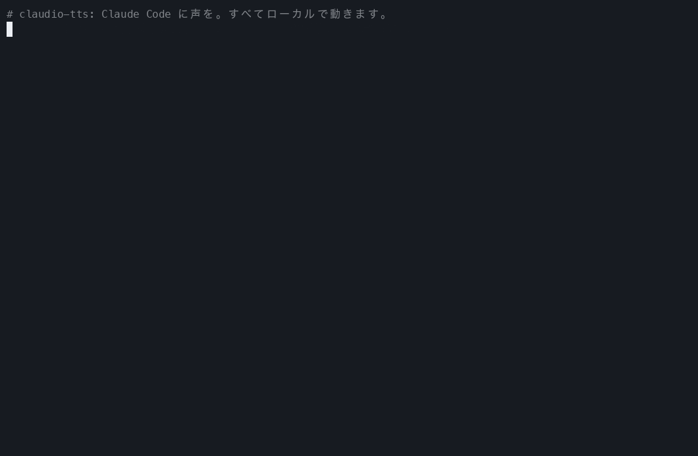
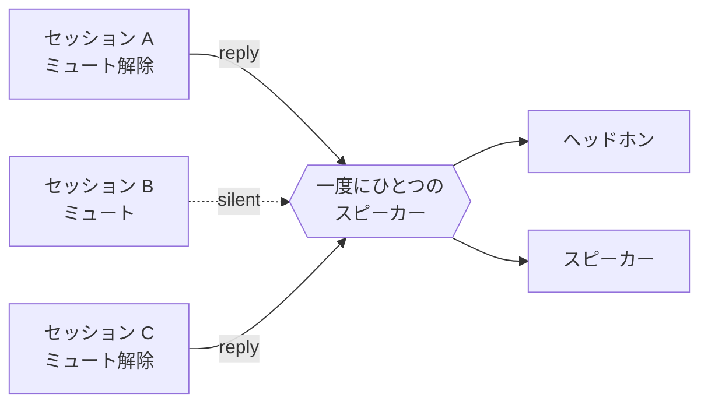
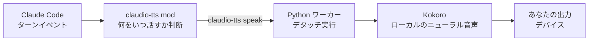

<div align="center">

<sub>🌍 [English (US)](README.md) · [Italiano](README.it.md) · [Polski](README.pl.md) · [Français](README.fr.md) · [Deutsch](README.de.md) · **日本語** · [简体中文](README.zh-CN.md) · [हिन्दी](README.hi.md) · [Русский](README.ru.md) · [Español](README.es.md) · [Português](README.pt-BR.md)</sub>

# 🔊 claudio-tts

### Claude Code に声をプレゼント。ローカルで、無料で、トークン消費ゼロ。

[Claude Code](https://claude.com/claude-code) の返信を自然な音声で読み上げます。オープンソースの音声モデル
**[Kokoro](https://huggingface.co/hexgrad/Kokoro-82M)** を使い、Claude Code の新しい
**mod システム**の上に作られています。API キーもアカウントも不要で、単語ごとの料金もかからず、テキストがあなたのマシンの外に出ることもありません。

[](https://github.com/restante/claudio-tts/actions/workflows/ci.yml)
[](https://github.com/restante/claudio-tts/releases)
[](LICENSE)


[](CONTRIBUTING.md)



<sub>本物のコマンドを本物で録画したものです。GIF には音が入らないので、下の
<a href="#-音声を聴いてみよう">サンプルを聴いてみてください</a>。再録画はいつでも
<code>scripts/make-demo.sh</code> でできます。</sub>

**[インストール](#-インストール) · [音声](#%EF%B8%8F-音声) · [コマンド](#-コマンド) · [なぜ Kokoro?](#-なぜ-kokoro-トークンも-api-も請求も不要) · [mod](#-claude-code-の-mod-の上に構築) · [コントリビュート](#-コントリビュート) · [バグを報告する](#-バグを報告する)**

</div>

---

## ✨ ハイライト

- 🎧 **何かをしながら Claude の声を聴けます。** diff を読みながら、コーヒーを淹れながら、目を休めながら。Claude の返信と、
  ツール呼び出しの前のナレーションが、届いたそばから読み上げられます。
- 🆓 **ずっと無料、トークンも API も不要。** 音声はあなた自身のコンピューターで生成されます。登録も支払いも一切ありません。
- 🔒 **プライベートでオフライン。** 最初に一度モデルをダウンロードすれば、インターネットなしで動きます。コードや会話が
  音声化のためにどこかへ送られることはありません。
- 🎯 **いつも最新の返信を。** トランスクリプトファイルをかき集めるのではなく、Claude Code 自身のターンイベントを聞いているので、
  いま受け取ったメッセージの*ひとつ前*を読んでしまうことはありません。
- 🧑‍🤝‍🧑 **たくさんのセッションに対応。** ミュートはセッションごと、新しいセッションはミュートで開始、セッション同士は声が重ならず順番に話し、
  それぞれが止めるのは*自分の*声だけです。
- 🗣️ **54 種類の音声、9 言語。** 声の変更はコマンドひとつ: `/tts voice af_heart`。
- 🔈 **あなたのスピーカー、あなたのルール。** 音量、速度、出力デバイス(ひとつでも、複数でも、すべて同時でも)。
- 🩺 **サポートも簡単。** `claudio-tts doctor --report` で、そのまま貼り付けられるバグ報告を出力します。

---

## 🧩 Claude Code の mod の上に構築

claudio-tts は、Claude Code の新しい **mod システム**の上に作られています。イベントのたびにシェルスクリプトを走らせる従来の
フックではありません。mod は型付きの関数からなる小さなプラグインで、Claude Code の*内部*で動き、モデルがしていることを
リアルタイムに把握し、コマンドやステータスラインの項目を追加でき、作業中にホットリロードされます。まさに、良い音声機能に必要なものです。

| mod の機能 | claudio-tts での使い方 |
| --- | --- |
| **ターンイベント**(`turn.complete`、`turn.step`、`turn.start`、`session.end`) | モデルの最終テキストとツール呼び出し前のナレーションを、イベントの中で*直接*受け取ります。だから 1 つ前の返信を読むことはなく、トランスクリプトファイルを読み直す必要もありません |
| **セッションごとの状態** | 各セッションが自分のミュートスイッチを覚えているので、10 個のセッションを開いても 10 人の声にはなりません |
| **永続的な mod ストア** | 音量、速度、音声、出力デバイスが再起動後も保たれます |
| **スラッシュコマンドの登録** | 下記のすべてを備えた `/tts` を、Claude Code の中にそのまま追加します |
| **ステータスライン** | 見ているセッションについて `TTS on` または `TTS muted` を表示します |
| **プロセス API** | Claude を一切ブロックせずに、ローカルの音声エンジンへテキストを渡します |
| **型付きの契約とツール** | 型の契約を同梱し、`claude plugin validate` と `claude plugin test` で検証されます |
| **ホットリロード** | mod を編集すればそのまま再読み込み。開発中に再起動は不要です |

mod 本体は薄い TypeScript のレイヤー([`src/claudio_tts/mod`](src/claudio_tts/mod))です。音声処理は小さな Python パッケージに
あり、macOS と Windows で同じコードパスを共有します。

---

## 🚀 インストール

必要なのは [Claude Code](https://claude.com/claude-code) だけです。Python、依存関係、音声モデルなど、残りはすべてインストーラーが
やってくれます。

**macOS**

```bash
curl -fsSL https://raw.githubusercontent.com/restante/claudio-tts/main/install.sh | bash
```

**Windows**(PowerShell、ベータ)

```powershell
irm https://raw.githubusercontent.com/restante/claudio-tts/main/install.ps1 | iex
```

そのあと **Claude Code を再起動**して、セッションの中で次を実行します。

```text
/tts unmute
```

これで完了です。メッセージを送って、聴いてみてください。🎉(新しいセッションは、あえてミュートで始まります。詳しくは
[複数セッション](#-複数セッション耳はひとつ)をどうぞ。)

<details>
<summary><b>インストーラーは実際に何をするの?</b></summary>

1. [`uv`](https://docs.astral.sh/uv/) がなければインストールします。`uv` は専用の Python 3.12 もダウンロードするので、
   Python を自分で入れておく必要はありません。
2. 独立した環境(macOS: `~/Library/Application Support/claudio-tts`、
   Windows: `%LOCALAPPDATA%\claudio-tts`)を作り、このパッケージと依存関係をその中にインストールします。
3. Kokoro モデル(326 MB、`--lite` なら 92 MB)をダウンロードし、**SHA-256 チェックサムを検証**します。
4. Claude Code の mod を `~/.claude/mods/claudio-tts` にコピーし、`~/.claude/settings.json` に登録します。
   設定は `settings.json.claudio-tts.bak` にバックアップされ、上書きではなくマージされます。
5. `doctor` を実行して、モデル、オーディオデバイス、Claude Code をチェックします。

何度実行しても安全です。再実行すれば更新され、重複することもありません。
</details>

<details>
<summary><b>インストーラーのオプション</b></summary>

| macOS / Linux(`bash -s -- …`) | Windows(`-…`) | 効果 |
| --- | --- | --- |
| `--lite` | `-Lite` | より小さい 92 MB のモデル(自然さは少し落ちますが、ダウンロードも動作も速い) |
| `--no-model` | `-NoModel` | モデルのダウンロードをスキップ |
| `--ref <ref>` | `-Ref <ref>` | ブランチ、タグ、コミットを指定してインストール |
| `--uninstall` | `-Uninstall` | すべて削除(音声ファイルを残すには `--keep-models` / `-KeepModels` を追加) |
| `--local` | `-Local` | 今いるチェックアウトからインストール |

PowerShell の `irm | iex` ではスイッチを渡せません。先に `CLAUDIO_TTS_LITE=1`、`CLAUDIO_TTS_NO_MODEL=1`、
`CLAUDIO_TTS_REF=<ref>`、`CLAUDIO_TTS_UNINSTALL=1` のいずれかを設定するか、
`& ([scriptblock]::Create((irm <url>))) -Lite` を使ってください。
</details>

---

## 🎮 コマンド

すべて、Claude Code の中のスラッシュコマンドひとつで完結します。

| コマンド | できること |
| --- | --- |
| `/tts` | **このセッションの**読み上げを切り替え |
| `/tts mute` · `/tts unmute` | このセッションだけオフ / オンにする |
| `/tts status` | ミュート状態、音量、速度、音声、出力を表示 |
| `/tts default on` · `/tts default off` | **新しい**セッションを読み上げ状態で始めるかどうか(`off` = ミュートで開始、これが初期設定) |
| `/tts voice` | すべての音声を一覧表示し、現在の音声を表示 |
| `/tts voice af_heart` | 音声を変更(新しい声で挨拶します)。`/tts voice default` で元に戻す |
| `/tts lang de` · `/tts lang auto` | 音声にほかの言語を読ませる(140 言語のどれでも)、または音声本来の言語に戻す |
| `/tts volume 1-10` | 音量。すべてのセッションで共通です。`/tts volume` で現在値を表示 |
| `/tts speed 0.5-1.5` | 話す速さ(1 が標準)。`/tts pace` は別名です |
| `/tts device` | 出力デバイスを一覧表示し、現在の選択を表示 |
| `/tts device airpods` | ひとつのデバイスで話す(名前の一部でも OK) |
| `/tts device airpods,macbook` | …複数のデバイスで**同時に**話す |
| `/tts device all` | …実在するすべての出力で話す(Zoom や Teams などの仮想デバイスはスキップ) |
| `/tts device default` | システムの既定に戻す |
| `/tts mic` | マイクを一覧表示。`/tts mic <name>` で好みを保存 |

セッションの中ではこんな感じになります。

```text
> /tts unmute
claudio-tts: TTS on (this session), volume 10/10, speed 1, voice default, output default

> /tts voice bf_emma
claudio-tts: Voice: bf_emma

> /tts speed 0.9
claudio-tts: TTS speed 0.9
```

音量、速度、音声、デバイスは*あなたの環境*についての設定なので共通です。ミュートは*会話*についての設定なので、セッションごとです。

---

## 🗣️ 音声

Kokoro には **9 言語、54 種類の音声**があります。`/tts voice <name>` で選ぶか、`/tts voice`(ターミナルなら
`claudio-tts voices`)で全部を一覧表示できます。音声名の最初の文字が言語、2 文字目が性別を表し、
**claudio-tts は名前から正しい言語を自動で選びます**。

> **ここにあるのは例であって、上限ではありません。** Kokoro が対応するどの音声でも使えますし、自分の音声ファイルを追加することもでき、
> 音声は 140 言語のテキストを読み上げられます([ほかの音声や言語を使う](#-ほかの音声や言語を使う)を参照)。

| | 言語 | 女性 | 男性 |
| --- | --- | --- | --- |
| 🇺🇸 | アメリカ英語 | `af_alloy` `af_aoede` `af_bella` `af_heart` `af_jessica` `af_kore` `af_nicole` `af_nova` `af_river` `af_sarah` `af_sky` | `am_adam` `am_echo` `am_eric` `am_fenrir` `am_liam` `am_michael` `am_onyx` `am_puck` `am_santa` |
| 🇬🇧 | イギリス英語 | `bf_alice` `bf_emma` `bf_isabella` `bf_lily` | `bm_daniel` `bm_fable` `bm_george` `bm_lewis` |
| 🇪🇸 | スペイン語 | `ef_dora` | `em_alex` `em_santa` |
| 🇫🇷 | フランス語 | `ff_siwis` | |
| 🇮🇳 | ヒンディー語 | `hf_alpha` `hf_beta` | `hm_omega` `hm_psi` |
| 🇮🇹 | イタリア語 | `if_sara` | `im_nicola` |
| 🇯🇵 | 日本語 | `jf_alpha` `jf_gongitsune` `jf_nezumi` `jf_tebukuro` | `jm_kumo` |
| 🇧🇷 | ブラジルポルトガル語 | `pf_dora` | `pm_alex` `pm_santa` |
| 🇨🇳 | 中国語(標準語) | `zf_xiaobei` `zf_xiaoni` `zf_xiaoxiao` `zf_xiaoyi` | `zm_yunjian` `zm_yunxi` `zm_yunxia` `zm_yunyang` |

> **ドイツ語、ポーランド語、ロシア語について:** Kokoro には、ドイツ語、ポーランド語、ロシア語のネイティブな音声がまだありません。インストーラー、
> コマンド、このドキュメントは 3 言語すべてで完全に利用できます(先頭のリンクをご覧ください)が、実際に話す声は
> 英語などほかの言語の音声で、はっきりとしたなまりでテキストを読み上げることになります。
> `claudio-tts say "…" --voice af_heart --lang de`(または `pl`、`ru`)で聴いてみてください。Kokoro がそれらの音声を追加すれば、
> claudio-tts は同じ `/tts voice` コマンドでそのまま使えるようになります。

### 🎧 音声を聴いてみよう

**[▶ 音声プレーヤーを開く](https://restante.github.io/claudio-tts/)** と、54 種類すべての音声を、ワンクリックの再生ボタンでブラウザ上でそのまま聴けます。
(GitHub は README の中で音声を再生できないため、プレーヤーは小さな Web ページに置いてあります。)あるいは、下の名前をクリックして直接そのページへ飛ぶこともできます。サンプルは Kokoro 自身が生成したものです。

| 音声 | 試聴 | 音声 | 試聴 |
| --- | --- | --- | --- |
| `af_heart` ⭐ | [▶ 聴く](https://restante.github.io/claudio-tts/#af_heart) | `bf_emma` | [▶ 聴く](https://restante.github.io/claudio-tts/#bf_emma) |
| `af_bella` ⭐ | [▶ 聴く](https://restante.github.io/claudio-tts/#af_bella) | `bf_isabella` | [▶ 聴く](https://restante.github.io/claudio-tts/#bf_isabella) |
| `af_nicole` | [▶ 聴く](https://restante.github.io/claudio-tts/#af_nicole) | `bm_george` | [▶ 聴く](https://restante.github.io/claudio-tts/#bm_george) |
| `af_sarah` | [▶ 聴く](https://restante.github.io/claudio-tts/#af_sarah) | `bm_fable` | [▶ 聴く](https://restante.github.io/claudio-tts/#bm_fable) |
| `af_sky` | [▶ 聴く](https://restante.github.io/claudio-tts/#af_sky) | `ef_dora` 🇪🇸 | [▶ 聴く](https://restante.github.io/claudio-tts/#ef_dora) |
| `am_michael` | [▶ 聴く](https://restante.github.io/claudio-tts/#am_michael) | `ff_siwis` 🇫🇷 | [▶ 聴く](https://restante.github.io/claudio-tts/#ff_siwis) |
| `am_fenrir` | [▶ 聴く](https://restante.github.io/claudio-tts/#am_fenrir) | `if_sara` 🇮🇹 | [▶ 聴く](https://restante.github.io/claudio-tts/#if_sara) |
| `am_puck` | [▶ 聴く](https://restante.github.io/claudio-tts/#am_puck) | `jf_alpha` 🇯🇵 | [▶ 聴く](https://restante.github.io/claudio-tts/#jf_alpha) |
| `hf_alpha` 🇮🇳 | [▶ 聴く](https://restante.github.io/claudio-tts/#hf_alpha) | `zf_xiaoxiao` 🇨🇳 | [▶ 聴く](https://restante.github.io/claudio-tts/#zf_xiaoxiao) |
| `pf_dora` 🇧🇷 | [▶ 聴く](https://restante.github.io/claudio-tts/#pf_dora) | | |

⭐ `af_heart` と `af_bella` は、英語の音声の中でもとくに自然だと言われています。まずはここから試してみてください。

### ヒント

- **音声とテキストの言語を合わせましょう。** スペイン語の音声が英語を読むと不自然に聞こえます。音声がテキストの発音を
  決めるからです。Claude とスペイン語で話すなら、`ef_dora` か `em_alex` を選んでください。
- **すべてのセッションの既定を設定する**にはコマンドは不要です。`~/.claude/settings.json` の `env` ブロックに
  `"KOKORO_VOICE": "bf_emma"` を入れましょう。`/tts voice` で上書きでき、`/tts voice default` でこの設定に戻ります。
- **速すぎる? 遅すぎる?** `/tts speed 0.85` でゆっくりに、`/tts speed 1.2` で速くなります。
- **もう少し静かに?** `/tts volume 4`。音量はサンプルごとに適用されるので、システムの音量には影響しません。
- セッションの最初の 1 文は、モデルを読み込むため少し時間がかかることがあります。2 文目以降は速いです。`--lite`
  モデルは起動が速く、メモリ使用量も少なめです。

### 🔧 ほかの音声や言語を使う

組み込みの 54 種類の音声と 9 つのネイティブ言語は、標準で付いてくる分にすぎません。

```text
/tts voice af_mix                # a voice you added (a .npy file in the voices folder)
/tts lang de                     # read German (or any of 140 languages) through the current voice
/tts lang auto                   # back to the voice's own language
```

```json
{ "env": { "CLAUDIO_TTS_MODEL": "/path/to/model.onnx", "CLAUDIO_TTS_VOICES": "/path/to/voices.bin" } }
```

- **自分の音声を追加する**: Kokoro のスタイルベクトルをインストールフォルダの `voices/<name>.npy` として保存すると、`<name>` が
  `/tts voice` に現れます。2 つの音声をブレンドして新しい音声を作ることもできます。
- **別の Kokoro モデルや音声パックを使う**(新しいリリースやコミュニティのパックなど): 上の 2 つの環境変数を
  `~/.claude/settings.json` に設定します。
- **どんな言語でも読む**: `/tts lang <code>` で、現在の音声にその言語を読ませられます(140 個のコード。`claudio-tts languages`
  を参照)。ネイティブな音声がない言語は、なまりのある読み上げになります。

ブレンド用スクリプト付きのステップバイステップ解説はこちら: **[docs/voices.md](docs/voices.md)**。

---

## 🆓 なぜ Kokoro? トークンも API も請求も不要

「しゃべらせる」仕組みの多くは、すべての返信をクラウドの音声合成サービスに送ります。claudio-tts は違います。小さなオープンウェイトの
音声モデル **[Kokoro](https://huggingface.co/hexgrad/Kokoro-82M)** を、あなた自身の CPU で動かします。

| | ☁️ クラウドの音声合成 | 🔊 claudio-tts + Kokoro |
| --- | --- | --- |
| **API キー / アカウント** | 必要 | **不要** |
| **コスト** | 文字数や分数ごとに、ずっと課金 | **無料** |
| **使用する Claude トークン** | モデルが台本を書く場合、追加で消費することが多い | **追加ゼロ**(注記を参照) |
| **プライバシー** | 返信がサードパーティに送られる | **あなたのコンピューターの外には何も出ません** |
| **オフライン** | 不可 | **可能**(最初に一度ダウンロードしたあと) |
| **レイテンシ** | ネットワークの往復と順番待ち | **最初の 1 文ができ次第、すぐに話し始めます** |
| **レート制限 / 障害** | あり | **なし** |
| **ライセンス** | 利用規約 | **モデルは Apache-2.0、コードは MIT** |
| **サイズ** | 該当なし | 326 MB(`--lite` なら 92 MB) |

> **正直な注記。** 最初のモデルのダウンロードは 326 MB です。話している間は音声生成で CPU を少し使います。最高級の有料クラウド音声の方が
> Kokoro より豊かに聞こえる場合もありますが、この小ささのモデルとしては、Kokoro は驚くほど自然です。そして*オプションの*
> [音声サマリー](#%EF%B8%8F-しゃべりを減らす-オプションの音声サマリー)は、返信ごとに 1〜2 文を追加で書くよう Claude に頼むため、
> ごくわずかな出力トークンを使います。ただし、オンにしたときだけです。
> オフのままなら、claudio-tts は Claude がすでに書いたテキストを読むだけで、**追加のトークンはまったく使いません**。

---

## 🧑‍🤝‍🧑 複数セッション、耳はひとつ



- 新しいセッションは**ミュートで始まります**。見ているセッションだけミュートを解除する(`/tts unmute`)か、全部を最初から
  話させたいなら `/tts default on` を実行してください。
- ミュート解除中のセッションが同時に答えた場合、2 つ目は最初の声を遮らず、**順番を待ちます**。
- プロンプトを送信するか、ミュートすると、止まるのは**そのセッションの**声だけです。

## ✂️ しゃべりを*減らす*: オプションの音声サマリー

長い回答は、聴いていると疲れます。返信にサマリーブロックが含まれていれば、claudio-tts は**そのブロックだけ**を読み上げ、
残りはスキップします。`CLAUDE.md` に次のような内容を追加すれば、Claude が毎回書いてくれます。

```markdown
At the END of EVERY response add a short, conversational summary for text-to-speech, in this exact form.
Avoid URLs, file paths, code and variable names.

<!-- TTS_SUMMARY Two or three plain sentences about the result. TTS_SUMMARY -->
```

ブロックがない場合は返信全体を読み上げます。その際、Markdown、コードブロック、リンク、絵文字は自然に聞こえるよう整えられます。

---

## 🛠️ 仕組み



mod はモデルのテキストとツール呼び出しを監視し、セッションごとのミュートを管理して、テキストを `claudio-tts`
コマンドに渡します。OS 固有の処理(オーディオ、プロセス制御、ロック、話している間の音楽の音量下げ)はすべて Python パッケージの
中にあるので、macOS と Windows でコードパスを共有できます。詳細は [docs/how-it-works.md](docs/how-it-works.md) をご覧ください。

## ⚙️ 設定

環境変数です(`~/.claude/settings.json` の `env` ブロックに入れてください)。

| 変数 | 既定値 | 意味 |
| --- | --- | --- |
| `KOKORO_VOICE` | `af_sky` | すべてのセッションの既定の音声([音声](#%EF%B8%8F-音声)を参照) |
| `CLAUDIO_TTS_MODEL`, `CLAUDIO_TTS_VOICES` | 組み込み | 別の Kokoro モデル / 音声パックを使う(両方必須) |
| `AUDIO_DUCK_ENABLED` | `true` | 話している間、Apple Music / Spotify の音量を下げる(macOS のみ) |
| `DUCK_LEVEL` | `5` | 元の音楽の音量に対して、何パーセントまで下げるか |
| `CLAUDIO_TTS_HOME` | OS ごと | インストール先 |

## 💻 コマンドライン

このパッケージは `claudio-tts` コマンドもインストールします(専用の環境の中に入ります)。

```text
claudio-tts say "Hello there" --voice bf_emma   speak now and wait
claudio-tts voices                              list all voices (the 54 built-in plus yours)
claudio-tts languages                           list the 140 languages a voice can read
claudio-tts devices [--inputs]                  list audio devices
claudio-tts doctor [--speak | --report]         check the install, or write a bug report
claudio-tts download-model [--lite]             fetch and verify the voice files
claudio-tts install-mod / uninstall-mod
```

## 🖥️ 対応プラットフォーム

| | 状況 |
| --- | --- |
| **macOS**(Apple silicon と Intel) | ✅ 対応・テスト済み。音楽の音量下げにも対応 |
| **Windows 10/11** | 🧪 **ベータ。** CI でテスト済み。実機のオーディオでのフィードバックを歓迎します。音楽の音量下げはまだありません |
| **Linux** | 🤷 ベストエフォート。実機では未テスト |

---

## 🐞 バグを報告する

おかしな点を見つけましたか? それは本当に助かります。ありがとうございます。

1. 次のコマンドを実行して、出力をコピーしてください。

   ```bash
   claudio-tts doctor --report
   ```

   (`claudio-tts` が PATH にない場合は、インストーラーが表示したフルパスを使い、末尾を
   `python -m claudio_tts doctor --report` にしてください。)出力には OS、バージョン、デバイス名が含まれますが、
   話した内容や秘密情報は**一切**含まれません。
2. [**バグ報告を開き**](https://github.com/restante/claudio-tts/issues/new?template=bug_report.yml)、そこに貼り付けてください。
   期待したことと、実際に起きたことも書いてください。

よくある対処法は [docs/troubleshooting.md](docs/troubleshooting.md) と [docs/windows.md](docs/windows.md) にあります。
いちばん多いのはこれです: **無音なら、たいていそのセッションがまだミュートのままです**。`/tts unmute` と入力してください。

## 🤝 コントリビュート

**コントリビューター大歓迎です。** これは週末の個人プロジェクトとして始まりましたが、人が増えるほど良くなっていきます。
試せる音声が増え、対応プラットフォームが増え、アイデアも増えます。

飛び込みやすいのは、こんなところです。

- 🪟 **Windows**: 実機で試して、聞こえた音を報告する、または音楽の音量下げ(アプリごとの音量)を作る。
- 🐧 **Linux**: お使いのディストリビューションでインストーラーを磨き、テストする。
- 🎛️ **音声のブレンドとプレビュー**: 2 つの音声を混ぜる、選ぶ前に試聴する。
- 📦 **パッケージング**: `pipx`、Homebrew、winget。
- 🌍 **言語**: コード、数字、多言語混在テキストのより良い読み上げ。
- 📚 **ドキュメントとデモ**: より良い GIF、翻訳、チュートリアル。

[`good first issue`](https://github.com/restante/claudio-tts/labels/good%20first%20issue) や
[`help wanted`](https://github.com/restante/claudio-tts/labels/help%20wanted) を探して、
[CONTRIBUTING.md](CONTRIBUTING.md) を読めば、5 分でセットアップできます。

**まず話してみたい?** [ディスカッションを始める](https://github.com/restante/claudio-tts/discussions)か、
GitHub のプロフィール [@restante](https://github.com/restante) から連絡してください。アイデア、質問、「X で試したら…」という
体験談、お手伝いの申し出、どれも大歓迎です。そして claudio-tts があなたの一日を楽しくしたなら、⭐ をいただけると、ほかの人が見つけやすくなります。

## 🗺️ ロードマップ

- [ ] Windows での音楽の音量下げ
- [ ] 音声のブレンド(`/tts voice af_heart+am_adam`)
- [ ] `pipx` / Homebrew / winget でのインストール
- [ ] コード、パス、数字のよりスマートな読み上げ
- [ ] 音声プレビューの選択画面

## 🗑️ アンインストール

```bash
curl -fsSL https://raw.githubusercontent.com/restante/claudio-tts/main/install.sh | bash -s -- --uninstall
```

(Windows: `$env:CLAUDIO_TTS_UNINSTALL=1; irm …/install.ps1 | iex`。)`settings.json` は元の状態に戻ります。

## 🧑‍💻 開発

```bash
git clone https://github.com/restante/claudio-tts && cd claudio-tts
bash install.sh --dev          # editable install, mod symlinked from src/claudio_tts/mod
.venv/bin/pytest               # or: uv venv && uv pip install -e ".[dev]" && pytest
```

Claude Code がインストールされていれば、`claude plugin validate src/claudio_tts/mod` と
`claude plugin test src/claudio_tts/mod` で mod をチェックできます。

## 🙏 クレジット

- hexgrad による [Kokoro-82M](https://huggingface.co/hexgrad/Kokoro-82M)(Apache-2.0)。thewh1teagle による
  [kokoro-onnx](https://github.com/thewh1teagle/kokoro-onnx)(MIT)を通じて実行しています。
- Claude Code に声を与えるというアイデアは [ktaletsk/claude-code-tts](https://github.com/ktaletsk/claude-code-tts) から生まれました。
  claudio-tts は Claude Code の mod システム上でゼロから実装し直したもので、コードは共有していません。
- Claude(AI)の助けを借りて作り、そのあとメンテナーがレビューとテストを行いました。

## 📄 ライセンス

[MIT](LICENSE) © 2026 Claudio Restante
