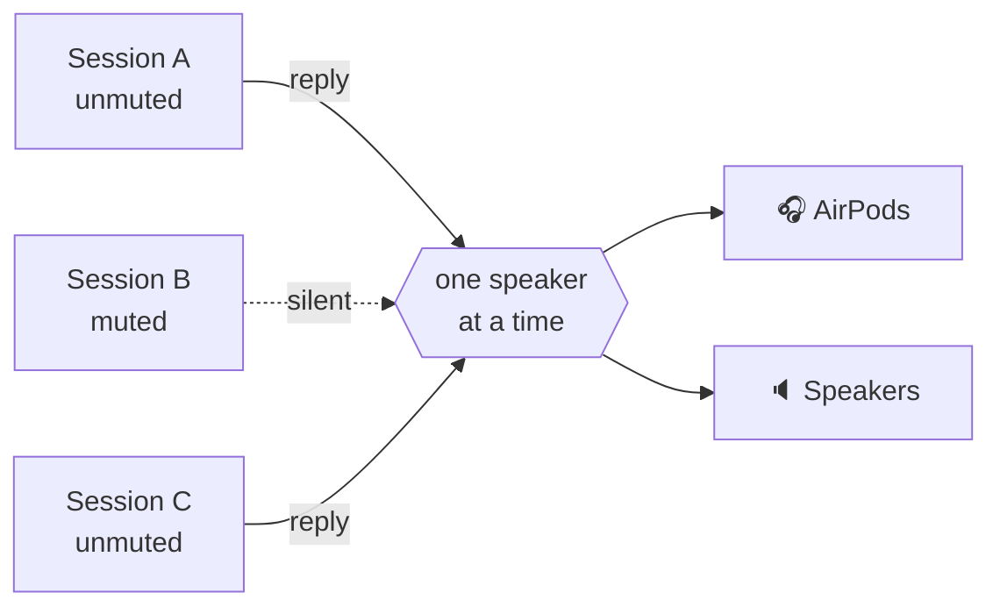

<div align="center">

# 🔊 claudio-tts

**Make Claude Code talk back.**
Natural, local text-to-speech for your Claude Code replies, with per-session control, so ten open
sessions never turn into ten voices shouting at once.

[](https://github.com/restante/claudio-tts/actions/workflows/ci.yml)
[](LICENSE)


</div>

---

## Why

- 🎧 **Hear Claude while you do something else.** Read a diff, make coffee, keep your eyes on the code.
  Claude speaks its replies, and the narration before each tool call, as they arrive.
- 🏠 **Fully local.** Speech is generated on your machine with the open
  [Kokoro](https://huggingface.co/hexgrad/Kokoro-82M) model. No API key, no account, no audio leaves your computer.
- 🎯 **Always the latest reply.** It listens to Claude Code's own turn events, not the transcript file, so it can
  never read the message *before* the one you just got.
- 🧑‍🤝‍🧑 **Built for many sessions.** Mute is per session, new sessions start muted, speech from different
  sessions takes turns instead of talking over each other, and each session only ever stops *its own* voice.
- 🔈 **Your speakers, your rules.** Volume, speed and output device (one, several, or all at once) from a slash command.

## Install

You need [Claude Code](https://claude.com/claude-code). The installer takes care of everything else, including
Python, the dependencies and the voice model.

**macOS**

```bash
curl -fsSL https://raw.githubusercontent.com/restante/claudio-tts/main/install.sh | bash
```

**Windows** (PowerShell, beta)

```powershell
irm https://raw.githubusercontent.com/restante/claudio-tts/main/install.ps1 | iex
```

Then **restart Claude Code** and, in a session:

```text
/tts unmute
```

That's it. Send a message and listen. 🎉

<details>
<summary><b>What does the installer actually do?</b></summary>

1. Installs [`uv`](https://docs.astral.sh/uv/) if you don't have it. `uv` also downloads a private Python 3.12, so
   you don't need Python installed.
2. Creates an isolated environment (macOS: `~/Library/Application Support/claudio-tts`,
   Windows: `%LOCALAPPDATA%\claudio-tts`) and installs this package and its dependencies into it.
3. Downloads the Kokoro model (326 MB, or 92 MB with `--lite`) and **verifies its SHA-256 checksum**.
4. Copies the Claude Code mod into `~/.claude/mods/claudio-tts` and registers it in `~/.claude/settings.json`
   (your settings are backed up to `settings.json.claudio-tts.bak` and merged, never overwritten).
5. Runs `doctor` to check the model, audio devices and Claude Code.

It is safe to run again: re-running updates, and nothing is duplicated.
</details>

<details>
<summary><b>Options</b></summary>

| macOS / Linux (`bash -s -- …`) | Windows (`-…`) | Effect |
| --- | --- | --- |
| `--lite` | `-Lite` | Smaller 92 MB model (a little less natural, faster to download and run) |
| `--no-model` | `-NoModel` | Skip the model download |
| `--ref <ref>` | `-Ref <ref>` | Install a branch, tag or commit |
| `--uninstall` | `-Uninstall` | Remove everything (add `--keep-models` / `-KeepModels` to keep the voice files) |
| `--local` | `-Local` | Install from the checkout you are standing in |

With PowerShell's `irm | iex` you cannot pass switches; set `CLAUDIO_TTS_LITE=1`, `CLAUDIO_TTS_NO_MODEL=1`,
`CLAUDIO_TTS_REF=<ref>` or `CLAUDIO_TTS_UNINSTALL=1` first, or use
`& ([scriptblock]::Create((irm <url>))) -Lite`.
</details>

## Commands

Everything is one slash command inside Claude Code:

| Command | What it does |
| --- | --- |
| `/tts` | Toggle speech **for this session** |
| `/tts mute` · `/tts unmute` | Turn it off / on for this session only |
| `/tts status` | Show mute state, volume, speed and output |
| `/tts default on` · `/tts default off` | Whether **new** sessions start speaking (`off` = start muted, the default) |
| `/tts volume 1-10` | Loudness, shared by all sessions. `/tts volume` shows it |
| `/tts speed 0.5-1.5` | Speaking pace (1 is normal). `/tts pace` is an alias |
| `/tts device` | List output devices and show the current choice |
| `/tts device airpods` | Speak on one device (partial names work) |
| `/tts device airpods,macbook` | …on several devices **at the same time** |
| `/tts device all` | …on every real output (virtual devices such as Zoom and Teams are skipped) |
| `/tts device default` | Back to the system default |
| `/tts mic` | List microphones; `/tts mic <name>` saves a preference |

Volume, speed and device describe *your setup*, so they are shared. Mute describes *a conversation*, so it is per session.

## Many sessions, one pair of ears



- New sessions **start muted**. Unmute only the one you are watching.
- If two unmuted sessions answer at once, the second **waits for its turn** rather than cutting the first off.
- Sending a prompt, or muting, stops **only that session's** voice.

## Make it speak *less*: the optional spoken summary

Long answers are tiring to listen to. If a reply contains a summary block, claudio-tts reads **only that block**
and skips the rest. Add something like this to your `CLAUDE.md` and Claude will write one every time:

```markdown
At the END of EVERY response add a short, conversational summary for text-to-speech, in this exact form.
Avoid URLs, file paths, code and variable names.

<!-- TTS_SUMMARY Two or three plain sentences about the result. TTS_SUMMARY -->
```

No block? It reads the whole reply, with markdown, code blocks, links and emoji cleaned up so it sounds natural.

## How it works

```mermaid
flowchart LR
  E[Claude Code<br/>turn events] --> M[claudio-tts mod<br/>decides what & when]
  M -->|claudio-tts speak| P[Python worker<br/>detached]
  P --> K[Kokoro<br/>local neural TTS]
  K --> O[Your output<br/>device(s)]
```

The Claude Code **mod** is a thin layer: it listens for the model's text and tool calls, tracks per-session mute,
and hands text to the `claudio-tts` command. All the OS-specific work (audio, process control, locking, ducking
your music while it talks) lives in the Python package, so macOS and Windows share one code path.
More in [docs/how-it-works.md](docs/how-it-works.md).

## Configuration

Environment variables (put them in the `env` block of `~/.claude/settings.json`):

| Variable | Default | Meaning |
| --- | --- | --- |
| `KOKORO_VOICE` | `af_sky` | Kokoro voice, e.g. `bf_emma`, `am_adam`, `af_bella` |
| `AUDIO_DUCK_ENABLED` | `true` | Lower Apple Music / Spotify while speaking (macOS only) |
| `DUCK_LEVEL` | `5` | Percent of the original music volume to duck to |
| `CLAUDIO_TTS_HOME` | per OS | Where the install lives |

## Command line

The package also installs a `claudio-tts` command (inside its private environment):

```text
claudio-tts say "Hello there"        speak now and wait
claudio-tts devices [--inputs]       list audio devices
claudio-tts doctor [--speak]         check the install (and say a test phrase)
claudio-tts download-model [--lite]  fetch and verify the voice files
claudio-tts install-mod / uninstall-mod
```

## Platform support

| | Status |
| --- | --- |
| **macOS** (Apple silicon & Intel) | ✅ Supported and tested, including music ducking |
| **Windows 10/11** | 🧪 **Beta.** Tested in CI; real-audio feedback welcome. No music ducking yet |
| **Linux** | 🤷 Best effort, untested on real hardware |

## Troubleshooting

- **Silence?** New sessions start muted: run `/tts unmute`. Then `/tts status`, and `claudio-tts doctor --speak`.
- **Wrong device?** `/tts device` lists the names, then `/tts device <part of the name>`.
- **Mod not showing up?** Restart Claude Code. Open sessions only load mods when they start.
- More in [docs/troubleshooting.md](docs/troubleshooting.md) and [docs/windows.md](docs/windows.md).

## Uninstall

```bash
curl -fsSL https://raw.githubusercontent.com/restante/claudio-tts/main/install.sh | bash -s -- --uninstall
```

(Windows: `$env:CLAUDIO_TTS_UNINSTALL=1; irm …/install.ps1 | iex`.) Your `settings.json` is restored to how it was.

## Develop

```bash
git clone https://github.com/restante/claudio-tts && cd claudio-tts
bash install.sh --dev          # editable install, mod symlinked from src/claudio_tts/mod
.venv/bin/pytest               # or: uv venv && uv pip install -e ".[dev]" && pytest
```

The mod lives in [`src/claudio_tts/mod`](src/claudio_tts/mod) (TypeScript). With Claude Code installed, check it with
`claude plugin validate src/claudio_tts/mod` and `claude plugin test src/claudio_tts/mod`.

## Credits

- [Kokoro-82M](https://huggingface.co/hexgrad/Kokoro-82M) by hexgrad (Apache-2.0), run through
  [kokoro-onnx](https://github.com/thewh1teagle/kokoro-onnx) by thewh1teagle (MIT).
- The idea of voicing Claude Code through hooks comes from
  [ktaletsk/claude-code-tts](https://github.com/ktaletsk/claude-code-tts). claudio-tts is a fresh implementation
  on Claude Code's mod system and shares no code with it.

## License

[MIT](LICENSE) © 2026 Claudio Restante
