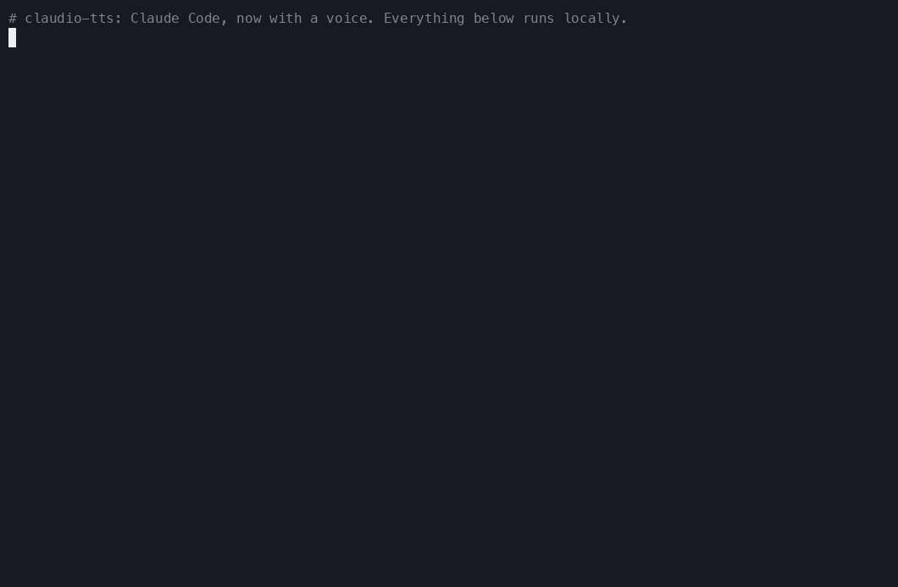
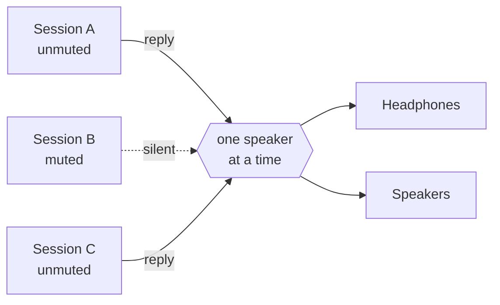
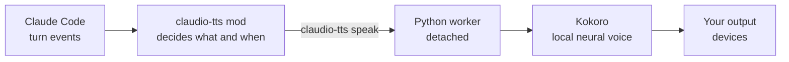

<div align="center">

<sub>🌍 **English (US)** · [Italiano](README.it.md) · [Polski](README.pl.md) · [Français](README.fr.md) · [Deutsch](README.de.md) · [日本語](README.ja.md) · [简体中文](README.zh-CN.md) · [हिन्दी](README.hi.md) · [Русский](README.ru.md) · [Español](README.es.md) · [Português](README.pt-BR.md)</sub>

# 🔊 claudio-tts

### Give Claude Code a voice. Locally. For free. With zero tokens.

Natural spoken replies for [Claude Code](https://claude.com/claude-code), powered by the open-source
**[Kokoro](https://huggingface.co/hexgrad/Kokoro-82M)** voice model and built on Claude Code's new
**mod system**. No API key, no account, no per-word cost, and your text never leaves your machine.

[](https://github.com/restante/claudio-tts/actions/workflows/ci.yml)
[](https://github.com/restante/claudio-tts/releases)
[](LICENSE)


[](CONTRIBUTING.md)

<sub>**Claude Code text-to-speech** · Claude talks back · voice output for Claude Code · offline TTS · Kokoro · Claude Code plugin / mod · works with 54 voices in 9 languages</sub>



<sub>A real recording, nothing faked: install, configure, then a live Claude Code session where Claude talks back.
A GIF can't carry sound, so <a href="https://restante.github.io/claudio-tts/">listen to the voices in the player</a>.
Re-record it any time with <code>scripts/make-hero.sh</code>.</sub>

**[Install](#-install) · [Voices](#%EF%B8%8F-voices) · [Commands](#-commands) · [Why Kokoro](#-why-kokoro-no-tokens-no-apis-no-bill) · [Mods](#-built-on-claude-code-mods) · [Contribute](#-contribute) · [Report a bug](#-report-a-bug)**

</div>

---

## ✨ Highlights

- 🎧 **Hear Claude while you do something else.** Read a diff, make coffee, rest your eyes. Claude's replies, and
  the narration before each tool call, are spoken as they arrive.
- 🆓 **Free forever, no tokens, no APIs.** Speech is generated on your own computer. There is nothing to sign up
  for and nothing to pay for.
- 🔒 **Private and offline.** After the one-time model download, it works with no internet. Your code and your
  conversations are never sent anywhere to be voiced.
- 🎯 **Always the latest reply.** It listens to Claude Code's own turn events instead of scraping the transcript
  file, so it can never read the message *before* the one you just got.
- 🧑‍🤝‍🧑 **Made for many sessions.** Mute is per session, new sessions start muted, sessions take turns instead of
  talking over each other, and each one only ever stops *its own* voice.
- 🗣️ **54 voices, 9 languages.** Change the voice with one command: `/tts voice af_heart`.
- 🔈 **Your speakers, your rules.** Volume, speed and output device (one, several, or all at once).
- 🩺 **Easy to support.** `claudio-tts doctor --report` writes a ready-to-paste bug report.

---

## 🧩 Built on Claude Code mods

claudio-tts is built on the new **mod system** in Claude Code, not on the older "run a shell script on every
event" hooks. A mod is a small plugin of typed functions that runs *inside* Claude Code, sees what the model is
doing as it happens, can add commands and status-line entries, and hot-reloads while you work. That is exactly what
a good voice needs:

| Mod feature | What claudio-tts does with it |
| --- | --- |
| **Turn events** (`turn.complete`, `turn.step`, `turn.start`, `session.end`) | Receives the model's final text and the narration before tool calls *directly in the event*, so it is never one reply behind and never has to re-read a transcript file |
| **Per-session state** | Each session remembers its own mute switch, so ten open sessions don't become ten voices |
| **Persistent mod store** | Volume, speed, voice and output device survive restarts |
| **Slash-command registration** | Adds `/tts` with everything below, right inside Claude Code |
| **Status line** | Shows `TTS on` or `TTS muted` for the session you are looking at |
| **Process API** | Hands the text to the local speech engine without ever blocking Claude |
| **Typed contract and tooling** | Ships a type contract, and is checked with `claude plugin validate` and `claude plugin test` |
| **Hot reload** | Edit the mod and it reloads, no restart needed while developing |

The mod itself is a thin TypeScript layer ([`src/claudio_tts/mod`](src/claudio_tts/mod)). The audio work lives in
a small Python package so macOS and Windows share one code path.

---

## 🚀 Install

You need [Claude Code](https://claude.com/claude-code). The installer handles everything else, including Python,
the dependencies and the voice model.

**macOS**

```bash
curl -fsSL https://raw.githubusercontent.com/restante/claudio-tts/main/install.sh | bash
```

**Windows** (PowerShell, beta)

```powershell
irm https://raw.githubusercontent.com/restante/claudio-tts/main/install.ps1 | iex
```

Then **restart Claude Code** and, in a session:

```text
/tts unmute
```

That's it. Send a message and listen. 🎉 (New sessions start muted on purpose; see
[many sessions](#-many-sessions-one-pair-of-ears).)

<details>
<summary><b>What does the installer actually do?</b></summary>

1. Installs [`uv`](https://docs.astral.sh/uv/) if you don't have it. `uv` also downloads a private Python 3.12,
   so you don't need Python installed.
2. Creates an isolated environment (macOS: `~/Library/Application Support/claudio-tts`,
   Windows: `%LOCALAPPDATA%\claudio-tts`) and installs this package and its dependencies into it.
3. Downloads the Kokoro model (326 MB, or 92 MB with `--lite`) and **verifies its SHA-256 checksum**.
4. Copies the Claude Code mod into `~/.claude/mods/claudio-tts` and registers it in `~/.claude/settings.json`.
   Your settings are backed up to `settings.json.claudio-tts.bak` and merged, never overwritten.
5. Runs `doctor` to check the model, audio devices and Claude Code.

It is safe to run again: re-running updates, and nothing is duplicated.
</details>

<details>
<summary><b>Installer options</b></summary>

| macOS / Linux (`bash -s -- …`) | Windows (`-…`) | Effect |
| --- | --- | --- |
| `--lite` | `-Lite` | Smaller 92 MB model (a little less natural, faster to download and run) |
| `--no-model` | `-NoModel` | Skip the model download |
| `--ref <ref>` | `-Ref <ref>` | Install a branch, tag or commit |
| `--uninstall` | `-Uninstall` | Remove everything (add `--keep-models` / `-KeepModels` to keep the voice files) |
| `--local` | `-Local` | Install from the checkout you are standing in |

With PowerShell's `irm | iex` you cannot pass switches; set `CLAUDIO_TTS_LITE=1`, `CLAUDIO_TTS_NO_MODEL=1`,
`CLAUDIO_TTS_REF=<ref>` or `CLAUDIO_TTS_UNINSTALL=1` first, or use
`& ([scriptblock]::Create((irm <url>))) -Lite`.
</details>

---

## 🎙️ Talk to Claude, and hear Claude

Voice works in **both directions** in Claude Code, with two independent pieces:

| Direction | Feature | Powered by |
| --- | --- | --- |
| 🗣️ **You → Claude** | Claude Code's built-in voice input: run `/voice` to toggle it (hold the key to talk) | Claude Code itself |
| 🔊 **Claude → you** | Spoken replies, narration before tool calls, per-session control | **claudio-tts** |

Turn on both and you can have a hands-free conversation with Claude Code. To switch voice input on by default, put
this in `~/.claude/settings.json` (the install already added the claudio-tts part):

```json
{
  "voice": { "enabled": true, "mode": "hold" },
  "env": { "KOKORO_VOICE": "af_heart" }
}
```

Then, in a Claude Code session:

```text
/tts unmute          # new sessions start muted on purpose
/tts voice af_heart  # pick the voice (it says hello)
> explain this stack trace      <- type it, or hold the voice key and say it
```

Claude's reply is spoken as it arrives. `/tts mute` silences just this session.

---

## 🎮 Commands

Everything is one slash command inside Claude Code:

| Command | What it does |
| --- | --- |
| `/tts` | Toggle speech **for this session** |
| `/tts mute` · `/tts unmute` | Turn it off / on for this session only |
| `/tts status` | Show mute state, volume, speed, voice and output |
| `/tts default on` · `/tts default off` | Whether **new** sessions start speaking (`off` = start muted, the default) |
| `/tts disable` · `/tts enable` | Turn claudio-tts fully off (no speech, no status line, no update notice) or back on, for this session only |
| `/tts voice` | List every voice and show the current one |
| `/tts voice af_heart` | Change the voice (it says hello in the new voice). `/tts voice default` resets it |
| `/tts lang de` · `/tts lang auto` | Make the voice read another language (any of 140), or go back to its own |
| `/tts update` | Check for a newer release and install it (nothing installs until you type this). `/tts update check` only looks, `/tts update off` stops the daily check |
| `/tts volume 1-10` | Loudness, shared by all sessions. `/tts volume` shows it |
| `/tts speed 0.5-1.5` | Speaking pace (1 is normal). `/tts pace` is an alias |
| `/tts device` | List output devices and show the current choice |
| `/tts device airpods` | Speak on one device (partial names work) |
| `/tts device airpods,macbook` | …on several devices **at the same time** |
| `/tts device all` | …on every real output (virtual devices such as Zoom and Teams are skipped) |
| `/tts device default` | Back to the system default |
| `/tts mic` | List microphones; `/tts mic <name>` saves a preference |

This is what it looks like in a session:

```text
> /tts unmute
claudio-tts: TTS on (this session), volume 10/10, speed 1, voice default, output default

> /tts voice bf_emma
claudio-tts: Voice: bf_emma

> /tts speed 0.9
claudio-tts: TTS speed 0.9
```

Volume, speed, voice and device describe *your setup*, so they are shared. Mute describes *a conversation*, so it
is per session.

---

## 🗣️ Voices

Kokoro ships **54 voices in 9 languages**. Pick one with `/tts voice <name>`, or list them all with `/tts voice`
(or `claudio-tts voices` in a terminal). The first letter of a voice name is its language and the second is its
gender, and **claudio-tts picks the right language automatically** from the name.

> **These are examples, not limits.** Any voice Kokoro supports can be used, you can add your own voice files,
> and a voice can read text in 140 languages (see [Use any other voice or language](#-use-any-other-voice-or-language)).

| | Language | Female | Male |
| --- | --- | --- | --- |
| 🇺🇸 | American English | `af_alloy` `af_aoede` `af_bella` `af_heart` `af_jessica` `af_kore` `af_nicole` `af_nova` `af_river` `af_sarah` `af_sky` | `am_adam` `am_echo` `am_eric` `am_fenrir` `am_liam` `am_michael` `am_onyx` `am_puck` `am_santa` |
| 🇬🇧 | British English | `bf_alice` `bf_emma` `bf_isabella` `bf_lily` | `bm_daniel` `bm_fable` `bm_george` `bm_lewis` |
| 🇪🇸 | Spanish | `ef_dora` | `em_alex` `em_santa` |
| 🇫🇷 | French | `ff_siwis` | |
| 🇮🇳 | Hindi | `hf_alpha` `hf_beta` | `hm_omega` `hm_psi` |
| 🇮🇹 | Italian | `if_sara` | `im_nicola` |
| 🇯🇵 | Japanese | `jf_alpha` `jf_gongitsune` `jf_nezumi` `jf_tebukuro` | `jm_kumo` |
| 🇧🇷 | Brazilian Portuguese | `pf_dora` | `pm_alex` `pm_santa` |
| 🇨🇳 | Mandarin Chinese | `zf_xiaobei` `zf_xiaoni` `zf_xiaoxiao` `zf_xiaoyi` | `zm_yunjian` `zm_yunxi` `zm_yunxia` `zm_yunyang` |

> **German, Polish and Russian:** Kokoro has no native German, Polish or Russian voices yet. The installer, the
> commands and this documentation are fully available in all three (see the links at the top), but the spoken voice
> will be an English or other-language one reading your text with a noticeable accent. Try
> `claudio-tts say "…" --voice af_heart --lang de` (or `pl`, `ru`) to hear it. If Kokoro adds those voices,
> claudio-tts will pick them up through the same `/tts voice` command.

### 🎧 Hear the voices

**[▶ Open the voice player](https://restante.github.io/claudio-tts/)** to listen to all 54 voices right in your
browser, with one-click play buttons. (GitHub can't play audio inside a README, so the player lives on a small
web page.) Or click a name below to jump straight to it. Samples are generated by Kokoro itself.

| Voice | Listen | Voice | Listen |
| --- | --- | --- | --- |
| `af_heart` ⭐ | [▶ listen](https://restante.github.io/claudio-tts/#af_heart) | `bf_emma` | [▶ listen](https://restante.github.io/claudio-tts/#bf_emma) |
| `af_bella` ⭐ | [▶ listen](https://restante.github.io/claudio-tts/#af_bella) | `bf_isabella` | [▶ listen](https://restante.github.io/claudio-tts/#bf_isabella) |
| `af_nicole` | [▶ listen](https://restante.github.io/claudio-tts/#af_nicole) | `bm_george` | [▶ listen](https://restante.github.io/claudio-tts/#bm_george) |
| `af_sarah` | [▶ listen](https://restante.github.io/claudio-tts/#af_sarah) | `bm_fable` | [▶ listen](https://restante.github.io/claudio-tts/#bm_fable) |
| `af_sky` | [▶ listen](https://restante.github.io/claudio-tts/#af_sky) | `ef_dora` 🇪🇸 | [▶ listen](https://restante.github.io/claudio-tts/#ef_dora) |
| `am_michael` | [▶ listen](https://restante.github.io/claudio-tts/#am_michael) | `ff_siwis` 🇫🇷 | [▶ listen](https://restante.github.io/claudio-tts/#ff_siwis) |
| `am_fenrir` | [▶ listen](https://restante.github.io/claudio-tts/#am_fenrir) | `if_sara` 🇮🇹 | [▶ listen](https://restante.github.io/claudio-tts/#if_sara) |
| `am_puck` | [▶ listen](https://restante.github.io/claudio-tts/#am_puck) | `jf_alpha` 🇯🇵 | [▶ listen](https://restante.github.io/claudio-tts/#jf_alpha) |
| `hf_alpha` 🇮🇳 | [▶ listen](https://restante.github.io/claudio-tts/#hf_alpha) | `zf_xiaoxiao` 🇨🇳 | [▶ listen](https://restante.github.io/claudio-tts/#zf_xiaoxiao) |
| `pf_dora` 🇧🇷 | [▶ listen](https://restante.github.io/claudio-tts/#pf_dora) | | |

⭐ `af_heart` and `af_bella` are generally regarded as the most natural English voices; start there.

### Tips

- **The voice and the text should match.** A Spanish voice reading English will sound odd, because the voice
  decides how the text is pronounced. If you chat with Claude in Spanish, pick `ef_dora` or `em_alex`.
- **Set a default for every session** without a command: put `"KOKORO_VOICE": "bf_emma"` in the `env` block of
  `~/.claude/settings.json`. `/tts voice` overrides it, and `/tts voice default` goes back to it.
- **Too fast, too slow?** `/tts speed 0.85` slows it down, `/tts speed 1.2` speeds it up.
- **Want it quieter?** `/tts volume 4`. Volume is applied per sample, so it doesn't touch your system volume.
- The first sentence of a session can take a moment while the model loads; later ones are quick. The `--lite`
  model starts faster and uses less memory.

### 🔧 Use any other voice or language

The 54 built-in voices and 9 native languages are just what ships in the box:

```text
/tts voice af_mix                # a voice you added (a .npy file in the voices folder)
/tts lang de                     # read German (or any of 140 languages) through the current voice
/tts lang auto                   # back to the voice's own language
```

```json
{ "env": { "CLAUDIO_TTS_MODEL": "/path/to/model.onnx", "CLAUDIO_TTS_VOICES": "/path/to/voices.bin" } }
```

- **Add your own voice**: save a Kokoro style vector as `voices/<name>.npy` in the install folder, and `<name>`
  appears in `/tts voice`. You can even blend two voices into a new one.
- **Use another Kokoro model or voices pack** (a newer release, a community pack): set the two environment
  variables above in `~/.claude/settings.json`.
- **Read any language**: `/tts lang <code>` makes the current voice read that language (140 codes, see
  `claudio-tts languages`). Languages without a native voice are read with an accent.

Step-by-step, with a blending script: **[docs/voices.md](docs/voices.md)**.

---

## 🆓 Why Kokoro? No tokens, no APIs, no bill

Most "make it talk" setups send every reply to a cloud text-to-speech service. claudio-tts doesn't. It runs
**[Kokoro](https://huggingface.co/hexgrad/Kokoro-82M)**, a small open-weight voice model, on your own CPU.

| | ☁️ Cloud text-to-speech | 🔊 claudio-tts + Kokoro |
| --- | --- | --- |
| **API key / account** | Required | **None** |
| **Cost** | Per character or per minute, forever | **Free** |
| **Claude tokens used** | Often extra, if a model writes the script | **Zero extra** (see note) |
| **Privacy** | Your replies are sent to a third party | **Nothing leaves your computer** |
| **Offline** | No | **Yes** (after the one-time download) |
| **Latency** | Network round trip plus queueing | **Starts speaking as soon as the first sentence is ready** |
| **Rate limits / outages** | Yes | **None** |
| **Licence** | Terms of service | **Apache-2.0 model, MIT code** |
| **Size** | n/a | 326 MB (92 MB `--lite`) |

> **Honest notes.** The one-time model download is 326 MB. Generating speech uses some CPU while it talks. The
> very best paid cloud voices can sound richer than Kokoro, but Kokoro is remarkably natural for a model this
> small. And the *optional* [spoken summary](#%EF%B8%8F-make-it-speak-less-the-optional-spoken-summary) asks Claude
> to write one extra sentence or two per reply, which costs a handful of output tokens, only if you turn it on.
> Without it, claudio-tts reads text Claude already wrote and uses **no extra tokens at all**.

---

## 🧑‍🤝‍🧑 Many sessions, one pair of ears



- New sessions **start muted**. Unmute only the one you are watching (`/tts unmute`), or run
  `/tts default on` if you would rather they all start speaking.
- If two unmuted sessions answer at once, the second **waits for its turn** instead of cutting the first off.
- Sending a prompt, or muting, stops **only that session's** voice.

## ✂️ Make it speak *less*: the optional spoken summary

Long answers are tiring to listen to. If a reply contains a summary block, claudio-tts reads **only that block**
and skips the rest. Add something like this to your `CLAUDE.md` and Claude will write one every time:

```markdown
At the END of EVERY response add a short, conversational summary for text-to-speech, in this exact form.
Avoid URLs, file paths, code and variable names.

<!-- TTS_SUMMARY Two or three plain sentences about the result. TTS_SUMMARY -->
```

No block? It reads the whole reply, with markdown, code blocks, links and emoji cleaned up so it sounds natural.

---

## 🛠️ How it works



The mod listens for the model's text and tool calls, tracks per-session mute, and hands text to the `claudio-tts`
command. All the OS-specific work (audio, process control, locking, ducking your music while it talks) lives in the
Python package, so macOS and Windows share one code path. Details in [docs/how-it-works.md](docs/how-it-works.md).

## ⚙️ Configuration

Environment variables (put them in the `env` block of `~/.claude/settings.json`):

| Variable | Default | Meaning |
| --- | --- | --- |
| `KOKORO_VOICE` | `af_sky` | Default voice for every session (see [Voices](#%EF%B8%8F-voices)) |
| `CLAUDIO_TTS_MODEL`, `CLAUDIO_TTS_VOICES` | built-in | Use another Kokoro model / voices pack (both required) |
| `AUDIO_DUCK_ENABLED` | `true` | Lower Apple Music / Spotify while speaking (macOS only) |
| `DUCK_LEVEL` | `5` | Percent of the original music volume to duck to |
| `CLAUDIO_TTS_HOME` | per OS | Where the install lives |

## 💻 Command line

The package also installs a `claudio-tts` command (inside its private environment):

```text
claudio-tts say "Hello there" --voice bf_emma   speak now and wait
claudio-tts voices                              list all voices (the 54 built-in plus yours)
claudio-tts languages                           list the 140 languages a voice can read
claudio-tts devices [--inputs]                  list audio devices
claudio-tts doctor [--speak | --report]         check the install, or write a bug report
claudio-tts download-model [--lite]             fetch and verify the voice files
claudio-tts install-mod / uninstall-mod
```

## 🖥️ Platform support

| | Status |
| --- | --- |
| **macOS** (Apple silicon and Intel) | ✅ Supported and tested, including music ducking |
| **Windows 10/11** | 🧪 **Beta.** Tested in CI; real-audio feedback welcome. No music ducking yet |
| **Linux** | 🤷 Best effort, untested on real hardware |

---

## 🐞 Report a bug

Found something odd? That is genuinely useful, thank you.

1. Run this and copy the output:

   ```bash
   claudio-tts doctor --report
   ```

   (If `claudio-tts` isn't on your PATH, use the full path the installer printed, ending in
   `python -m claudio_tts doctor --report`.) It contains your OS, versions and device names, but **never** anything
   you have spoken or any secrets.
2. [**Open a bug report**](https://github.com/restante/claudio-tts/issues/new?template=bug_report.yml) and paste
   it in. Say what you expected and what happened.

Quick fixes live in [docs/troubleshooting.md](docs/troubleshooting.md) and [docs/windows.md](docs/windows.md). The
most common one: **silence usually means the session is still muted**, so type `/tts unmute`.

## 🤝 Contribute

**Contributors are very welcome.** This started as a one-person weekend project, and it gets better with more
people: more voices tested, more platforms covered, more ideas.

Great places to jump in:

- 🪟 **Windows**: try it on real hardware, report what you hear, or build music ducking (per-app volume).
- 🐧 **Linux**: polish and test the installer on your distro.
- 🎛️ **Voice blending and previews**: mix two voices, or audition a voice before choosing.
- 📦 **Packaging**: `pipx`, Homebrew, winget.
- 🌍 **Languages**: better reading of code, numbers and mixed-language text.
- 📚 **Docs and demos**: better GIFs, translations, tutorials.

Look for [`good first issue`](https://github.com/restante/claudio-tts/labels/good%20first%20issue) and
[`help wanted`](https://github.com/restante/claudio-tts/labels/help%20wanted), and read
[CONTRIBUTING.md](CONTRIBUTING.md) to get set up in five minutes.

**Want to talk first?** [Start a discussion](https://github.com/restante/claudio-tts/discussions) or reach me
through my GitHub profile, [@restante](https://github.com/restante). Ideas, questions, "I tried it on X and…"
stories, and offers to help are all welcome. And if claudio-tts made your day, a ⭐ helps others find it.

## 📱 Control Claude from your phone

[**claudio-vibecode**](https://github.com/restante/claudio-vibecode) is a companion project built on claudio-tts: a local web page for your phone (iPhone or Android) where you read the conversation, send a message, stop Claude, approve tool calls, hold a button to talk, and **hear Claude's voice on the phone** while the Mac stays quiet. It installs claudio-tts for you and appears as an extra output in `/tts device`.

```bash
curl -fsSL https://raw.githubusercontent.com/restante/claudio-vibecode/main/install.sh | bash
```

## 🗺️ Roadmap

- [ ] Music ducking on Windows
- [ ] Voice blending (`/tts voice af_heart+am_adam`)
- [ ] `pipx` / Homebrew / winget installs
- [ ] Smarter reading of code, paths and numbers
- [ ] A voice preview picker

## 🔄 Updating

claudio-tts looks for a new release at most once a day when a session starts and shows `update available`. It never installs by itself. Type `/tts update` to install it, then restart open sessions. `/tts update off` turns the check off.

## 🗑️ Uninstall

```bash
curl -fsSL https://raw.githubusercontent.com/restante/claudio-tts/main/install.sh | bash -s -- --uninstall
```

(Windows: `$env:CLAUDIO_TTS_UNINSTALL=1; irm …/install.ps1 | iex`.) Your `settings.json` is restored to how it was.

## 🧑‍💻 Develop

```bash
git clone https://github.com/restante/claudio-tts && cd claudio-tts
bash install.sh --dev          # editable install, mod symlinked from src/claudio_tts/mod
.venv/bin/pytest               # or: uv venv && uv pip install -e ".[dev]" && pytest
```

With Claude Code installed, check the mod with `claude plugin validate src/claudio_tts/mod` and
`claude plugin test src/claudio_tts/mod`.

## 🙏 Credits

- [Kokoro-82M](https://huggingface.co/hexgrad/Kokoro-82M) by hexgrad (Apache-2.0), run through
  [kokoro-onnx](https://github.com/thewh1teagle/kokoro-onnx) by thewh1teagle (MIT).
- The idea of voicing Claude Code comes from [ktaletsk/claude-code-tts](https://github.com/ktaletsk/claude-code-tts).
  claudio-tts is a fresh implementation on Claude Code's mod system and shares no code with it.
- My friend [Donato Antonini](https://www.linkedin.com/in/donato-antonini-47b18a48/), for the brainstorming and the idea.

## 📄 License

[MIT](LICENSE) © 2026 Claudio Restante
