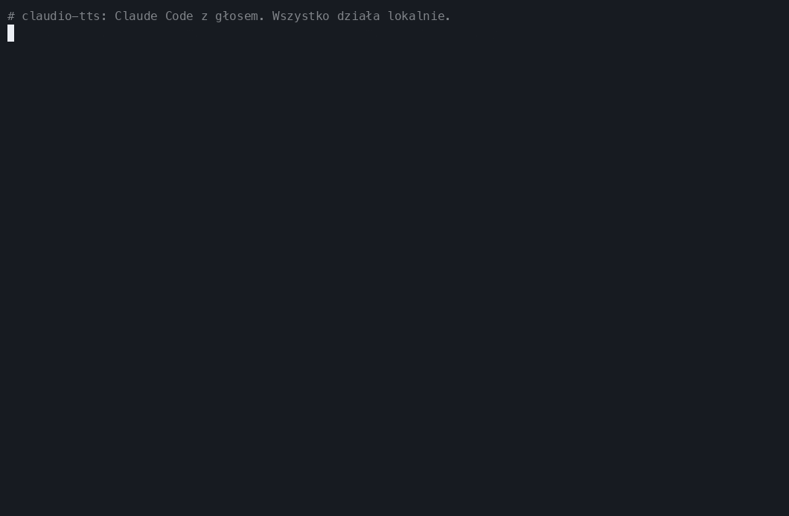
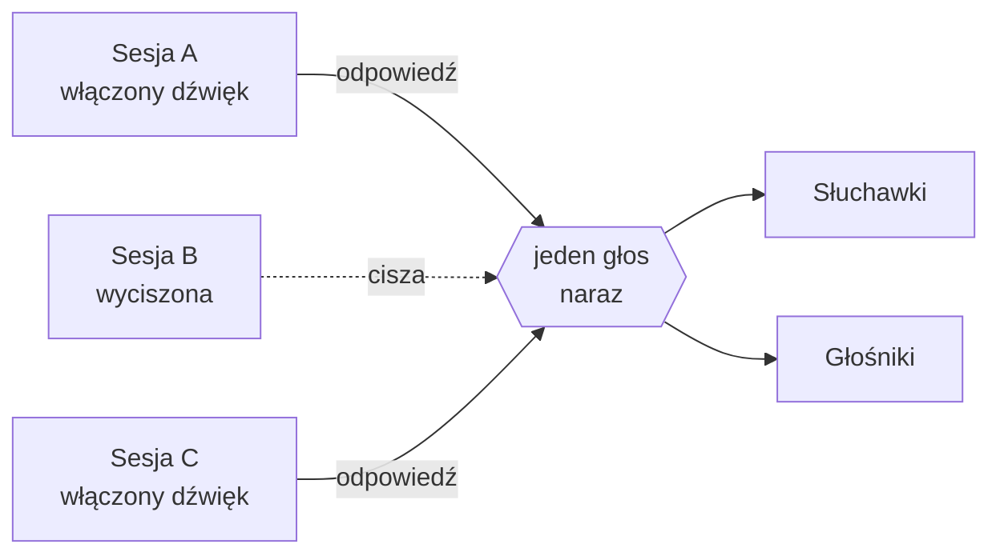
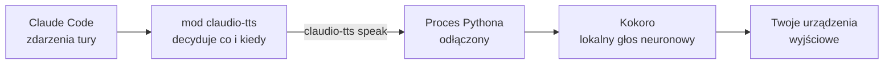

<div align="center">

<sub>🌍 [English (US)](README.md) · [Italiano](README.it.md) · **Polski** · [Français](README.fr.md) · [Deutsch](README.de.md) · [日本語](README.ja.md) · [简体中文](README.zh-CN.md) · [हिन्दी](README.hi.md) · [Русский](README.ru.md) · [Español](README.es.md) · [Português](README.pt-BR.md)</sub>

# 🔊 claudio-tts

### Daj Claude Code głos. Lokalnie. Za darmo. Bez ani jednego tokena.

Naturalne odpowiedzi mówione dla [Claude Code](https://claude.com/claude-code), napędzane otwartoźródłowym
modelem głosowym **[Kokoro](https://huggingface.co/hexgrad/Kokoro-82M)** i zbudowane na nowym
**systemie modów** Claude Code. Bez klucza API, bez konta, bez opłat za słowo, a twój tekst nigdy nie opuszcza
twojego komputera.

[](https://github.com/restante/claudio-tts/actions/workflows/ci.yml)
[](https://github.com/restante/claudio-tts/releases)
[](LICENSE)


[](CONTRIBUTING.md)



<sub>Prawdziwe nagranie prawdziwych poleceń. GIF nie przenosi dźwięku, więc
<a href="#-posłuchaj-głosów">posłuchaj próbek</a> poniżej. Możesz je nagrać od nowa w dowolnej chwili za pomocą
<code>scripts/make-demo.sh</code>.</sub>

**[Instalacja](#-zainstaluj) · [Głosy](#%EF%B8%8F-głosy) · [Polecenia](#-polecenia) · [Dlaczego Kokoro](#-dlaczego-kokoro-zero-tokenów-zero-api-zero-rachunków) · [Mody](#-zbudowane-na-modach-claude-code) · [Współtworzenie](#-współtworzenie) · [Zgłoś błąd](#-zgłoś-błąd)**

</div>

---

## ✨ Najważniejsze cechy

- 🎧 **Słuchaj Claude'a, kiedy robisz coś innego.** Przejrzyj diff, zrób kawę, daj odpocząć oczom. Odpowiedzi
  Claude'a oraz komentarz przed każdym wywołaniem narzędzia są czytane na bieżąco, gdy tylko się pojawiają.
- 🆓 **Za darmo na zawsze, bez tokenów, bez API.** Mowa powstaje na twoim własnym komputerze. Nie trzeba się nigdzie
  rejestrować i za nic płacić.
- 🔒 **Prywatnie i offline.** Po jednorazowym pobraniu modelu działa bez internetu. Twój kod i twoje rozmowy
  nigdy nie są nigdzie wysyłane, żeby je przeczytać na głos.
- 🎯 **Zawsze najnowsza odpowiedź.** Nasłuchuje zdarzeń tury samego Claude Code zamiast skrobać plik transkrypcji,
  więc nigdy nie przeczyta wiadomości *sprzed* tej, którą właśnie dostałeś.
- 🧑‍🤝‍🧑 **Stworzone dla wielu sesji.** Wyciszenie działa osobno dla każdej sesji, nowe sesje startują wyciszone, sesje
  czekają na swoją kolej zamiast przekrzykiwać się nawzajem, a każda zatrzymuje wyłącznie *własny* głos.
- 🗣️ **54 głosy, 9 języków.** Zmieniasz głos jednym poleceniem: `/tts voice af_heart`.
- 🔈 **Twoje głośniki, twoje zasady.** Głośność, tempo i urządzenie wyjściowe (jedno, kilka albo wszystkie naraz).
- 🩺 **Łatwe wsparcie.** `claudio-tts doctor --report` tworzy gotowy do wklejenia raport o błędzie.

---

## 🧩 Zbudowane na modach Claude Code

claudio-tts opiera się na nowym **systemie modów** w Claude Code, a nie na starszych hookach typu „uruchom skrypt
powłoki przy każdym zdarzeniu”. Mod to mała wtyczka złożona z typowanych funkcji, która działa *wewnątrz* Claude Code,
widzi na bieżąco, co robi model, może dodawać polecenia i wpisy w linii statusu oraz przeładowuje się na gorąco,
kiedy pracujesz. Dokładnie tego potrzebuje dobry głos:

| Funkcja moda | Co claudio-tts z nią robi |
| --- | --- |
| **Zdarzenia tury** (`turn.complete`, `turn.step`, `turn.start`, `session.end`) | Dostaje końcowy tekst modelu i komentarz przed wywołaniami narzędzi *bezpośrednio w zdarzeniu*, więc nigdy nie jest o jedną odpowiedź w tyle i nie musi ponownie czytać pliku transkrypcji |
| **Stan per sesja** | Każda sesja pamięta własny przełącznik wyciszenia, więc dziesięć otwartych sesji nie zamienia się w dziesięć głosów |
| **Trwały magazyn moda** | Głośność, tempo, głos i urządzenie wyjściowe przetrwają restarty |
| **Rejestracja poleceń ze slashem** | Dodaje `/tts` ze wszystkim, co poniżej, prosto w Claude Code |
| **Linia statusu** | Pokazuje `TTS on` albo `TTS muted` dla sesji, na którą akurat patrzysz |
| **Process API** | Przekazuje tekst lokalnemu silnikowi mowy, nigdy nie blokując Claude'a |
| **Typowany kontrakt i narzędzia** | Dostarcza kontrakt typów i jest sprawdzany przez `claude plugin validate` oraz `claude plugin test` |
| **Przeładowanie na gorąco** | Edytujesz moda i od razu się przeładowuje, bez restartu podczas pracy nad nim |

Sam mod to cienka warstwa w TypeScripcie ([`src/claudio_tts/mod`](src/claudio_tts/mod)). Praca nad dźwiękiem odbywa
się w małym pakiecie Pythona, dzięki czemu macOS i Windows korzystają z jednej ścieżki kodu.

---

## 🚀 Zainstaluj

Potrzebujesz [Claude Code](https://claude.com/claude-code). Resztą zajmie się instalator, w tym Pythonem,
zależnościami i modelem głosowym.

**macOS**

```bash
curl -fsSL https://raw.githubusercontent.com/restante/claudio-tts/main/install.sh | bash
```

**Windows** (PowerShell, beta)

```powershell
irm https://raw.githubusercontent.com/restante/claudio-tts/main/install.ps1 | iex
```

Potem **uruchom Claude Code ponownie** i w sesji wpisz:

```text
/tts unmute
```

To wszystko. Wyślij wiadomość i słuchaj. 🎉 (Nowe sesje celowo startują wyciszone; zobacz
[wiele sesji](#-wiele-sesji-jedna-para-uszu).)

<details>
<summary><b>Co właściwie robi instalator?</b></summary>

1. Instaluje [`uv`](https://docs.astral.sh/uv/), jeśli go jeszcze nie masz. `uv` pobiera też prywatnego Pythona 3.12,
   więc nie musisz mieć zainstalowanego Pythona.
2. Tworzy odizolowane środowisko (macOS: `~/Library/Application Support/claudio-tts`,
   Windows: `%LOCALAPPDATA%\claudio-tts`) i instaluje w nim ten pakiet wraz z zależnościami.
3. Pobiera model Kokoro (326 MB, albo 92 MB z `--lite`) i **weryfikuje jego sumę kontrolną SHA-256**.
4. Kopiuje moda Claude Code do `~/.claude/mods/claudio-tts` i rejestruje go w `~/.claude/settings.json`.
   Twoje ustawienia są zapisywane w kopii zapasowej `settings.json.claudio-tts.bak` i scalane, nigdy nadpisywane.
5. Uruchamia `doctor`, żeby sprawdzić model, urządzenia audio i Claude Code.

Można go bezpiecznie uruchomić ponownie: ponowne uruchomienie aktualizuje, a nic się nie duplikuje.
</details>

<details>
<summary><b>Opcje instalatora</b></summary>

| macOS / Linux (`bash -s -- …`) | Windows (`-…`) | Efekt |
| --- | --- | --- |
| `--lite` | `-Lite` | Mniejszy model 92 MB (odrobinę mniej naturalny, szybszy do pobrania i uruchomienia) |
| `--no-model` | `-NoModel` | Pomiń pobieranie modelu |
| `--ref <ref>` | `-Ref <ref>` | Zainstaluj gałąź, tag albo commit |
| `--uninstall` | `-Uninstall` | Usuń wszystko (dodaj `--keep-models` / `-KeepModels`, żeby zachować pliki głosów) |
| `--local` | `-Local` | Zainstaluj z kopii repozytorium, w której właśnie jesteś |

W PowerShellu z `irm | iex` nie da się przekazać przełączników; najpierw ustaw `CLAUDIO_TTS_LITE=1`,
`CLAUDIO_TTS_NO_MODEL=1`, `CLAUDIO_TTS_REF=<ref>` albo `CLAUDIO_TTS_UNINSTALL=1`, albo użyj
`& ([scriptblock]::Create((irm <url>))) -Lite`.
</details>

---

## 🎮 Polecenia

Wszystko to jedno polecenie ze slashem wewnątrz Claude Code:

| Polecenie | Co robi |
| --- | --- |
| `/tts` | Przełącza mowę **dla tej sesji** |
| `/tts mute` · `/tts unmute` | Wyłącza / włącza ją tylko dla tej sesji |
| `/tts status` | Pokazuje stan wyciszenia, głośność, tempo, głos i wyjście |
| `/tts default on` · `/tts default off` | Czy **nowe** sesje zaczynają mówić (`off` = startują wyciszone, to ustawienie domyślne) |
| `/tts voice` | Wypisuje wszystkie głosy i pokazuje bieżący |
| `/tts voice af_heart` | Zmienia głos (nowy głos się przywita). `/tts voice default` przywraca domyślny |
| `/tts lang de` · `/tts lang auto` | Sprawia, że głos czyta w innym języku (dowolnym ze 140) albo wraca do własnego |
| `/tts volume 1-10` | Głośność, wspólna dla wszystkich sesji. `/tts volume` ją pokazuje |
| `/tts speed 0.5-1.5` | Tempo mówienia (1 to normalne). `/tts pace` to alias |
| `/tts device` | Wypisuje urządzenia wyjściowe i pokazuje bieżący wybór |
| `/tts device airpods` | Mów na jednym urządzeniu (działają częściowe nazwy) |
| `/tts device airpods,macbook` | …na kilku urządzeniach **jednocześnie** |
| `/tts device all` | …na każdym prawdziwym wyjściu (urządzenia wirtualne, jak Zoom i Teams, są pomijane) |
| `/tts device default` | Powrót do domyślnego urządzenia systemu |
| `/tts mic` | Wypisuje mikrofony; `/tts mic <name>` zapisuje preferencję |

Tak to wygląda w sesji:

```text
> /tts unmute
claudio-tts: TTS on (this session), volume 10/10, speed 1, voice default, output default

> /tts voice bf_emma
claudio-tts: Voice: bf_emma

> /tts speed 0.9
claudio-tts: TTS speed 0.9
```

Głośność, tempo, głos i urządzenie opisują *twoją konfigurację*, więc są wspólne. Wyciszenie opisuje *rozmowę*,
więc działa osobno dla każdej sesji.

---

## 🗣️ Głosy

Kokoro ma **54 głosy w 9 językach**. Wybierz jeden poleceniem `/tts voice <nazwa>` albo wypisz wszystkie za pomocą
`/tts voice` (lub `claudio-tts voices` w terminalu). Pierwsza litera nazwy głosu oznacza język, a druga płeć,
a **claudio-tts automatycznie wybiera właściwy język** na podstawie nazwy.

> **To przykłady, nie ograniczenia.** Możesz użyć każdego głosu obsługiwanego przez Kokoro, dodać własne pliki
> głosów, a głos może czytać tekst w 140 językach (zobacz [Użyj dowolnego innego głosu lub języka](#-użyj-dowolnego-innego-głosu-lub-języka)).

| | Język | Żeńskie | Męskie |
| --- | --- | --- | --- |
| 🇺🇸 | Amerykański angielski | `af_alloy` `af_aoede` `af_bella` `af_heart` `af_jessica` `af_kore` `af_nicole` `af_nova` `af_river` `af_sarah` `af_sky` | `am_adam` `am_echo` `am_eric` `am_fenrir` `am_liam` `am_michael` `am_onyx` `am_puck` `am_santa` |
| 🇬🇧 | Brytyjski angielski | `bf_alice` `bf_emma` `bf_isabella` `bf_lily` | `bm_daniel` `bm_fable` `bm_george` `bm_lewis` |
| 🇪🇸 | Hiszpański | `ef_dora` | `em_alex` `em_santa` |
| 🇫🇷 | Francuski | `ff_siwis` | |
| 🇮🇳 | Hindi | `hf_alpha` `hf_beta` | `hm_omega` `hm_psi` |
| 🇮🇹 | Włoski | `if_sara` | `im_nicola` |
| 🇯🇵 | Japoński | `jf_alpha` `jf_gongitsune` `jf_nezumi` `jf_tebukuro` | `jm_kumo` |
| 🇧🇷 | Brazylijski portugalski | `pf_dora` | `pm_alex` `pm_santa` |
| 🇨🇳 | Chiński mandaryński | `zf_xiaobei` `zf_xiaoni` `zf_xiaoxiao` `zf_xiaoyi` | `zm_yunjian` `zm_yunxi` `zm_yunxia` `zm_yunyang` |

> **Niemiecki, polski i rosyjski:** Kokoro nie ma jeszcze natywnych głosów niemieckich, polskich ani rosyjskich.
> Instalator, polecenia i ta dokumentacja są w pełni dostępne we wszystkich trzech językach (zobacz linki na samej
> górze), ale mówiony głos będzie angielski albo w innym języku i przeczyta twój tekst ze zauważalnym akcentem.
> Posłuchaj, jak to brzmi, poleceniem `claudio-tts say "…" --voice af_heart --lang de` (albo `pl`, `ru`).
>
> **Dla czytelników polskich:** polski tekst będzie więc brzmiał z obcym akcentem. Wypróbuj
> `claudio-tts say "…" --voice af_heart --lang pl`. Jeśli chcesz słuchać polskich odpowiedzi technicznych, wybierz
> angielski głos, na przykład `af_heart` (`/tts voice af_heart`). Słowa techniczne, nazwy poleceń i kod, które i tak
> są po angielsku, zabrzmią wtedy najnaturalniej. Gdy Kokoro doda te głosy, claudio-tts podchwyci je tym samym
> poleceniem `/tts voice`.

### 🎧 Posłuchaj głosów

**[▶ Otwórz odtwarzacz głosów](https://restante.github.io/claudio-tts/)**, żeby posłuchać wszystkich 54 głosów
prosto w przeglądarce, za pomocą przycisków odtwarzania na jedno kliknięcie. (GitHub nie potrafi odtwarzać dźwięku
wewnątrz README, więc odtwarzacz mieszka na małej stronie internetowej.) Albo kliknij nazwę poniżej, żeby przejść
od razu do danego głosu. Próbki wygenerował sam Kokoro.

| Głos | Posłuchaj | Głos | Posłuchaj |
| --- | --- | --- | --- |
| `af_heart` ⭐ | [▶ posłuchaj](https://restante.github.io/claudio-tts/#af_heart) | `bf_emma` | [▶ posłuchaj](https://restante.github.io/claudio-tts/#bf_emma) |
| `af_bella` ⭐ | [▶ posłuchaj](https://restante.github.io/claudio-tts/#af_bella) | `bf_isabella` | [▶ posłuchaj](https://restante.github.io/claudio-tts/#bf_isabella) |
| `af_nicole` | [▶ posłuchaj](https://restante.github.io/claudio-tts/#af_nicole) | `bm_george` | [▶ posłuchaj](https://restante.github.io/claudio-tts/#bm_george) |
| `af_sarah` | [▶ posłuchaj](https://restante.github.io/claudio-tts/#af_sarah) | `bm_fable` | [▶ posłuchaj](https://restante.github.io/claudio-tts/#bm_fable) |
| `af_sky` | [▶ posłuchaj](https://restante.github.io/claudio-tts/#af_sky) | `ef_dora` 🇪🇸 | [▶ posłuchaj](https://restante.github.io/claudio-tts/#ef_dora) |
| `am_michael` | [▶ posłuchaj](https://restante.github.io/claudio-tts/#am_michael) | `ff_siwis` 🇫🇷 | [▶ posłuchaj](https://restante.github.io/claudio-tts/#ff_siwis) |
| `am_fenrir` | [▶ posłuchaj](https://restante.github.io/claudio-tts/#am_fenrir) | `if_sara` 🇮🇹 | [▶ posłuchaj](https://restante.github.io/claudio-tts/#if_sara) |
| `am_puck` | [▶ posłuchaj](https://restante.github.io/claudio-tts/#am_puck) | `jf_alpha` 🇯🇵 | [▶ posłuchaj](https://restante.github.io/claudio-tts/#jf_alpha) |
| `hf_alpha` 🇮🇳 | [▶ posłuchaj](https://restante.github.io/claudio-tts/#hf_alpha) | `zf_xiaoxiao` 🇨🇳 | [▶ posłuchaj](https://restante.github.io/claudio-tts/#zf_xiaoxiao) |
| `pf_dora` 🇧🇷 | [▶ posłuchaj](https://restante.github.io/claudio-tts/#pf_dora) | | |

⭐ `af_heart` i `af_bella` uchodzą powszechnie za najbardziej naturalne głosy angielskie; zacznij od nich.

### Wskazówki

- **Głos i tekst powinny do siebie pasować.** Hiszpański głos czytający angielski będzie brzmiał dziwnie, bo to
  głos decyduje, jak tekst jest wymawiany. Jeśli rozmawiasz z Claude'em po hiszpańsku, wybierz `ef_dora` albo `em_alex`.
- **Ustaw domyślny głos dla każdej sesji** bez polecenia: wpisz `"KOKORO_VOICE": "bf_emma"` w bloku `env` pliku
  `~/.claude/settings.json`. `/tts voice` go nadpisuje, a `/tts voice default` do niego wraca.
- **Za szybko, za wolno?** `/tts speed 0.85` zwalnia, `/tts speed 1.2` przyspiesza.
- **Chcesz ciszej?** `/tts volume 4`. Głośność jest stosowana do każdej próbki, więc nie rusza głośności systemu.
- Pierwsze zdanie w sesji może chwilę potrwać, bo ładuje się model; kolejne są szybkie. Model `--lite`
  startuje szybciej i zajmuje mniej pamięci.

### 🔧 Użyj dowolnego innego głosu lub języka

54 wbudowane głosy i 9 języków natywnych to tylko to, co dostajesz w pudełku:

```text
/tts voice af_mix                # a voice you added (a .npy file in the voices folder)
/tts lang de                     # read German (or any of 140 languages) through the current voice
/tts lang auto                   # back to the voice's own language
```

```json
{ "env": { "CLAUDIO_TTS_MODEL": "/path/to/model.onnx", "CLAUDIO_TTS_VOICES": "/path/to/voices.bin" } }
```

- **Dodaj własny głos**: zapisz wektor stylu Kokoro jako `voices/<name>.npy` w folderze instalacji, a `<name>`
  pojawi się w `/tts voice`. Możesz nawet wymieszać dwa głosy w nowy.
- **Użyj innego modelu Kokoro lub paczki głosów** (nowszego wydania, paczki od społeczności): ustaw dwie zmienne
  środowiskowe powyżej w `~/.claude/settings.json`.
- **Czytaj w dowolnym języku**: `/tts lang <kod>` sprawia, że bieżący głos czyta w tym języku (140 kodów, zobacz
  `claudio-tts languages`). Języki bez natywnego głosu są czytane z akcentem. Dla odpowiedzi po angielsku nie
  musisz nic ustawiać; dla tekstu po polsku wpisz `/tts lang pl`.

Krok po kroku, ze skryptem do mieszania głosów: **[docs/voices.md](docs/voices.md)**.

---

## 🆓 Dlaczego Kokoro? Zero tokenów, zero API, zero rachunków

Większość rozwiązań „niech to mówi” wysyła każdą odpowiedź do chmurowej usługi zamiany tekstu na mowę. claudio-tts
tego nie robi. Uruchamia **[Kokoro](https://huggingface.co/hexgrad/Kokoro-82M)**, mały model głosowy z otwartymi
wagami, na twoim własnym procesorze.

| | ☁️ Chmurowa zamiana tekstu na mowę | 🔊 claudio-tts + Kokoro |
| --- | --- | --- |
| **Klucz API / konto** | Wymagane | **Brak** |
| **Koszt** | Za znak albo za minutę, bez końca | **Za darmo** |
| **Zużyte tokeny Claude'a** | Często dodatkowe, jeśli model pisze skrypt | **Zero dodatkowych** (zobacz uwagę) |
| **Prywatność** | Twoje odpowiedzi trafiają do osoby trzeciej | **Nic nie opuszcza twojego komputera** |
| **Offline** | Nie | **Tak** (po jednorazowym pobraniu) |
| **Opóźnienie** | Podróż przez sieć plus kolejka | **Zaczyna mówić, gdy tylko pierwsze zdanie jest gotowe** |
| **Limity / awarie** | Tak | **Brak** |
| **Licencja** | Regulamin usługi | **Model na Apache-2.0, kod na MIT** |
| **Rozmiar** | n/d | 326 MB (92 MB `--lite`) |

> **Uczciwe uwagi.** Jednorazowe pobranie modelu to 326 MB. Generowanie mowy obciąża trochę procesor, kiedy mówi.
> Najlepsze płatne głosy chmurowe mogą brzmieć bogatsze niż Kokoro, ale Kokoro jest zaskakująco naturalny jak na
> tak mały model. A *opcjonalne* [podsumowanie głosowe](#%EF%B8%8F-niech-mówi-mniej-opcjonalne-podsumowanie-głosowe)
> prosi Claude'a o napisanie jednego czy dwóch dodatkowych zdań na odpowiedź, co kosztuje garść tokenów wyjściowych,
> ale tylko jeśli je włączysz. Bez niego claudio-tts czyta tekst, który Claude i tak już napisał, i **nie zużywa
> żadnych dodatkowych tokenów**.

---

## 🧑‍🤝‍🧑 Wiele sesji, jedna para uszu



- Nowe sesje **startują wyciszone**. Włącz dźwięk tylko w tej, którą oglądasz (`/tts unmute`), albo uruchom
  `/tts default on`, jeśli wolisz, żeby wszystkie zaczynały od mówienia.
- Jeśli dwie sesje z włączonym dźwiękiem odpowiadają jednocześnie, druga **czeka na swoją kolej** zamiast przerywać
  pierwszą.
- Wysłanie promptu albo wyciszenie zatrzymuje głos **tylko tej sesji**.

## ✂️ Niech mówi *mniej*: opcjonalne podsumowanie głosowe

Długie odpowiedzi męczy się słuchać. Jeśli odpowiedź zawiera blok podsumowania, claudio-tts czyta **tylko ten blok**
i pomija resztę. Dodaj coś takiego do swojego `CLAUDE.md`, a Claude będzie pisał go za każdym razem:

```markdown
At the END of EVERY response add a short, conversational summary for text-to-speech, in this exact form.
Avoid URLs, file paths, code and variable names.

<!-- TTS_SUMMARY Dwa lub trzy zwykłe zdania o wyniku. TTS_SUMMARY -->
```

Nie ma bloku? Czyta całą odpowiedź, a markdown, bloki kodu, linki i emoji są oczyszczane tak, żeby brzmiało
naturalnie.

---

## 🛠️ Jak to działa



Mod nasłuchuje tekstu modelu i wywołań narzędzi, śledzi wyciszenie per sesja i przekazuje tekst poleceniu
`claudio-tts`. Cała praca zależna od systemu (dźwięk, kontrola procesów, blokady, ściszanie twojej muzyki, kiedy
mówi) odbywa się w pakiecie Pythona, więc macOS i Windows korzystają z jednej ścieżki kodu. Szczegóły w
[docs/how-it-works.md](docs/how-it-works.md).

## ⚙️ Konfiguracja

Zmienne środowiskowe (wpisz je w bloku `env` pliku `~/.claude/settings.json`):

| Zmienna | Domyślnie | Znaczenie |
| --- | --- | --- |
| `KOKORO_VOICE` | `af_sky` | Domyślny głos dla każdej sesji (zobacz [Głosy](#%EF%B8%8F-głosy)) |
| `CLAUDIO_TTS_MODEL`, `CLAUDIO_TTS_VOICES` | wbudowane | Użyj innego modelu Kokoro / paczki głosów (wymagane obie) |
| `AUDIO_DUCK_ENABLED` | `true` | Ścisza Apple Music / Spotify podczas mówienia (tylko macOS) |
| `DUCK_LEVEL` | `5` | Procent oryginalnej głośności muzyki, do którego ją ściszyć |
| `CLAUDIO_TTS_HOME` | zależnie od systemu | Gdzie mieszka instalacja |

## 💻 Wiersz poleceń

Pakiet instaluje też polecenie `claudio-tts` (wewnątrz własnego prywatnego środowiska):

```text
claudio-tts say "Hello there" --voice bf_emma   speak now and wait
claudio-tts voices                              list all voices (the 54 built-in plus yours)
claudio-tts languages                           list the 140 languages a voice can read
claudio-tts devices [--inputs]                  list audio devices
claudio-tts doctor [--speak | --report]         check the install, or write a bug report
claudio-tts download-model [--lite]             fetch and verify the voice files
claudio-tts install-mod / uninstall-mod
```

## 🖥️ Obsługiwane platformy

| | Status |
| --- | --- |
| **macOS** (Apple silicon i Intel) | ✅ Obsługiwany i przetestowany, w tym ściszanie muzyki |
| **Windows 10/11** | 🧪 **Beta.** Testowany w CI; mile widziane opinie o prawdziwym dźwięku. Na razie bez ściszania muzyki |
| **Linux** | 🤷 Na tyle, na ile się da, nietestowany na prawdziwym sprzęcie |

---

## 🐞 Zgłoś błąd

Znalazłeś coś dziwnego? To naprawdę przydatne, dzięki.

1. Uruchom to i skopiuj wynik:

   ```bash
   claudio-tts doctor --report
   ```

   (Jeśli `claudio-tts` nie ma w twoim PATH, użyj pełnej ścieżki wypisanej przez instalator, zakończonej
   `python -m claudio_tts doctor --report`.) Raport zawiera twój system, wersje i nazwy urządzeń, ale **nigdy**
   niczego, co zostało wypowiedziane, ani żadnych sekretów.
2. [**Otwórz zgłoszenie błędu**](https://github.com/restante/claudio-tts/issues/new?template=bug_report.yml) i wklej
   do niego raport. Napisz, czego oczekiwałeś i co się stało.

Szybkie rozwiązania znajdziesz w [docs/troubleshooting.md](docs/troubleshooting.md) i [docs/windows.md](docs/windows.md).
Najczęstsze z nich: **cisza zwykle oznacza, że sesja jest nadal wyciszona**, więc wpisz `/tts unmute`.

## 🤝 Współtworzenie

**Współtwórcy są bardzo mile widziani.** To zaczęło się jako weekendowy projekt jednej osoby, a z większą liczbą
ludzi robi się coraz lepsze: więcej przetestowanych głosów, więcej obsłużonych platform, więcej pomysłów.

Świetne miejsca, żeby wskoczyć:

- 🪟 **Windows**: wypróbuj go na prawdziwym sprzęcie, napisz, co słyszysz, albo zbuduj ściszanie muzyki (głośność per aplikacja).
- 🐧 **Linux**: dopracuj i przetestuj instalator na swojej dystrybucji.
- 🎛️ **Mieszanie głosów i podglądy**: mieszaj dwa głosy albo odsłuchaj głos przed wyborem.
- 📦 **Pakowanie**: `pipx`, Homebrew, winget.
- 🌍 **Języki**: lepsze czytanie kodu, liczb i tekstu w mieszanych językach.
- 📚 **Dokumentacja i dema**: lepsze GIF-y, tłumaczenia, tutoriale.

Szukaj etykiet [`good first issue`](https://github.com/restante/claudio-tts/labels/good%20first%20issue) i
[`help wanted`](https://github.com/restante/claudio-tts/labels/help%20wanted) oraz przeczytaj
[CONTRIBUTING.md](CONTRIBUTING.md), żeby w pięć minut przygotować środowisko.

**Chcesz najpierw pogadać?** [Zacznij dyskusję](https://github.com/restante/claudio-tts/discussions) albo napisz do
mnie przez mój profil na GitHubie, [@restante](https://github.com/restante). Pomysły, pytania, historie w stylu
„wypróbowałem to na X i…” oraz propozycje pomocy są mile widziane. A jeśli claudio-tts umilił ci dzień, ⭐ pomoże
innym je znaleźć.

## 🗺️ Plan rozwoju

- [ ] Ściszanie muzyki na Windows
- [ ] Mieszanie głosów (`/tts voice af_heart+am_adam`)
- [ ] Instalacja przez `pipx` / Homebrew / winget
- [ ] Mądrzejsze czytanie kodu, ścieżek i liczb
- [ ] Wybieracz głosów z podglądem

## 🗑️ Odinstalowanie

```bash
curl -fsSL https://raw.githubusercontent.com/restante/claudio-tts/main/install.sh | bash -s -- --uninstall
```

(Windows: `$env:CLAUDIO_TTS_UNINSTALL=1; irm …/install.ps1 | iex`.) Twój `settings.json` wraca do stanu sprzed instalacji.

## 🧑‍💻 Rozwój

```bash
git clone https://github.com/restante/claudio-tts && cd claudio-tts
bash install.sh --dev          # editable install, mod symlinked from src/claudio_tts/mod
.venv/bin/pytest               # or: uv venv && uv pip install -e ".[dev]" && pytest
```

Jeśli masz zainstalowany Claude Code, sprawdź moda poleceniami `claude plugin validate src/claudio_tts/mod` i
`claude plugin test src/claudio_tts/mod`.

## 🙏 Podziękowania

- [Kokoro-82M](https://huggingface.co/hexgrad/Kokoro-82M) autorstwa hexgrad (Apache-2.0), uruchamiany przez
  [kokoro-onnx](https://github.com/thewh1teagle/kokoro-onnx) autorstwa thewh1teagle (MIT).
- Pomysł na udźwiękowienie Claude Code pochodzi z [ktaletsk/claude-code-tts](https://github.com/ktaletsk/claude-code-tts).
  claudio-tts to świeża implementacja na systemie modów Claude Code i nie dzieli z nim żadnego kodu.
- Zbudowane z pomocą Claude'a (AI), a następnie sprawdzone i przetestowane przez opiekuna projektu.

## 📄 Licencja

[MIT](LICENSE) © 2026 Claudio Restante
