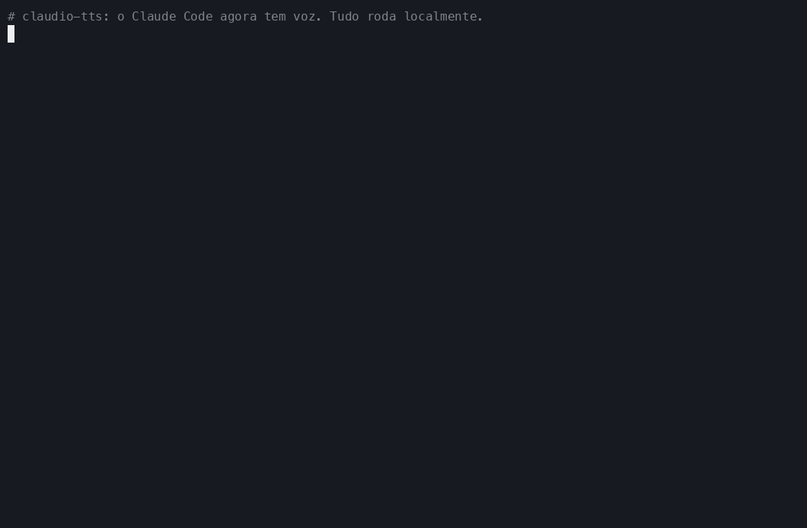
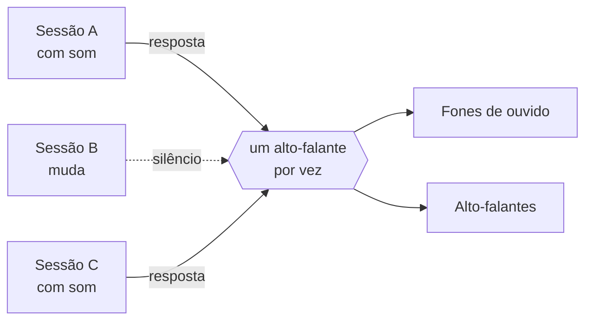
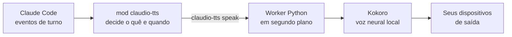

<div align="center">

<sub>🌍 [English (US)](README.md) · [Italiano](README.it.md) · [Polski](README.pl.md) · [Français](README.fr.md) · [Deutsch](README.de.md) · [日本語](README.ja.md) · [简体中文](README.zh-CN.md) · [हिन्दी](README.hi.md) · [Русский](README.ru.md) · [Español](README.es.md) · **Português**</sub>

# 🔊 claudio-tts

### Dê uma voz ao Claude Code. Localmente. De graça. Com zero tokens.

Respostas faladas e naturais para o [Claude Code](https://claude.com/claude-code), movidas pelo modelo de voz open source
**[Kokoro](https://huggingface.co/hexgrad/Kokoro-82M)** e construídas sobre o novo
**sistema de mods** do Claude Code. Sem chave de API, sem conta, sem custo por palavra, e o seu texto nunca sai do seu computador.

[](https://github.com/restante/claudio-tts/actions/workflows/ci.yml)
[](https://github.com/restante/claudio-tts/releases)
[](LICENSE)


[](CONTRIBUTING.md)



<sub>Uma gravação de verdade dos comandos de verdade. Um GIF não carrega som, então
<a href="#-ouça-as-vozes">ouça os exemplos</a> logo abaixo. Você pode regravá-lo quando quiser com
<code>scripts/make-demo.sh</code>.</sub>

**[Instalar](#-instalar) · [Vozes](#%EF%B8%8F-vozes) · [Comandos](#-comandos) · [Por que o Kokoro](#-por-que-o-kokoro-sem-tokens-sem-apis-sem-fatura) · [Mods](#-construído-sobre-os-mods-do-claude-code) · [Contribuir](#-contribuir) · [Relatar um bug](#-relatar-um-bug)**

</div>

---

## ✨ Destaques

- 🎧 **Ouça o Claude enquanto faz outra coisa.** Leia um diff, tome um café, descanse os olhos. As respostas do Claude, e
  a narração antes de cada chamada de ferramenta, são faladas conforme chegam.
- 🆓 **De graça para sempre, sem tokens, sem APIs.** A fala é gerada no seu próprio computador. Não há nada para
  assinar e nada para pagar.
- 🔒 **Privado e offline.** Depois do download único do modelo, funciona sem internet. O seu código e as suas
  conversas nunca são enviados a lugar nenhum para serem transformados em voz.
- 🎯 **Sempre a resposta mais recente.** Ele escuta os eventos de turno do próprio Claude Code em vez de vasculhar o
  arquivo de transcrição, então nunca lê a mensagem *anterior* à que você acabou de receber.
- 🧑‍🤝‍🧑 **Feito para várias sessões.** O mute é por sessão, sessões novas começam mudas, as sessões se revezam em vez de
  falar umas por cima das outras, e cada uma só interrompe a *sua própria* voz.
- 🗣️ **54 vozes, 9 idiomas.** Troque de voz com um único comando: `/tts voice af_heart`.
- 🔈 **Seus alto-falantes, suas regras.** Volume, velocidade e dispositivo de saída (um, vários ou todos ao mesmo tempo).
- 🩺 **Fácil de dar suporte.** `claudio-tts doctor --report` escreve um relato de bug pronto para colar.

---

## 🧩 Construído sobre os mods do Claude Code

O claudio-tts é construído sobre o novo **sistema de mods** do Claude Code, e não sobre os antigos hooks de "rodar um
script de shell a cada evento". Um mod é um pequeno plugin de funções tipadas que roda *dentro* do Claude Code, vê o
que o modelo está fazendo enquanto acontece, pode adicionar comandos e itens na barra de status, e recarrega a quente
enquanto você trabalha. É exatamente o que uma boa voz precisa:

| Recurso de mod | O que o claudio-tts faz com ele |
| --- | --- |
| **Eventos de turno** (`turn.complete`, `turn.step`, `turn.start`, `session.end`) | Recebe o texto final do modelo e a narração antes das chamadas de ferramenta *direto no evento*, então nunca fica uma resposta atrasado e nunca precisa reler um arquivo de transcrição |
| **Estado por sessão** | Cada sessão lembra o seu próprio botão de mute, então dez sessões abertas não viram dez vozes |
| **Armazenamento persistente do mod** | Volume, velocidade, voz e dispositivo de saída sobrevivem às reinicializações |
| **Registro de slash commands** | Adiciona o `/tts` com tudo que está abaixo, direto dentro do Claude Code |
| **Barra de status** | Mostra `TTS on` ou `TTS muted` para a sessão que você está olhando |
| **API de processos** | Entrega o texto ao motor de fala local sem nunca bloquear o Claude |
| **Contrato tipado e ferramentas** | Traz um contrato de tipos e é verificado com `claude plugin validate` e `claude plugin test` |
| **Hot reload** | Edite o mod e ele recarrega, sem precisar reiniciar durante o desenvolvimento |

O mod em si é uma camada fina de TypeScript ([`src/claudio_tts/mod`](src/claudio_tts/mod)). O trabalho de áudio fica
em um pequeno pacote Python, para que macOS e Windows compartilhem um único caminho de código.

---

## 🚀 Instalar

Você precisa do [Claude Code](https://claude.com/claude-code). O instalador cuida de todo o resto, incluindo o Python,
as dependências e o modelo de voz.

**macOS**

```bash
curl -fsSL https://raw.githubusercontent.com/restante/claudio-tts/main/install.sh | bash
```

**Windows** (PowerShell, beta)

```powershell
irm https://raw.githubusercontent.com/restante/claudio-tts/main/install.ps1 | iex
```

Depois **reinicie o Claude Code** e, em uma sessão:

```text
/tts unmute
```

Pronto. Mande uma mensagem e ouça. 🎉 (As sessões novas começam mudas de propósito; veja
[várias sessões](#-muitas-sessões-um-par-de-ouvidos).)

<details>
<summary><b>O que o instalador faz de verdade?</b></summary>

1. Instala o [`uv`](https://docs.astral.sh/uv/) se você não tiver. O `uv` também baixa um Python 3.12 privado,
   então você não precisa ter o Python instalado.
2. Cria um ambiente isolado (macOS: `~/Library/Application Support/claudio-tts`,
   Windows: `%LOCALAPPDATA%\claudio-tts`) e instala este pacote e as dependências nele.
3. Baixa o modelo Kokoro (326 MB, ou 92 MB com `--lite`) e **verifica o checksum SHA-256**.
4. Copia o mod do Claude Code para `~/.claude/mods/claudio-tts` e o registra em `~/.claude/settings.json`.
   Suas configurações são salvas em `settings.json.claudio-tts.bak` e mescladas, nunca sobrescritas.
5. Roda o `doctor` para checar o modelo, os dispositivos de áudio e o Claude Code.

É seguro rodar de novo: rodar outra vez atualiza, e nada é duplicado.
</details>

<details>
<summary><b>Opções do instalador</b></summary>

| macOS / Linux (`bash -s -- …`) | Windows (`-…`) | Efeito |
| --- | --- | --- |
| `--lite` | `-Lite` | Modelo menor de 92 MB (um pouco menos natural, mais rápido de baixar e de rodar) |
| `--no-model` | `-NoModel` | Pula o download do modelo |
| `--ref <ref>` | `-Ref <ref>` | Instala uma branch, tag ou commit |
| `--uninstall` | `-Uninstall` | Remove tudo (adicione `--keep-models` / `-KeepModels` para manter os arquivos de voz) |
| `--local` | `-Local` | Instala a partir do checkout em que você está |

Com o `irm | iex` do PowerShell não dá para passar opções; defina antes `CLAUDIO_TTS_LITE=1`, `CLAUDIO_TTS_NO_MODEL=1`,
`CLAUDIO_TTS_REF=<ref>` ou `CLAUDIO_TTS_UNINSTALL=1`, ou use
`& ([scriptblock]::Create((irm <url>))) -Lite`.
</details>

---

## 🎮 Comandos

Tudo é um único slash command dentro do Claude Code:

| Comando | O que faz |
| --- | --- |
| `/tts` | Alterna a fala **nesta sessão** |
| `/tts mute` · `/tts unmute` | Desliga / liga só nesta sessão |
| `/tts status` | Mostra o estado do mute, volume, velocidade, voz e saída |
| `/tts default on` · `/tts default off` | Define se as sessões **novas** começam falando (`off` = começam mudas, o padrão) |
| `/tts voice` | Lista todas as vozes e mostra a atual |
| `/tts voice af_heart` | Troca a voz (ela diz olá na nova voz). `/tts voice default` restaura o padrão |
| `/tts volume 1-10` | Volume, compartilhado por todas as sessões. `/tts volume` mostra o atual |
| `/tts speed 0.5-1.5` | Ritmo da fala (1 é o normal). `/tts pace` é um apelido |
| `/tts device` | Lista os dispositivos de saída e mostra a escolha atual |
| `/tts device airpods` | Fala em um dispositivo (nomes parciais funcionam) |
| `/tts device airpods,macbook` | …em vários dispositivos **ao mesmo tempo** |
| `/tts device all` | …em todas as saídas reais (dispositivos virtuais como Zoom e Teams são ignorados) |
| `/tts device default` | Volta ao padrão do sistema |
| `/tts mic` | Lista os microfones; `/tts mic <name>` salva uma preferência |

Veja como fica em uma sessão:

```text
> /tts unmute
claudio-tts: TTS on (this session), volume 10/10, speed 1, voice default, output default

> /tts voice bf_emma
claudio-tts: Voice: bf_emma

> /tts speed 0.9
claudio-tts: TTS speed 0.9
```

Volume, velocidade, voz e dispositivo descrevem *a sua configuração*, então são compartilhados. O mute descreve *uma
conversa*, então é por sessão.

---

## 🗣️ Vozes

O Kokoro traz **54 vozes em 9 idiomas**. Escolha uma com `/tts voice <name>`, ou liste todas com `/tts voice`
(ou `claudio-tts voices` em um terminal). A primeira letra do nome da voz é o idioma e a segunda é o
gênero, e o **claudio-tts escolhe o idioma certo automaticamente** a partir do nome.

| | Idioma | Feminina | Masculina |
| --- | --- | --- | --- |
| 🇺🇸 | Inglês americano | `af_alloy` `af_aoede` `af_bella` `af_heart` `af_jessica` `af_kore` `af_nicole` `af_nova` `af_river` `af_sarah` `af_sky` | `am_adam` `am_echo` `am_eric` `am_fenrir` `am_liam` `am_michael` `am_onyx` `am_puck` `am_santa` |
| 🇬🇧 | Inglês britânico | `bf_alice` `bf_emma` `bf_isabella` `bf_lily` | `bm_daniel` `bm_fable` `bm_george` `bm_lewis` |
| 🇪🇸 | Espanhol | `ef_dora` | `em_alex` `em_santa` |
| 🇫🇷 | Francês | `ff_siwis` | |
| 🇮🇳 | Hindi | `hf_alpha` `hf_beta` | `hm_omega` `hm_psi` |
| 🇮🇹 | Italiano | `if_sara` | `im_nicola` |
| 🇯🇵 | Japonês | `jf_alpha` `jf_gongitsune` `jf_nezumi` `jf_tebukuro` | `jm_kumo` |
| 🇧🇷 | Português brasileiro | `pf_dora` | `pm_alex` `pm_santa` |
| 🇨🇳 | Chinês mandarim | `zf_xiaobei` `zf_xiaoni` `zf_xiaoxiao` `zf_xiaoyi` | `zm_yunjian` `zm_yunxi` `zm_yunxia` `zm_yunyang` |

> **Boa notícia para quem fala português do Brasil:** 🇧🇷 o português brasileiro é um dos idiomas **nativos** do
> Kokoro, com as vozes `pf_dora`, `pm_alex` e `pm_santa`. Nada de sotaque estrangeiro: a pronúncia é a de uma voz
> feita para o nosso idioma. Ouça a `pf_dora` na [amostra](docs/samples/pf_dora.mp3) e, para usar, é só rodar
> `/tts voice pf_dora`.

> **Alemão, polonês e russo:** o Kokoro ainda não tem vozes nativas de alemão, polonês nem russo. O instalador, os
> comandos e esta documentação estão totalmente disponíveis nos três (veja os links no topo), mas a voz falada
> será de inglês ou de outro idioma lendo o seu texto com um sotaque perceptível. Experimente
> `claudio-tts say "…" --voice af_heart --lang de` (ou `pl`, `ru`) para ouvir. Se o Kokoro adicionar essas vozes,
> o claudio-tts as reconhecerá pelo mesmo comando `/tts voice`.

### 🎧 Ouça as vozes

Clique em um nome para tocar uma amostra curta (o GitHub abre um player). As amostras são geradas pelo próprio Kokoro.

| Voz | Ouvir | Voz | Ouvir |
| --- | --- | --- | --- |
| `af_heart` ⭐ | [▶ tocar](docs/samples/af_heart.mp3) | `bf_emma` | [▶ tocar](docs/samples/bf_emma.mp3) |
| `af_bella` ⭐ | [▶ tocar](docs/samples/af_bella.mp3) | `bf_isabella` | [▶ tocar](docs/samples/bf_isabella.mp3) |
| `af_nicole` | [▶ tocar](docs/samples/af_nicole.mp3) | `bm_george` | [▶ tocar](docs/samples/bm_george.mp3) |
| `af_sarah` | [▶ tocar](docs/samples/af_sarah.mp3) | `bm_fable` | [▶ tocar](docs/samples/bm_fable.mp3) |
| `af_sky` | [▶ tocar](docs/samples/af_sky.mp3) | `ef_dora` 🇪🇸 | [▶ tocar](docs/samples/ef_dora.mp3) |
| `am_michael` | [▶ tocar](docs/samples/am_michael.mp3) | `ff_siwis` 🇫🇷 | [▶ tocar](docs/samples/ff_siwis.mp3) |
| `am_fenrir` | [▶ tocar](docs/samples/am_fenrir.mp3) | `if_sara` 🇮🇹 | [▶ tocar](docs/samples/if_sara.mp3) |
| `am_puck` | [▶ tocar](docs/samples/am_puck.mp3) | `jf_alpha` 🇯🇵 | [▶ tocar](docs/samples/jf_alpha.mp3) |
| `hf_alpha` 🇮🇳 | [▶ tocar](docs/samples/hf_alpha.mp3) | `zf_xiaoxiao` 🇨🇳 | [▶ tocar](docs/samples/zf_xiaoxiao.mp3) |
| `pf_dora` 🇧🇷 | [▶ tocar](docs/samples/pf_dora.mp3) | | |

⭐ `af_heart` e `af_bella` são em geral consideradas as vozes de inglês mais naturais; comece por elas.

### Dicas

- **A voz e o texto devem combinar.** Uma voz de espanhol lendo inglês vai soar estranha, porque a voz
  decide como o texto é pronunciado. Se você conversa com o Claude em português, escolha `pf_dora` ou `pm_alex`.
- **Defina um padrão para todas as sessões** sem precisar de comando: coloque `"KOKORO_VOICE": "bf_emma"` no bloco `env` de
  `~/.claude/settings.json`. O `/tts voice` sobrepõe esse valor, e o `/tts voice default` volta a ele.
- **Rápido ou lento demais?** `/tts speed 0.85` desacelera, `/tts speed 1.2` acelera.
- **Quer mais baixinho?** `/tts volume 4`. O volume é aplicado por amostra, então não mexe no volume do seu sistema.
- A primeira frase de uma sessão pode demorar um instante enquanto o modelo carrega; as seguintes são rápidas. O
  modelo `--lite` começa mais rápido e usa menos memória.

---

## 🆓 Por que o Kokoro? Sem tokens, sem APIs, sem fatura

A maioria das soluções de "faça ele falar" manda cada resposta para um serviço de texto para fala na nuvem. O claudio-tts não. Ele roda o
**[Kokoro](https://huggingface.co/hexgrad/Kokoro-82M)**, um pequeno modelo de voz de pesos abertos, na sua própria CPU.

| | ☁️ Texto para fala na nuvem | 🔊 claudio-tts + Kokoro |
| --- | --- | --- |
| **Chave de API / conta** | Obrigatória | **Nenhuma** |
| **Custo** | Por caractere ou por minuto, para sempre | **Grátis** |
| **Tokens do Claude usados** | Muitas vezes extras, se um modelo escreve o roteiro | **Zero extra** (veja a nota) |
| **Privacidade** | Suas respostas são enviadas a um terceiro | **Nada sai do seu computador** |
| **Offline** | Não | **Sim** (depois do download único) |
| **Latência** | Ida e volta pela rede mais fila | **Começa a falar assim que a primeira frase fica pronta** |
| **Limites de uso / quedas** | Sim | **Nenhum** |
| **Licença** | Termos de serviço | **Modelo Apache-2.0, código MIT** |
| **Tamanho** | n/d | 326 MB (92 MB com `--lite`) |

> **Sendo sinceros.** O download único do modelo é de 326 MB. Gerar a fala usa um pouco de CPU enquanto ele fala. As
> melhores vozes pagas da nuvem podem soar mais ricas que o Kokoro, mas o Kokoro é incrivelmente natural para um modelo tão
> pequeno. E o [resumo falado](#%EF%B8%8F-faça-o-falar-menos-o-resumo-falado-opcional) *opcional* pede ao Claude
> que escreva uma ou duas frases extras por resposta, o que custa alguns poucos tokens de saída, e só se você ativá-lo.
> Sem ele, o claudio-tts lê o texto que o Claude já escreveu e **não usa nenhum token extra**.

---

## 🧑‍🤝‍🧑 Muitas sessões, um par de ouvidos



- Sessões novas **começam mudas**. Ative o som só da que você está acompanhando (`/tts unmute`), ou rode
  `/tts default on` se preferir que todas comecem falando.
- Se duas sessões com som responderem ao mesmo tempo, a segunda **espera a sua vez** em vez de cortar a primeira.
- Enviar um prompt, ou dar mute, interrompe **só a voz daquela sessão**.

## ✂️ Faça-o falar *menos*: o resumo falado opcional

Respostas longas cansam de ouvir. Se uma resposta tiver um bloco de resumo, o claudio-tts lê **só esse bloco**
e pula o resto. Adicione algo assim ao seu `CLAUDE.md` e o Claude vai escrever um toda vez:

```markdown
At the END of EVERY response add a short, conversational summary for text-to-speech, in this exact form.
Avoid URLs, file paths, code and variable names.

<!-- TTS_SUMMARY Duas ou três frases simples sobre o resultado. TTS_SUMMARY -->
```

Sem bloco? Ele lê a resposta inteira, com markdown, blocos de código, links e emojis limpos para soar natural.

---

## 🛠️ Como funciona



O mod escuta o texto do modelo e as chamadas de ferramenta, controla o mute por sessão e entrega o texto ao comando
`claudio-tts`. Todo o trabalho específico de cada sistema operacional (áudio, controle de processos, travas, baixar o volume da sua música enquanto fala) fica no
pacote Python, então macOS e Windows compartilham um único caminho de código. Detalhes em [docs/how-it-works.md](docs/how-it-works.md).

## ⚙️ Configuração

Variáveis de ambiente (coloque-as no bloco `env` de `~/.claude/settings.json`):

| Variável | Padrão | Significado |
| --- | --- | --- |
| `KOKORO_VOICE` | `af_sky` | Voz padrão de todas as sessões (veja [Vozes](#%EF%B8%8F-vozes)) |
| `AUDIO_DUCK_ENABLED` | `true` | Abaixa o Apple Music / Spotify enquanto fala (só no macOS) |
| `DUCK_LEVEL` | `5` | Porcentagem do volume original da música para a qual abaixar |
| `CLAUDIO_TTS_HOME` | por SO | Onde a instalação fica |

## 💻 Linha de comando

O pacote também instala um comando `claudio-tts` (dentro do seu ambiente privado):

```text
claudio-tts say "Hello there" --voice bf_emma   speak now and wait
claudio-tts voices                              list all 54 voices
claudio-tts devices [--inputs]                  list audio devices
claudio-tts doctor [--speak | --report]         check the install, or write a bug report
claudio-tts download-model [--lite]             fetch and verify the voice files
claudio-tts install-mod / uninstall-mod
```

## 🖥️ Plataformas suportadas

| | Status |
| --- | --- |
| **macOS** (Apple silicon e Intel) | ✅ Suportado e testado, incluindo a redução do volume da música |
| **Windows 10/11** | 🧪 **Beta.** Testado no CI; feedback com áudio real é bem-vindo. Ainda sem redução do volume da música |
| **Linux** | 🤷 Melhor esforço, não testado em hardware real |

---

## 🐞 Relatar um bug

Encontrou algo estranho? Isso é realmente útil, obrigado.

1. Rode isto e copie a saída:

   ```bash
   claudio-tts doctor --report
   ```

   (Se o `claudio-tts` não estiver no seu PATH, use o caminho completo que o instalador mostrou, terminando em
   `python -m claudio_tts doctor --report`.) Ele contém o seu SO, versões e nomes de dispositivos, mas **nunca** nada
   do que foi falado nem qualquer segredo.
2. [**Abra um relato de bug**](https://github.com/restante/claudio-tts/issues/new?template=bug_report.yml) e cole
   a saída. Diga o que você esperava e o que aconteceu.

As soluções rápidas estão em [docs/troubleshooting.md](docs/troubleshooting.md) e [docs/windows.md](docs/windows.md). A
mais comum: **silêncio geralmente significa que a sessão ainda está muda**, então digite `/tts unmute`.

## 🤝 Contribuir

**Contribuidores são muito bem-vindos.** Isto começou como um projeto de fim de semana de uma pessoa só, e fica melhor com mais
gente: mais vozes testadas, mais plataformas cobertas, mais ideias.

Ótimos lugares para entrar:

- 🪟 **Windows**: teste em hardware real, conte o que você ouviu, ou construa a redução do volume da música (volume por aplicativo).
- 🐧 **Linux**: aperfeiçoe e teste o instalador na sua distro.
- 🎛️ **Mistura de vozes e prévias**: misture duas vozes, ou ouça uma voz antes de escolher.
- 📦 **Empacotamento**: `pipx`, Homebrew, winget.
- 🌍 **Idiomas**: leitura melhor de código, números e texto com idiomas misturados.
- 📚 **Docs e demos**: GIFs melhores, traduções, tutoriais.

Procure por [`good first issue`](https://github.com/restante/claudio-tts/labels/good%20first%20issue) e
[`help wanted`](https://github.com/restante/claudio-tts/labels/help%20wanted), e leia o
[CONTRIBUTING.md](CONTRIBUTING.md) para configurar tudo em cinco minutos.

**Quer conversar antes?** [Inicie uma discussão](https://github.com/restante/claudio-tts/discussions) ou fale comigo
pelo meu perfil no GitHub, [@restante](https://github.com/restante). Ideias, perguntas, histórias do tipo "testei no X e…"
e ofertas de ajuda são todas bem-vindas. E se o claudio-tts alegrou o seu dia, uma ⭐ ajuda outras pessoas a encontrá-lo.

## 🗺️ Roteiro

- [ ] Redução do volume da música no Windows
- [ ] Mistura de vozes (`/tts voice af_heart+am_adam`)
- [ ] Instalação via `pipx` / Homebrew / winget
- [ ] Leitura mais inteligente de código, caminhos e números
- [ ] Um seletor com prévia de vozes

## 🗑️ Desinstalar

```bash
curl -fsSL https://raw.githubusercontent.com/restante/claudio-tts/main/install.sh | bash -s -- --uninstall
```

(Windows: `$env:CLAUDIO_TTS_UNINSTALL=1; irm …/install.ps1 | iex`.) O seu `settings.json` é restaurado como estava.

## 🧑‍💻 Desenvolver

```bash
git clone https://github.com/restante/claudio-tts && cd claudio-tts
bash install.sh --dev          # editable install, mod symlinked from src/claudio_tts/mod
.venv/bin/pytest               # or: uv venv && uv pip install -e ".[dev]" && pytest
```

Com o Claude Code instalado, verifique o mod com `claude plugin validate src/claudio_tts/mod` e
`claude plugin test src/claudio_tts/mod`.

## 🙏 Créditos

- [Kokoro-82M](https://huggingface.co/hexgrad/Kokoro-82M) por hexgrad (Apache-2.0), executado pelo
  [kokoro-onnx](https://github.com/thewh1teagle/kokoro-onnx) de thewh1teagle (MIT).
- A ideia de dar voz ao Claude Code vem do [ktaletsk/claude-code-tts](https://github.com/ktaletsk/claude-code-tts).
  O claudio-tts é uma implementação nova sobre o sistema de mods do Claude Code e não compartilha código com ele.
- Construído com a ajuda do Claude (IA), depois revisado e testado pelo mantenedor.

## 📄 Licença

[MIT](LICENSE) © 2026 Claudio Restante
