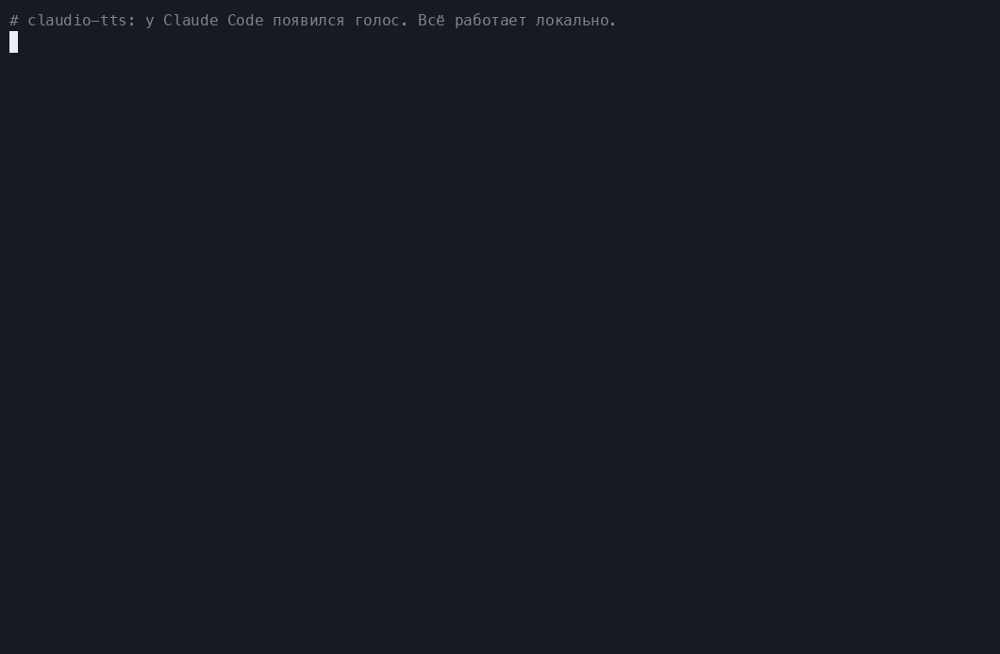
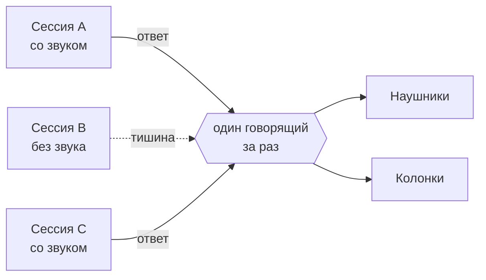
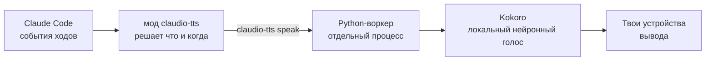

<div align="center">

<sub>🌍 [English (US)](README.md) · [Italiano](README.it.md) · [Polski](README.pl.md) · [Français](README.fr.md) · [Deutsch](README.de.md) · [日本語](README.ja.md) · [简体中文](README.zh-CN.md) · [हिन्दी](README.hi.md) · **Русский** · [Español](README.es.md) · [Português](README.pt-BR.md)</sub>

# 🔊 claudio-tts

### Подари Claude Code голос. Локально. Бесплатно. Без единого токена.

Естественные голосовые ответы для [Claude Code](https://claude.com/claude-code) на основе открытой
голосовой модели **[Kokoro](https://huggingface.co/hexgrad/Kokoro-82M)**, построенные на новой
**системе модов** Claude Code. Никаких API-ключей, никаких аккаунтов, никакой платы за слова, а твой текст никогда не покидает твой компьютер.

[](https://github.com/restante/claudio-tts/actions/workflows/ci.yml)
[](https://github.com/restante/claudio-tts/releases)
[](LICENSE)


[](CONTRIBUTING.md)



<sub>Настоящая запись настоящих команд. В GIF нет звука, поэтому
<a href="#-послушай-голоса">послушай примеры</a> ниже. Перезаписать демо можно в любой момент через
<code>scripts/make-demo.sh</code>.</sub>

**[Установка](#-установка) · [Голоса](#%EF%B8%8F-голоса) · [Команды](#-команды) · [Почему Kokoro](#-почему-kokoro-никаких-токенов-никаких-api-никаких-счетов) · [Моды](#-построено-на-модах-claude-code) · [Участвуй](#-участвуй) · [Сообщить об ошибке](#-сообщить-об-ошибке)**

</div>

---

## ✨ Главное

- 🎧 **Слушай Claude, занимаясь другими делами.** Читай diff, завари кофе, дай глазам отдохнуть. Ответы Claude и
  комментарии перед каждым вызовом инструмента озвучиваются по мере поступления.
- 🆓 **Бесплатно навсегда, без токенов, без API.** Речь генерируется на твоём собственном компьютере. Регистрироваться
  не нужно, платить не за что.
- 🔒 **Приватно и офлайн.** После однократной загрузки модели всё работает без интернета. Твой код и твои
  разговоры никуда не отправляются для озвучивания.
- 🎯 **Всегда последний ответ.** Мод слушает события ходов самого Claude Code, а не разбирает файл транскрипта,
  поэтому он никогда не прочитает сообщение, которое было *перед* только что полученным.
- 🧑‍🤝‍🧑 **Создано для множества сессий.** Mute действует на уровне сессии, новые сессии стартуют без звука, сессии
  говорят по очереди, а не перебивают друг друга, и каждая останавливает только *свой* голос.
- 🗣️ **54 голоса, 9 языков.** Меняй голос одной командой: `/tts voice af_heart`.
- 🔈 **Твои колонки, твои правила.** Громкость, скорость и устройство вывода (одно, несколько или все сразу).
- 🩺 **Легко поддерживать.** `claudio-tts doctor --report` формирует готовый отчёт об ошибке, который остаётся только вставить.

---

## 🧩 Построено на модах Claude Code

claudio-tts построен на новой **системе модов** Claude Code, а не на старых хуках вида «запускать shell-скрипт на
каждое событие». Мод — это небольшой плагин из типизированных функций, который работает *внутри* Claude Code, видит,
что делает модель, прямо в процессе, умеет добавлять команды и элементы строки состояния и перезагружается на лету,
пока ты работаешь. Именно это и нужно хорошему голосу:

| Возможность модов | Что с ней делает claudio-tts |
| --- | --- |
| **События хода** (`turn.complete`, `turn.step`, `turn.start`, `session.end`) | Получает финальный текст модели и комментарии перед вызовами инструментов *прямо в событии*, поэтому никогда не отстаёт на один ответ и не перечитывает файл транскрипта |
| **Состояние на уровне сессии** | Каждая сессия помнит собственный переключатель mute, так что десять открытых сессий не превращаются в десять голосов |
| **Постоянное хранилище мода** | Громкость, скорость, голос и устройство вывода сохраняются после перезапуска |
| **Регистрация slash-команд** | Добавляет `/tts` со всем, что описано ниже, прямо внутри Claude Code |
| **Строка состояния** | Показывает `TTS on` или `TTS muted` для сессии, на которую ты смотришь |
| **Process API** | Передаёт текст локальному движку озвучивания, ни разу не блокируя Claude |
| **Типизированный контракт и инструменты** | Поставляется с контрактом типов и проверяется через `claude plugin validate` и `claude plugin test` |
| **Горячая перезагрузка** | Правишь мод, и он перезагружается сам, перезапуск при разработке не нужен |

Сам мод — это тонкий слой на TypeScript ([`src/claudio_tts/mod`](src/claudio_tts/mod)). Вся работа со звуком живёт в
небольшом Python-пакете, поэтому macOS и Windows используют один и тот же код.

---

## 🚀 Установка

Тебе нужен [Claude Code](https://claude.com/claude-code). Установщик сделает всё остальное, включая Python,
зависимости и голосовую модель.

**macOS**

```bash
curl -fsSL https://raw.githubusercontent.com/restante/claudio-tts/main/install.sh | bash
```

**Windows** (PowerShell, бета)

```powershell
irm https://raw.githubusercontent.com/restante/claudio-tts/main/install.ps1 | iex
```

Затем **перезапусти Claude Code** и в сессии введи:

```text
/tts unmute
```

Вот и всё. Отправь сообщение и слушай. 🎉 (Новые сессии нарочно стартуют без звука; см.
[много сессий](#-много-сессий-одна-пара-ушей).)

<details>
<summary><b>Что на самом деле делает установщик?</b></summary>

1. Устанавливает [`uv`](https://docs.astral.sh/uv/), если его у тебя нет. `uv` также скачивает собственный Python 3.12,
   так что ставить Python отдельно не нужно.
2. Создаёт изолированное окружение (macOS: `~/Library/Application Support/claudio-tts`,
   Windows: `%LOCALAPPDATA%\claudio-tts`) и устанавливает в него этот пакет и его зависимости.
3. Скачивает модель Kokoro (326 МБ, или 92 МБ с `--lite`) и **проверяет её контрольную сумму SHA-256**.
4. Копирует мод Claude Code в `~/.claude/mods/claudio-tts` и регистрирует его в `~/.claude/settings.json`.
   Твои настройки сохраняются в резервную копию `settings.json.claudio-tts.bak` и объединяются, а не перезаписываются.
5. Запускает `doctor`, чтобы проверить модель, аудиоустройства и Claude Code.

Его безопасно запускать повторно: повторный запуск обновляет установку, ничего не дублируя.
</details>

<details>
<summary><b>Параметры установщика</b></summary>

| macOS / Linux (`bash -s -- …`) | Windows (`-…`) | Эффект |
| --- | --- | --- |
| `--lite` | `-Lite` | Модель поменьше, 92 МБ (чуть менее естественная, зато быстрее скачивается и работает) |
| `--no-model` | `-NoModel` | Пропустить загрузку модели |
| `--ref <ref>` | `-Ref <ref>` | Установить ветку, тег или коммит |
| `--uninstall` | `-Uninstall` | Удалить всё (добавь `--keep-models` / `-KeepModels`, чтобы сохранить файлы голосов) |
| `--local` | `-Local` | Установить из checkout, в котором ты сейчас находишься |

В PowerShell с `irm | iex` передать параметры нельзя; сначала задай `CLAUDIO_TTS_LITE=1`, `CLAUDIO_TTS_NO_MODEL=1`,
`CLAUDIO_TTS_REF=<ref>` или `CLAUDIO_TTS_UNINSTALL=1`, либо используй
`& ([scriptblock]::Create((irm <url>))) -Lite`.
</details>

---

## 🎮 Команды

Всё управляется одной slash-командой внутри Claude Code:

| Команда | Что делает |
| --- | --- |
| `/tts` | Включает или выключает озвучивание **для этой сессии** |
| `/tts mute` · `/tts unmute` | Выключить / включить звук только для этой сессии |
| `/tts status` | Показать состояние mute, громкость, скорость, голос и вывод |
| `/tts default on` · `/tts default off` | Начинают ли **новые** сессии с озвучивания (`off` = стартуют без звука, по умолчанию) |
| `/tts voice` | Показать список всех голосов и текущий голос |
| `/tts voice af_heart` | Сменить голос (он поздоровается новым голосом). `/tts voice default` сбрасывает выбор |
| `/tts volume 1-10` | Громкость, общая для всех сессий. `/tts volume` показывает текущую |
| `/tts speed 0.5-1.5` | Темп речи (1 — обычный). `/tts pace` — псевдоним |
| `/tts lang de` · `/tts lang auto` | Заставить голос читать другой язык (любой из 140) или вернуться к его родному |
| `/tts update` | Ищет новый релиз и устанавливает его (ничего не ставится, пока вы не введёте команду). `/tts update check` только проверяет, `/tts update off` отключает ежедневную проверку |
| `/tts device` | Показать устройства вывода и текущий выбор |
| `/tts device airpods` | Говорить на одном устройстве (достаточно части названия) |
| `/tts device airpods,macbook` | …на нескольких устройствах **одновременно** |
| `/tts device all` | …на всех реальных выходах (виртуальные устройства вроде Zoom и Teams пропускаются) |
| `/tts device default` | Вернуться к системному устройству по умолчанию |
| `/tts mic` | Показать микрофоны; `/tts mic <name>` сохраняет предпочтение |

Вот как это выглядит в сессии:

```text
> /tts unmute
claudio-tts: TTS on (this session), volume 10/10, speed 1, voice default, output default

> /tts voice bf_emma
claudio-tts: Voice: bf_emma

> /tts speed 0.9
claudio-tts: TTS speed 0.9
```

Громкость, скорость, голос и устройство описывают *твою конфигурацию*, поэтому они общие. Mute описывает *конкретный
разговор*, поэтому он действует на уровне сессии.

---

## 🗣️ Голоса

Kokoro поставляется с **54 голосами на 9 языках**. Выбери голос через `/tts voice <name>` или посмотри весь список
через `/tts voice` (или `claudio-tts voices` в терминале). Первая буква имени голоса — язык, вторая — пол, а
**claudio-tts сам выбирает нужный язык** по имени.

> **Это примеры, а не ограничения.** Можно использовать любой голос, который поддерживает Kokoro, добавлять свои
> файлы голосов, а любой голос может читать текст на 140 языках (см.
> [Используй любой другой голос или язык](#-используй-любой-другой-голос-или-язык)).

| | Язык | Женские | Мужские |
| --- | --- | --- | --- |
| 🇺🇸 | Американский английский | `af_alloy` `af_aoede` `af_bella` `af_heart` `af_jessica` `af_kore` `af_nicole` `af_nova` `af_river` `af_sarah` `af_sky` | `am_adam` `am_echo` `am_eric` `am_fenrir` `am_liam` `am_michael` `am_onyx` `am_puck` `am_santa` |
| 🇬🇧 | Британский английский | `bf_alice` `bf_emma` `bf_isabella` `bf_lily` | `bm_daniel` `bm_fable` `bm_george` `bm_lewis` |
| 🇪🇸 | Испанский | `ef_dora` | `em_alex` `em_santa` |
| 🇫🇷 | Французский | `ff_siwis` | |
| 🇮🇳 | Хинди | `hf_alpha` `hf_beta` | `hm_omega` `hm_psi` |
| 🇮🇹 | Итальянский | `if_sara` | `im_nicola` |
| 🇯🇵 | Японский | `jf_alpha` `jf_gongitsune` `jf_nezumi` `jf_tebukuro` | `jm_kumo` |
| 🇧🇷 | Бразильский португальский | `pf_dora` | `pm_alex` `pm_santa` |
| 🇨🇳 | Китайский (мандарин) | `zf_xiaobei` `zf_xiaoni` `zf_xiaoxiao` `zf_xiaoyi` | `zm_yunjian` `zm_yunxi` `zm_yunxia` `zm_yunyang` |

> **Немецкий, польский и русский:** у Kokoro пока нет родных голосов для немецкого, польского и русского. Установщик,
> команды и эта документация полностью доступны на всех трёх языках (см. ссылки вверху), но говорить будет голос
> другого языка, например английский, и русский текст в его исполнении прозвучит с заметным акцентом. Для
> русского попробуй английский голос, скажем `af_heart`, с флагом `--lang ru`:
> `claudio-tts say "Привет! Это проверка голоса." --voice af_heart --lang ru`. Для немецкого и польского используй
> `--lang de` или `--lang pl`. Если Kokoro добавит родные голоса, claudio-tts подхватит их через ту же команду
> `/tts voice`.

### 🎧 Послушай голоса

**[▶ Открыть плеер голосов](https://restante.github.io/claudio-tts/)**, чтобы послушать все 54 голоса прямо в
браузере, одним нажатием на кнопку. (GitHub не умеет проигрывать звук внутри README, поэтому плеер живёт на
небольшой веб-странице.) Или нажми на имя ниже, чтобы сразу перейти к нему. Примеры сгенерированы самим Kokoro.

| Голос | Слушать | Голос | Слушать |
| --- | --- | --- | --- |
| `af_heart` ⭐ | [▶ слушать](https://restante.github.io/claudio-tts/#af_heart) | `bf_emma` | [▶ слушать](https://restante.github.io/claudio-tts/#bf_emma) |
| `af_bella` ⭐ | [▶ слушать](https://restante.github.io/claudio-tts/#af_bella) | `bf_isabella` | [▶ слушать](https://restante.github.io/claudio-tts/#bf_isabella) |
| `af_nicole` | [▶ слушать](https://restante.github.io/claudio-tts/#af_nicole) | `bm_george` | [▶ слушать](https://restante.github.io/claudio-tts/#bm_george) |
| `af_sarah` | [▶ слушать](https://restante.github.io/claudio-tts/#af_sarah) | `bm_fable` | [▶ слушать](https://restante.github.io/claudio-tts/#bm_fable) |
| `af_sky` | [▶ слушать](https://restante.github.io/claudio-tts/#af_sky) | `ef_dora` 🇪🇸 | [▶ слушать](https://restante.github.io/claudio-tts/#ef_dora) |
| `am_michael` | [▶ слушать](https://restante.github.io/claudio-tts/#am_michael) | `ff_siwis` 🇫🇷 | [▶ слушать](https://restante.github.io/claudio-tts/#ff_siwis) |
| `am_fenrir` | [▶ слушать](https://restante.github.io/claudio-tts/#am_fenrir) | `if_sara` 🇮🇹 | [▶ слушать](https://restante.github.io/claudio-tts/#if_sara) |
| `am_puck` | [▶ слушать](https://restante.github.io/claudio-tts/#am_puck) | `jf_alpha` 🇯🇵 | [▶ слушать](https://restante.github.io/claudio-tts/#jf_alpha) |
| `hf_alpha` 🇮🇳 | [▶ слушать](https://restante.github.io/claudio-tts/#hf_alpha) | `zf_xiaoxiao` 🇨🇳 | [▶ слушать](https://restante.github.io/claudio-tts/#zf_xiaoxiao) |
| `pf_dora` 🇧🇷 | [▶ слушать](https://restante.github.io/claudio-tts/#pf_dora) | | |

⭐ `af_heart` и `af_bella` принято считать самыми естественными английскими голосами; начни с них.

### Советы

- **Голос и текст должны совпадать.** Испанский голос, читающий английский текст, звучит странно, ведь именно голос
  определяет, как произносится текст. Если ты общаешься с Claude по-испански, выбери `ef_dora` или `em_alex`.
- **Задай голос по умолчанию для всех сессий** без команды: добавь `"KOKORO_VOICE": "bf_emma"` в блок `env` файла
  `~/.claude/settings.json`. `/tts voice` переопределяет его, а `/tts voice default` возвращает к нему.
- **Слишком быстро или слишком медленно?** `/tts speed 0.85` замедляет, `/tts speed 1.2` ускоряет.
- **Хочешь потише?** `/tts volume 4`. Громкость применяется к каждому сэмплу, поэтому системная громкость не меняется.
- Первое предложение в сессии может занять пару секунд, пока загружается модель; следующие идут быстро. Модель
  `--lite` стартует быстрее и занимает меньше памяти.

### 🔧 Используй любой другой голос или язык

54 встроенных голоса и 9 родных языков — это лишь то, что идёт в комплекте:

```text
/tts voice af_mix                # a voice you added (a .npy file in the voices folder)
/tts lang de                     # read German (or any of 140 languages) through the current voice
/tts lang auto                   # back to the voice's own language
```

```json
{ "env": { "CLAUDIO_TTS_MODEL": "/path/to/model.onnx", "CLAUDIO_TTS_VOICES": "/path/to/voices.bin" } }
```

- **Добавь свой голос**: сохрани вектор стиля Kokoro как `voices/<name>.npy` в папке установки, и `<name>`
  появится в `/tts voice`. Можно даже смешать два голоса в новый.
- **Используй другую модель Kokoro или другой пакет голосов** (более новый релиз, пакет от сообщества): задай две
  переменные окружения выше в `~/.claude/settings.json`.
- **Читай на любом языке**: `/tts lang <code>` заставляет текущий голос читать на этом языке (140 кодов, см.
  `claudio-tts languages`). Для русского, например, `/tts lang ru` читает русский текст через текущий голос, с
  акцентом, потому что у языков без родного голоса он неизбежен.

Пошагово, со скриптом для смешивания: **[docs/voices.md](docs/voices.md)**.

---

## 🆓 Почему Kokoro? Никаких токенов, никаких API, никаких счетов

В большинстве решений «заставь его говорить» каждый ответ уходит в облачный сервис синтеза речи. claudio-tts так не
делает. Он запускает **[Kokoro](https://huggingface.co/hexgrad/Kokoro-82M)**, небольшую голосовую модель с открытыми
весами, на твоём собственном процессоре.

| | ☁️ Облачный синтез речи | 🔊 claudio-tts + Kokoro |
| --- | --- | --- |
| **API-ключ / аккаунт** | Нужен | **Не нужен** |
| **Стоимость** | За символ или за минуту, навсегда | **Бесплатно** |
| **Токены Claude** | Часто дополнительные, если сценарий пишет модель | **Ноль дополнительных** (см. примечание) |
| **Приватность** | Твои ответы уходят третьей стороне | **Ничего не покидает твой компьютер** |
| **Офлайн** | Нет | **Да** (после однократной загрузки) |
| **Задержка** | Сетевой обмен плюс очередь | **Начинает говорить, как только готово первое предложение** |
| **Лимиты / сбои** | Есть | **Нет** |
| **Лицензия** | Условия использования | **Модель Apache-2.0, код MIT** |
| **Размер** | н/д | 326 МБ (92 МБ с `--lite`) |

> **Честные оговорки.** Однократная загрузка модели занимает 326 МБ. Пока идёт озвучивание, расходуется часть
> процессора. Самые лучшие платные облачные голоса могут звучать богаче, чем Kokoro, но для модели такого размера
> Kokoro удивительно естественный. А *необязательное* [голосовое резюме](#%EF%B8%8F-пусть-говорит-меньше-необязательное-голосовое-резюме)
> просит Claude написать одно-два дополнительных предложения на ответ, что стоит горстку выходных токенов, и только
> если ты это включишь. Без него claudio-tts читает текст, который Claude уже написал, и **не тратит дополнительных
> токенов вообще**.

---

## 🧑‍🤝‍🧑 Много сессий, одна пара ушей



- Новые сессии **стартуют без звука**. Включай звук только в той, за которой следишь (`/tts unmute`), или выполни
  `/tts default on`, если хочешь, чтобы все сразу начинали говорить.
- Если две сессии со звуком отвечают одновременно, вторая **ждёт своей очереди**, а не обрывает первую.
- Отправка промпта или mute останавливают голос **только этой сессии**.

## ✂️ Пусть говорит *меньше*: необязательное голосовое резюме

Длинные ответы утомительно слушать. Если в ответе есть блок с резюме, claudio-tts читает **только этот блок** и
пропускает остальное. Добавь что-то подобное в свой `CLAUDE.md`, и Claude будет писать такой блок каждый раз:

```markdown
At the END of EVERY response add a short, conversational summary for text-to-speech, in this exact form.
Avoid URLs, file paths, code and variable names.

<!-- TTS_SUMMARY Две-три простых предложения о результате. TTS_SUMMARY -->
```

Нет блока? Тогда читается весь ответ, а markdown, блоки кода, ссылки и эмодзи вычищаются, чтобы звучало естественно.

---

## 🛠️ Как это работает



Мод следит за текстом модели и вызовами инструментов, ведёт mute по сессиям и передаёт текст команде `claudio-tts`.
Вся работа, зависящая от ОС (звук, управление процессами, блокировки, приглушение твоей музыки во время речи), живёт
в Python-пакете, поэтому macOS и Windows используют один код. Подробности в [docs/how-it-works.md](docs/how-it-works.md).

## ⚙️ Конфигурация

Переменные окружения (добавляй их в блок `env` файла `~/.claude/settings.json`):

| Переменная | По умолчанию | Значение |
| --- | --- | --- |
| `KOKORO_VOICE` | `af_sky` | Голос по умолчанию для всех сессий (см. [Голоса](#%EF%B8%8F-голоса)) |
| `CLAUDIO_TTS_MODEL`, `CLAUDIO_TTS_VOICES` | встроенные | Использовать другую модель Kokoro / пакет голосов (нужны оба) |
| `AUDIO_DUCK_ENABLED` | `true` | Приглушать Apple Music / Spotify во время речи (только macOS) |
| `DUCK_LEVEL` | `5` | До какого процента от исходной громкости музыки приглушать |
| `CLAUDIO_TTS_HOME` | зависит от ОС | Где находится установка |

## 💻 Командная строка

Пакет также устанавливает команду `claudio-tts` (внутри своего приватного окружения):

```text
claudio-tts say "Hello there" --voice bf_emma   speak now and wait
claudio-tts voices                              list all voices (the 54 built-in plus yours)
claudio-tts languages                           list the 140 languages a voice can read
claudio-tts devices [--inputs]                  list audio devices
claudio-tts doctor [--speak | --report]         check the install, or write a bug report
claudio-tts download-model [--lite]             fetch and verify the voice files
claudio-tts install-mod / uninstall-mod
```

## 🖥️ Поддержка платформ

| | Статус |
| --- | --- |
| **macOS** (Apple silicon и Intel) | ✅ Поддерживается и протестировано, включая приглушение музыки |
| **Windows 10/11** | 🧪 **Бета.** Тестируется в CI; отзывы о реальном звуке приветствуются. Приглушения музыки пока нет |
| **Linux** | 🤷 По мере возможности, на реальном железе не проверялось |

---

## 🐞 Сообщить об ошибке

Нашёл что-то странное? Это правда полезно, спасибо.

1. Выполни это и скопируй вывод:

   ```bash
   claudio-tts doctor --report
   ```

   (Если `claudio-tts` нет в твоём PATH, используй полный путь, который вывел установщик, заканчивающийся на
   `python -m claudio_tts doctor --report`.) В отчёте есть твоя ОС, версии и названия устройств, но **никогда** ничего
   из того, что было озвучено, и никаких секретов.
2. [**Открой отчёт об ошибке**](https://github.com/restante/claudio-tts/issues/new?template=bug_report.yml) и вставь
   его туда. Напиши, чего ты ожидал и что произошло.

Быстрые решения собраны в [docs/troubleshooting.md](docs/troubleshooting.md) и [docs/windows.md](docs/windows.md).
Самое частое: **тишина обычно значит, что сессия всё ещё без звука**, так что введи `/tts unmute`.

## 🤝 Участвуй

**Контрибьюторам мы очень рады.** Всё началось как проект выходного дня одного человека, и с каждым новым участником
он становится лучше: больше проверенных голосов, больше платформ, больше идей.

Отличные места, чтобы включиться:

- 🪟 **Windows**: попробуй на реальном железе, расскажи, что слышишь, или сделай приглушение музыки (громкость по приложениям).
- 🐧 **Linux**: доведи до ума и протестируй установщик на своём дистрибутиве.
- 🎛️ **Смешивание голосов и предпрослушивание**: смешивай два голоса или прослушивай голос перед выбором.
- 📦 **Пакетирование**: `pipx`, Homebrew, winget.
- 🌍 **Языки**: более качественное чтение кода, чисел и текста на смеси языков.
- 📚 **Документация и демо**: лучшие GIF, переводы, туториалы.

Ищи [`good first issue`](https://github.com/restante/claudio-tts/labels/good%20first%20issue) и
[`help wanted`](https://github.com/restante/claudio-tts/labels/help%20wanted) и прочитай
[CONTRIBUTING.md](CONTRIBUTING.md), чтобы за пять минут всё настроить.

**Хочешь сначала поговорить?** [Начни обсуждение](https://github.com/restante/claudio-tts/discussions) или напиши мне
через мой профиль на GitHub, [@restante](https://github.com/restante). Идеи, вопросы, истории вида «я попробовал это
на X, и…» и предложения помощи — всё приветствуется. А если claudio-tts сделал твой день лучше, ⭐ поможет другим его найти.

## 🗺️ Дорожная карта

- [ ] Приглушение музыки в Windows
- [ ] Смешивание голосов (`/tts voice af_heart+am_adam`)
- [ ] Установка через `pipx` / Homebrew / winget
- [ ] Более умное чтение кода, путей и чисел
- [ ] Выбор голоса с предпрослушиванием

## 🔄 Обновление

claudio-tts проверяет новый релиз не чаще раза в день при старте сессии и показывает `update available`. Сам он ничего не устанавливает. Введите `/tts update`, чтобы установить, затем перезапустите открытые сессии. `/tts update off` отключает проверку.

## 🗑️ Удаление

```bash
curl -fsSL https://raw.githubusercontent.com/restante/claudio-tts/main/install.sh | bash -s -- --uninstall
```

(Windows: `$env:CLAUDIO_TTS_UNINSTALL=1; irm …/install.ps1 | iex`.) Твой `settings.json` будет восстановлен в прежнем виде.

## 🧑‍💻 Разработка

```bash
git clone https://github.com/restante/claudio-tts && cd claudio-tts
bash install.sh --dev          # editable install, mod symlinked from src/claudio_tts/mod
.venv/bin/pytest               # or: uv venv && uv pip install -e ".[dev]" && pytest
```

Если Claude Code установлен, проверь мод командами `claude plugin validate src/claudio_tts/mod` и
`claude plugin test src/claudio_tts/mod`.

## 🙏 Благодарности

- [Kokoro-82M](https://huggingface.co/hexgrad/Kokoro-82M) от hexgrad (Apache-2.0), запускается через
  [kokoro-onnx](https://github.com/thewh1teagle/kokoro-onnx) от thewh1teagle (MIT).
- Идея озвучить Claude Code пришла из [ktaletsk/claude-code-tts](https://github.com/ktaletsk/claude-code-tts).
  claudio-tts — новая реализация на системе модов Claude Code, и общего кода с ним у неё нет.
- Мой друг [Donato Antonini](https://www.linkedin.com/in/donato-antonini-47b18a48/) — за мозговой штурм и идею.

## 📄 Лицензия

[MIT](LICENSE) © 2026 Claudio Restante
