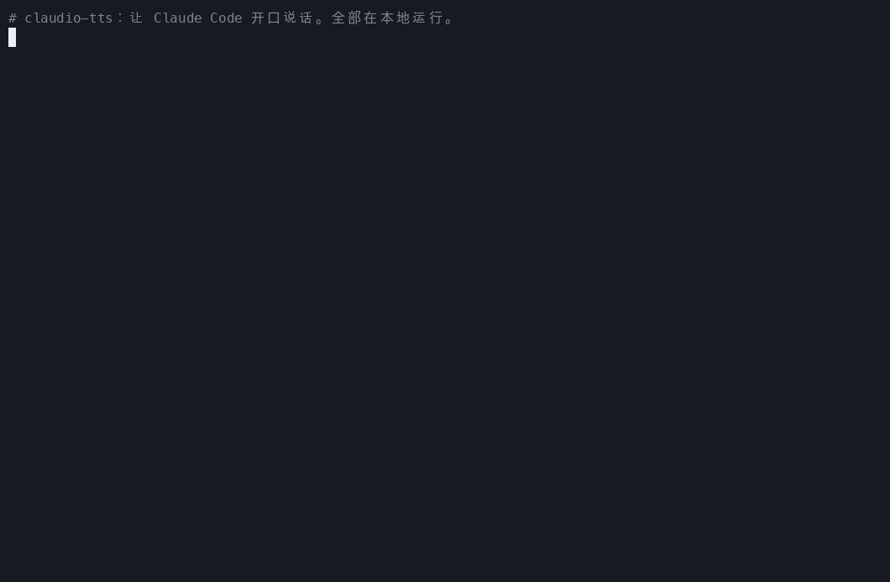
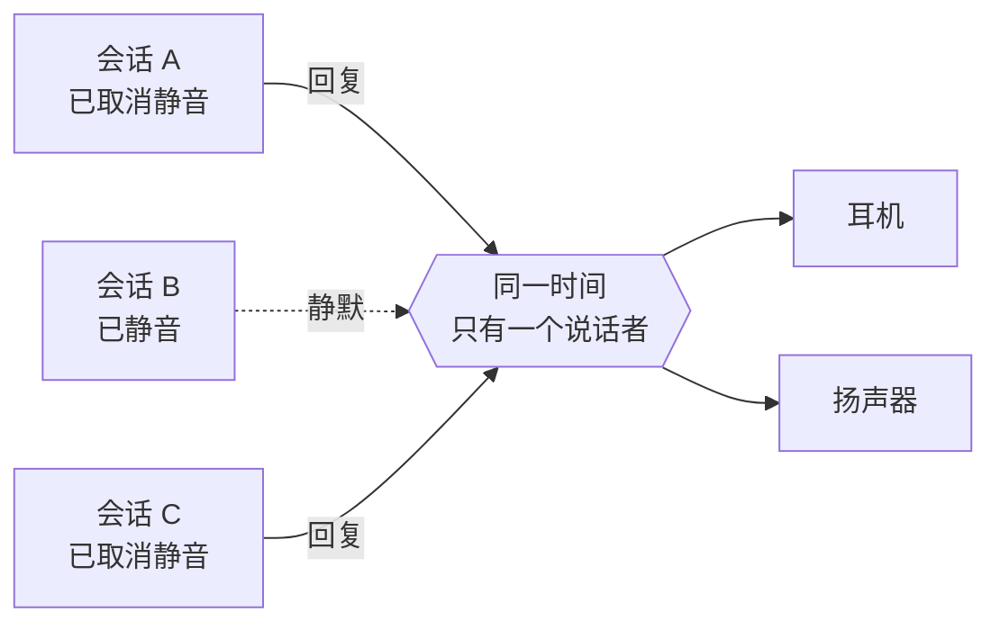

<div align="center">

<sub>🌍 [English (US)](README.md) · [Italiano](README.it.md) · [Polski](README.pl.md) · [Français](README.fr.md) · [Deutsch](README.de.md) · [日本語](README.ja.md) · **简体中文** · [हिन्दी](README.hi.md) · [Русский](README.ru.md) · [Español](README.es.md) · [Português](README.pt-BR.md)</sub>

# 🔊 claudio-tts

### 给 Claude Code 一副嗓子。本地运行。完全免费。零 token 消耗。

为 [Claude Code](https://claude.com/claude-code) 带来自然的语音朗读,由开源的
**[Kokoro](https://huggingface.co/hexgrad/Kokoro-82M)** 语音模型驱动,基于 Claude Code 全新的
**mod 系统**构建。不需要 API 密钥,不需要账号,不按字数收费,你的文字也绝不会离开你的电脑。

[](https://github.com/restante/claudio-tts/actions/workflows/ci.yml)
[](https://github.com/restante/claudio-tts/releases)
[](LICENSE)


[](CONTRIBUTING.md)



<sub>真实命令的真实录屏。GIF 带不了声音,所以请
<a href="#-听听这些声音">到下面听听示例</a>。随时可以用
<code>scripts/make-demo.sh</code> 重新录制。</sub>

**[安装](#-安装) · [语音](#%EF%B8%8F-语音) · [命令](#-命令) · [为什么选 Kokoro](#-为什么选-kokoro无-token无-api无账单) · [Mod](#-基于-claude-code-mod-构建) · [参与贡献](#-参与贡献) · [报告 bug](#-报告-bug)**

</div>

---

## ✨ 亮点

- 🎧 **一边做别的,一边听 Claude 说话。** 看 diff、泡咖啡、让眼睛歇一歇。Claude 的回复,以及每次调用工具前的说明,
  都会在到达时立刻朗读出来。
- 🆓 **永久免费,没有 token,没有 API。** 语音在你自己的电脑上生成。不用注册任何东西,也不用付一分钱。
- 🔒 **私密,还能离线。** 一次性下载模型之后,不联网也能用。你的代码和对话绝不会被发送到任何地方去配音。
- 🎯 **永远是最新的回复。** 它监听 Claude Code 自己的回合事件,而不是去抓取对话记录文件,所以绝不会念成你刚收到那条*之前*的消息。
- 🧑‍🤝‍🧑 **为多会话而生。** 静音按会话单独设置,新会话默认静音,会话之间轮流发言而不是互相抢话,而且每个会话只会停掉*它自己*的声音。
- 🗣️ **54 种声音,9 种语言。** 一条命令就能换声音:`/tts voice af_heart`。
- 🔈 **你的扬声器,你说了算。** 音量、语速和输出设备(一个、多个,或者同时全部)。
- 🩺 **排查问题很轻松。** `claudio-tts doctor --report` 会生成一份可以直接粘贴的错误报告。

---

## 🧩 基于 Claude Code mod 构建

claudio-tts 构建在 Claude Code 全新的 **mod 系统**之上,而不是老式的“每个事件都运行一个 shell 脚本”的 hooks。mod 是一个由带类型的函数组成的小插件,
它运行在 Claude Code *内部*,能实时看到模型正在做什么,可以添加命令和状态栏条目,还能在你工作时热重载。一个好用的语音功能,要的正是这些:

| Mod 功能 | claudio-tts 用它来做什么 |
| --- | --- |
| **回合事件**(`turn.complete`、`turn.step`、`turn.start`、`session.end`) | 直接从事件中拿到模型的最终文本和工具调用前的说明,所以绝不会慢一条回复,也不用重新读取对话记录文件 |
| **按会话保存状态** | 每个会话各自记住自己的静音开关,所以开着十个会话也不会变成十个声音 |
| **持久化的 mod 存储** | 音量、语速、声音和输出设备在重启后依然保留 |
| **斜杠命令注册** | 在 Claude Code 里直接添加 `/tts` 和下面所有命令 |
| **状态栏** | 为你正在看的会话显示 `TTS on` 或 `TTS muted` |
| **进程 API** | 把文本交给本地语音引擎,完全不会阻塞 Claude |
| **类型契约与工具链** | 附带类型契约,并通过 `claude plugin validate` 和 `claude plugin test` 检查 |
| **热重载** | 修改 mod 后自动重新加载,开发时无需重启 |

mod 本身只是一层很薄的 TypeScript 代码([`src/claudio_tts/mod`](src/claudio_tts/mod))。音频相关的工作都放在一个小小的 Python 包里,
这样 macOS 和 Windows 共用同一套代码路径。

---

## 🚀 安装

你需要 [Claude Code](https://claude.com/claude-code)。其余的一切都由安装程序搞定,包括 Python、依赖项和语音模型。

**macOS**

```bash
curl -fsSL https://raw.githubusercontent.com/restante/claudio-tts/main/install.sh | bash
```

**Windows**(PowerShell,beta)

```powershell
irm https://raw.githubusercontent.com/restante/claudio-tts/main/install.ps1 | iex
```

然后**重启 Claude Code**,在会话里输入:

```text
/tts unmute
```

就这么简单。发条消息,听听看吧。🎉(新会话默认静音是特意设计的,详见
[多个会话](#-多个会话一双耳朵)。)

<details>
<summary><b>安装程序到底做了什么?</b></summary>

1. 如果你还没有 [`uv`](https://docs.astral.sh/uv/),就先安装它。`uv` 还会下载一份私有的 Python 3.12,
   所以你不需要自己安装 Python。
2. 创建一个隔离环境(macOS:`~/Library/Application Support/claudio-tts`,
   Windows:`%LOCALAPPDATA%\claudio-tts`),并把本软件包及其依赖项装进去。
3. 下载 Kokoro 模型(326 MB,使用 `--lite` 则为 92 MB),并**校验它的 SHA-256 校验和**。
4. 把 Claude Code mod 复制到 `~/.claude/mods/claudio-tts`,并在 `~/.claude/settings.json` 中注册。
   你的设置会备份为 `settings.json.claudio-tts.bak`,并且是合并写入,绝不会覆盖。
5. 运行 `doctor` 检查模型、音频设备和 Claude Code。

可以放心重复运行:重新运行就是更新,不会产生任何重复内容。
</details>

<details>
<summary><b>安装选项</b></summary>

| macOS / Linux(`bash -s -- …`) | Windows(`-…`) | 作用 |
| --- | --- | --- |
| `--lite` | `-Lite` | 更小的 92 MB 模型(自然度略低,但下载和运行都更快) |
| `--no-model` | `-NoModel` | 跳过模型下载 |
| `--ref <ref>` | `-Ref <ref>` | 安装某个分支、标签或提交 |
| `--uninstall` | `-Uninstall` | 全部卸载(加上 `--keep-models` / `-KeepModels` 可保留语音文件) |
| `--local` | `-Local` | 从你当前所在的检出目录安装 |

使用 PowerShell 的 `irm | iex` 时无法传递开关参数;请先设置 `CLAUDIO_TTS_LITE=1`、`CLAUDIO_TTS_NO_MODEL=1`、
`CLAUDIO_TTS_REF=<ref>` 或 `CLAUDIO_TTS_UNINSTALL=1`,或者使用
`& ([scriptblock]::Create((irm <url>))) -Lite`。
</details>

---

## 🎮 命令

在 Claude Code 里,一切都只是一条斜杠命令:

| 命令 | 作用 |
| --- | --- |
| `/tts` | 切换**当前会话**的语音开关 |
| `/tts mute` · `/tts unmute` | 仅对当前会话关闭 / 开启 |
| `/tts status` | 显示静音状态、音量、语速、声音和输出设备 |
| `/tts default on` · `/tts default off` | **新**会话是否默认开口说话(`off` = 默认静音,这是默认值) |
| `/tts voice` | 列出所有声音,并显示当前使用的 |
| `/tts voice af_heart` | 更换声音(它会用新声音向你问好)。`/tts voice default` 可重置 |
| `/tts lang de` · `/tts lang auto` | 让声音朗读另一种语言(140 种任选),或恢复为它自己的语言 |
| `/tts update` | 检查新版本并安装(你输入之前不会安装任何东西)。`/tts update check` 只检查,`/tts update off` 关闭每日检查 |
| `/tts volume 1-10` | 响度,所有会话共用。`/tts volume` 可查看当前值 |
| `/tts speed 0.5-1.5` | 说话节奏(1 为正常)。`/tts pace` 是它的别名 |
| `/tts device` | 列出输出设备,并显示当前选择 |
| `/tts device airpods` | 用某一个设备播放(支持部分名称匹配) |
| `/tts device airpods,macbook` | ……**同时**用多个设备播放 |
| `/tts device all` | ……用所有真实输出设备播放(Zoom、Teams 之类的虚拟设备会被跳过) |
| `/tts device default` | 恢复为系统默认设备 |
| `/tts mic` | 列出麦克风;`/tts mic <name>` 会保存偏好设置 |

在会话里看起来是这样的:

```text
> /tts unmute
claudio-tts: TTS on (this session), volume 10/10, speed 1, voice default, output default

> /tts voice bf_emma
claudio-tts: Voice: bf_emma

> /tts speed 0.9
claudio-tts: TTS speed 0.9
```

音量、语速、声音和设备描述的是*你的使用环境*,所以是共享的。静音描述的是*一段对话*,所以按会话单独设置。

---

## 🗣️ 语音

Kokoro 自带 **9 种语言的 54 种声音**。用 `/tts voice <name>` 选一个,或者用 `/tts voice` 列出全部
(在终端里用 `claudio-tts voices`)。声音名称的第一个字母代表语言,第二个字母代表性别,
**claudio-tts 会根据名称自动选择正确的语言**。

> **这些只是示例,不是限制。** Kokoro 支持的任何声音都可以使用,你还可以添加自己的声音文件,
> 而且一种声音可以朗读 140 种语言的文本(见[使用其他声音或语言](#-使用其他声音或语言))。

| | 语言 | 女声 | 男声 |
| --- | --- | --- | --- |
| 🇺🇸 | 美式英语 | `af_alloy` `af_aoede` `af_bella` `af_heart` `af_jessica` `af_kore` `af_nicole` `af_nova` `af_river` `af_sarah` `af_sky` | `am_adam` `am_echo` `am_eric` `am_fenrir` `am_liam` `am_michael` `am_onyx` `am_puck` `am_santa` |
| 🇬🇧 | 英式英语 | `bf_alice` `bf_emma` `bf_isabella` `bf_lily` | `bm_daniel` `bm_fable` `bm_george` `bm_lewis` |
| 🇪🇸 | 西班牙语 | `ef_dora` | `em_alex` `em_santa` |
| 🇫🇷 | 法语 | `ff_siwis` | |
| 🇮🇳 | 印地语 | `hf_alpha` `hf_beta` | `hm_omega` `hm_psi` |
| 🇮🇹 | 意大利语 | `if_sara` | `im_nicola` |
| 🇯🇵 | 日语 | `jf_alpha` `jf_gongitsune` `jf_nezumi` `jf_tebukuro` | `jm_kumo` |
| 🇧🇷 | 巴西葡萄牙语 | `pf_dora` | `pm_alex` `pm_santa` |
| 🇨🇳 | 普通话 | `zf_xiaobei` `zf_xiaoni` `zf_xiaoxiao` `zf_xiaoyi` | `zm_yunjian` `zm_yunxi` `zm_yunxia` `zm_yunyang` |

> **德语、波兰语和俄语:** Kokoro 目前还没有原生的德语、波兰语或俄语声音。安装程序、命令和本文档都已提供这三种语言的完整版本(见顶部的链接),
> 但实际朗读的声音会是英语或其他语言的声音,念你的文字时会带有明显的口音。可以试试
> `claudio-tts say "…" --voice af_heart --lang de`(或 `pl`、`ru`)来听听效果。如果 Kokoro 以后加入了这些声音,
> claudio-tts 会通过同一条 `/tts voice` 命令直接支持。

### 🎧 听听这些声音

**[▶ 打开语音播放器](https://restante.github.io/claudio-tts/)**,直接在浏览器里一键试听全部 54 种声音。(GitHub 无法在 README 里播放音频,所以播放器放在了一个小网页上。)也可以点击下面的名称,直接跳到对应的声音。示例由 Kokoro 本身生成。

| 声音 | 试听 | 声音 | 试听 |
| --- | --- | --- | --- |
| `af_heart` ⭐ | [▶ 试听](https://restante.github.io/claudio-tts/#af_heart) | `bf_emma` | [▶ 试听](https://restante.github.io/claudio-tts/#bf_emma) |
| `af_bella` ⭐ | [▶ 试听](https://restante.github.io/claudio-tts/#af_bella) | `bf_isabella` | [▶ 试听](https://restante.github.io/claudio-tts/#bf_isabella) |
| `af_nicole` | [▶ 试听](https://restante.github.io/claudio-tts/#af_nicole) | `bm_george` | [▶ 试听](https://restante.github.io/claudio-tts/#bm_george) |
| `af_sarah` | [▶ 试听](https://restante.github.io/claudio-tts/#af_sarah) | `bm_fable` | [▶ 试听](https://restante.github.io/claudio-tts/#bm_fable) |
| `af_sky` | [▶ 试听](https://restante.github.io/claudio-tts/#af_sky) | `ef_dora` 🇪🇸 | [▶ 试听](https://restante.github.io/claudio-tts/#ef_dora) |
| `am_michael` | [▶ 试听](https://restante.github.io/claudio-tts/#am_michael) | `ff_siwis` 🇫🇷 | [▶ 试听](https://restante.github.io/claudio-tts/#ff_siwis) |
| `am_fenrir` | [▶ 试听](https://restante.github.io/claudio-tts/#am_fenrir) | `if_sara` 🇮🇹 | [▶ 试听](https://restante.github.io/claudio-tts/#if_sara) |
| `am_puck` | [▶ 试听](https://restante.github.io/claudio-tts/#am_puck) | `jf_alpha` 🇯🇵 | [▶ 试听](https://restante.github.io/claudio-tts/#jf_alpha) |
| `hf_alpha` 🇮🇳 | [▶ 试听](https://restante.github.io/claudio-tts/#hf_alpha) | `zf_xiaoxiao` 🇨🇳 | [▶ 试听](https://restante.github.io/claudio-tts/#zf_xiaoxiao) |
| `pf_dora` 🇧🇷 | [▶ 试听](https://restante.github.io/claudio-tts/#pf_dora) | | |

⭐ `af_heart` 和 `af_bella` 普遍被认为是最自然的英语声音,建议从它们开始。

### 小贴士

- **声音和文本的语言要匹配。** 用西班牙语声音念英文会很奇怪,因为声音决定了文本的发音方式。
  如果你用西班牙语和 Claude 聊天,就选 `ef_dora` 或 `em_alex`。
- **不用命令也能为所有会话设置默认声音:** 在 `~/.claude/settings.json` 的 `env` 块里加上 `"KOKORO_VOICE": "bf_emma"`。
  `/tts voice` 会覆盖它,而 `/tts voice default` 会回到它。
- **太快或太慢?** `/tts speed 0.85` 放慢,`/tts speed 1.2` 加快。
- **想小声一点?** `/tts volume 4`。音量是按每段音频单独应用的,所以不会影响你的系统音量。
- 会话里的第一句话可能要等模型加载一会儿,之后就很快了。`--lite` 模型启动更快,占用内存也更少。

### 🔧 使用其他声音或语言

内置的 54 种声音和 9 种原生语言,只是开箱即用的部分:

```text
/tts voice af_mix                # a voice you added (a .npy file in the voices folder)
/tts lang de                     # read German (or any of 140 languages) through the current voice
/tts lang auto                   # back to the voice's own language
```

```json
{ "env": { "CLAUDIO_TTS_MODEL": "/path/to/model.onnx", "CLAUDIO_TTS_VOICES": "/path/to/voices.bin" } }
```

- **添加你自己的声音**:把 Kokoro 风格向量保存为安装目录下的 `voices/<name>.npy`,`<name>`
  就会出现在 `/tts voice` 中。你甚至可以把两种声音混合成一种新声音。
- **使用其他 Kokoro 模型或声音包**(更新的版本、社区声音包):在 `~/.claude/settings.json` 中设置上面两个环境变量。
- **朗读任意语言**:`/tts lang <code>` 会让当前声音朗读该语言(共 140 个语言代码,见
  `claudio-tts languages`)。没有原生声音的语言会带着口音朗读。

分步说明及混合脚本见:**[docs/voices.md](docs/voices.md)**。

---

## 🆓 为什么选 Kokoro?无 token、无 API、无账单

大多数“让它开口说话”的方案,都会把每条回复发送到云端的文字转语音服务。claudio-tts 不会。它在你自己的 CPU 上运行
**[Kokoro](https://huggingface.co/hexgrad/Kokoro-82M)**,一个小巧的开放权重语音模型。

| | ☁️ 云端文字转语音 | 🔊 claudio-tts + Kokoro |
| --- | --- | --- |
| **API 密钥 / 账号** | 必需 | **不需要** |
| **费用** | 按字符或按分钟计费,没有尽头 | **免费** |
| **消耗的 Claude token** | 如果由模型来写稿,往往会额外消耗 | **零额外消耗**(见说明) |
| **隐私** | 你的回复会发送给第三方 | **没有任何内容离开你的电脑** |
| **离线** | 不行 | **可以**(一次性下载之后) |
| **延迟** | 网络往返加排队 | **第一句话一准备好就开始朗读** |
| **频率限制 / 服务中断** | 有 | **没有** |
| **许可** | 服务条款 | **模型 Apache-2.0,代码 MIT** |
| **体积** | 不适用 | 326 MB(`--lite` 为 92 MB) |

> **坦诚说明。** 一次性的模型下载有 326 MB。朗读时会占用一些 CPU。最顶级的付费云端声音可能比 Kokoro 更饱满,
> 但就这么小的模型而言,Kokoro 已经相当自然了。另外,*可选的*[语音摘要](#%EF%B8%8F-让它少说点可选的语音摘要)会请 Claude
> 在每条回复里多写一两句话,这会消耗少量输出 token,而且只有在你开启它时才会发生。
> 不开启的话,claudio-tts 只朗读 Claude 本来就写好的文本,**完全不会用到任何额外 token**。

---

## 🧑‍🤝‍🧑 多个会话,一双耳朵



- 新会话**默认静音**。只对你正在看的那个取消静音(`/tts unmute`),
  或者如果你更希望它们全都开口说话,就运行 `/tts default on`。
- 如果两个未静音的会话同时给出回复,第二个会**等待轮到自己**,而不是把第一个打断。
- 发送提示词或静音,只会停掉**该会话自己**的声音。

## ✂️ 让它少说点:可选的语音摘要

长篇回答听起来很累。如果回复里包含摘要块,claudio-tts 会**只朗读那一块**,跳过其余部分。把类似下面的内容加到你的 `CLAUDE.md` 里,Claude 每次都会写一个:

```markdown
At the END of EVERY response add a short, conversational summary for text-to-speech, in this exact form.
Avoid URLs, file paths, code and variable names.

<!-- TTS_SUMMARY 用两三句平实的话说明结果。 TTS_SUMMARY -->
```

没有摘要块?那就朗读整条回复,并把 markdown、代码块、链接和 emoji 清理干净,让听起来更自然。

---

## 🛠️ 工作原理


mod 监听模型的文本和工具调用,跟踪每个会话的静音状态,并把文本交给 `claudio-tts` 命令。所有与操作系统相关的工作(音频、进程控制、加锁,
以及朗读时压低你正在播放的音乐)都放在 Python 包里,所以 macOS 和 Windows 共用同一套代码路径。详情见 [docs/how-it-works.md](docs/how-it-works.md)。

## ⚙️ 配置

环境变量(放在 `~/.claude/settings.json` 的 `env` 块里):

| 变量 | 默认值 | 含义 |
| --- | --- | --- |
| `KOKORO_VOICE` | `af_sky` | 所有会话的默认声音(见[语音](#%EF%B8%8F-语音)) |
| `CLAUDIO_TTS_MODEL`、`CLAUDIO_TTS_VOICES` | 内置 | 使用其他 Kokoro 模型 / 声音包(两者都必须设置) |
| `AUDIO_DUCK_ENABLED` | `true` | 朗读时降低 Apple Music / Spotify 的音量(仅限 macOS) |
| `DUCK_LEVEL` | `5` | 把音乐压低到原音量的百分之几 |
| `CLAUDIO_TTS_HOME` | 因系统而异 | 安装所在的位置 |

## 💻 命令行

这个软件包还会安装一个 `claudio-tts` 命令(位于它的私有环境内):

```text
claudio-tts say "Hello there" --voice bf_emma   speak now and wait
claudio-tts voices                              list all voices (the 54 built-in plus yours)
claudio-tts languages                           list the 140 languages a voice can read
claudio-tts devices [--inputs]                  list audio devices
claudio-tts doctor [--speak | --report]         check the install, or write a bug report
claudio-tts download-model [--lite]             fetch and verify the voice files
claudio-tts install-mod / uninstall-mod
```

## 🖥️ 平台支持

| | 状态 |
| --- | --- |
| **macOS**(Apple 芯片和 Intel) | ✅ 已支持并经过测试,包括音乐压低功能 |
| **Windows 10/11** | 🧪 **Beta。** 已在 CI 中测试;欢迎反馈真实音频的使用体验。暂不支持音乐压低 |
| **Linux** | 🤷 尽力支持,尚未在真实硬件上测试 |

---

## 🐞 报告 bug

发现了奇怪的地方?这真的非常有帮助,谢谢你。

1. 运行下面的命令,并复制输出:

   ```bash
   claudio-tts doctor --report
   ```

   (如果 `claudio-tts` 不在你的 PATH 里,请使用安装程序打印出的完整路径,末尾接上
   `python -m claudio_tts doctor --report`。)报告里包含你的操作系统、版本和设备名称,但**绝不会**包含
   你朗读过的任何内容或任何机密信息。
2. [**提交 bug 报告**](https://github.com/restante/claudio-tts/issues/new?template=bug_report.yml),并把它粘贴进去。
   说明你期望的结果和实际发生了什么。

常见问题的快速解决方法见 [docs/troubleshooting.md](docs/troubleshooting.md) 和 [docs/windows.md](docs/windows.md)。
最常见的一条:**没声音通常是因为会话仍处于静音状态**,输入 `/tts unmute` 就行。

## 🤝 参与贡献

**非常欢迎贡献者。** 这个项目起初只是一个人的周末小项目,有更多人加入,它才会变得更好:
更多声音被测试、更多平台被覆盖、更多点子被提出。

很适合上手的方向:

- 🪟 **Windows**:在真实硬件上试用,反馈你听到的效果,或者实现音乐压低功能(按应用调节音量)。
- 🐧 **Linux**:在你的发行版上打磨并测试安装程序。
- 🎛️ **声音混合与预览**:混合两种声音,或者在选择前先试听。
- 📦 **打包**:`pipx`、Homebrew、winget。
- 🌍 **语言**:更好地朗读代码、数字和混合语言文本。
- 📚 **文档与演示**:更好的 GIF、翻译、教程。

可以看看 [`good first issue`](https://github.com/restante/claudio-tts/labels/good%20first%20issue) 和
[`help wanted`](https://github.com/restante/claudio-tts/labels/help%20wanted),并阅读
[CONTRIBUTING.md](CONTRIBUTING.md),五分钟就能搭好开发环境。

**想先聊聊?** [发起一个讨论](https://github.com/restante/claudio-tts/discussions),或者通过我的 GitHub 主页
[@restante](https://github.com/restante) 联系我。点子、问题、“我在 X 上试了一下,结果……”这样的故事,
还有愿意帮忙的心意,我都非常欢迎。如果 claudio-tts 让你的一天变得更美好,点个 ⭐ 能帮助更多人发现它。

## 🗺️ 路线图

- [ ] Windows 上的音乐压低
- [ ] 声音混合(`/tts voice af_heart+am_adam`)
- [ ] `pipx` / Homebrew / winget 安装
- [ ] 更聪明地朗读代码、路径和数字
- [ ] 声音预览选择器

## 🔄 更新

claudio-tts 在会话启动时每天最多检查一次新版本,并显示 `update available`。它从不自动安装。输入 `/tts update` 即可安装,然后重启已打开的会话。`/tts update off` 可关闭检查。

## 🗑️ 卸载

```bash
curl -fsSL https://raw.githubusercontent.com/restante/claudio-tts/main/install.sh | bash -s -- --uninstall
```

(Windows:`$env:CLAUDIO_TTS_UNINSTALL=1; irm …/install.ps1 | iex`。)你的 `settings.json` 会恢复成原来的样子。

## 🧑‍💻 开发

```bash
git clone https://github.com/restante/claudio-tts && cd claudio-tts
bash install.sh --dev          # editable install, mod symlinked from src/claudio_tts/mod
.venv/bin/pytest               # or: uv venv && uv pip install -e ".[dev]" && pytest
```

装好 Claude Code 后,可以用 `claude plugin validate src/claudio_tts/mod` 和
`claude plugin test src/claudio_tts/mod` 检查 mod。

## 🙏 致谢

- [Kokoro-82M](https://huggingface.co/hexgrad/Kokoro-82M),作者 hexgrad(Apache-2.0),通过
  thewh1teagle 的 [kokoro-onnx](https://github.com/thewh1teagle/kokoro-onnx)(MIT)运行。
- 为 Claude Code 配音的想法来自 [ktaletsk/claude-code-tts](https://github.com/ktaletsk/claude-code-tts)。
  claudio-tts 是基于 Claude Code mod 系统的全新实现,与它没有任何共享代码。
- 我的朋友 [Donato Antonini](https://www.linkedin.com/in/donato-antonini-47b18a48/)，感谢他的头脑风暴和创意。

## 📄 许可证

[MIT](LICENSE) © 2026 Claudio Restante
